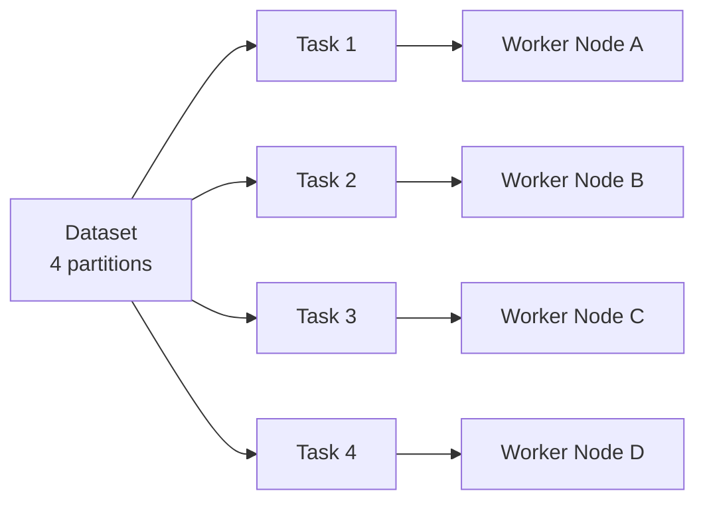
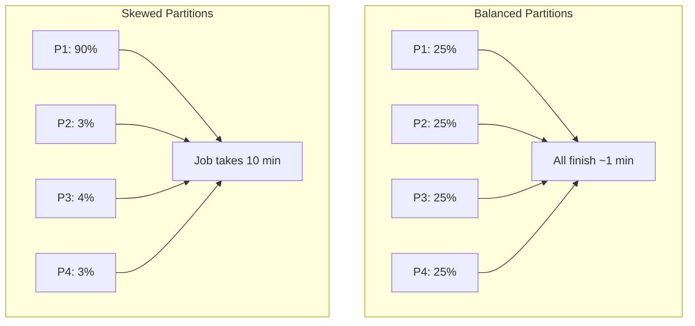

# How Partitions Enable Parallel Execution

## 1. Partitions Are the Unit of Parallelism

In a distributed engine like Spark, **partitioning defines the unit of parallelism**. You can deploy the most powerful cluster available, but if all data sits in a single partition, only one CPU core can work on it at a time. The number of partitions effectively sets the **speed limit** for how much work the cluster can perform simultaneously.

Partitioning is not merely about where data physically resides — it is the **blueprint for how work is divided** across the cluster.

---

## 2. The Partition-to-Task Mapping

When a job is submitted, the engine decomposes it into **tasks**. The mapping rule is strict:

| Rule | Meaning |
|------|---------|
| One partition → one task | Each partition maps to exactly one task |
| Task → worker node | Each task is dispatched to a worker for independent execution |
| Worker thread executes | A thread on the worker runs the task without coordinating with other partitions |

### Example: 4 partitions, 4 cores

- Dataset has 4 partitions → engine creates 4 tasks
- Cluster has 4 available CPU cores → all 4 tasks run **at the same time**
- This is **parallel execution**: static data becomes dynamic, concurrent work

### Scaling up: 400 partitions

- 400 partitions → up to 400 concurrent tasks
- With 400 cores available, theoretical throughput scales linearly with partition count
- Partitioning is the bridge between a static dataset and parallel cluster utilization

---

## 3. Optimal Partitioning: Avoiding Stragglers

Simply having many partitions is not enough. **Optimal partitioning** ensures cluster resources are utilized **evenly**.

### What is a straggler?

A **straggler** is a task that takes significantly longer than all others to complete. In distributed systems, a job finishes only when **every** task finishes — the slowest task determines total runtime.

| Scenario | Result |
|----------|--------|
| 99 tasks finish in 1 minute, 1 straggler takes 10 minutes | **Entire job takes 10 minutes** |
| One partition holds 90% of data, others nearly empty | One node overloaded, rest idle |

Poor partition strategy creates bottlenecks even when hardware is abundant. The goal is for every node to finish its work at roughly the same time.

---

## 4. Partition Count vs Cluster Size

| Factor | Too Few Partitions | Too Many Partitions |
|--------|-------------------|---------------------|
| Parallelism | Underutilizes cores | Can saturate all cores |
| Task overhead | Low scheduling cost | High scheduling overhead |
| Memory per task | Large per-task memory | Small per-task memory |
| Risk | Cluster idle | Driver/task scheduling pressure |

**Rule of thumb**: aim for 2–4× the number of cores in the cluster, adjusted for data size and skew. The exact number depends on workload, but the principle holds — partitions must be **balanced in size**, not just numerous.

---

## 5. Connection to Partitioning Strategies

Understanding that partitions drive parallelism sets up the next question: **how should data be assigned to partitions?**

- **Hash partitioning** — scatter keys uniformly using $P = \text{hash}(\text{key}) \mod N$
- **Range partitioning** — group contiguous key ranges together
- **Custom partitioners** — domain-specific logic when defaults fail

Each strategy affects both **parallelism** (how many tasks run) and **balance** (whether stragglers appear).

---

## Common Pitfalls / Exam Traps

- **Trap**: "More machines automatically means faster jobs." Without enough partitions, added nodes sit idle — parallelism is bounded by partition count, not node count.
- **Trap**: "More partitions always means better performance." Excessive partitions add scheduling overhead; **balanced** partitions matter more than raw count.
- **Trap**: "A job with 100 tasks on 10 cores runs 100 tasks in parallel." Only 10 run concurrently; the rest queue until cores free up.
- **Trap**: Confusing **partitions** (logical data splits) with **cores** (physical compute). Partitions define potential parallelism; cores define actual concurrency.
- **Trap**: Ignoring stragglers when measuring job performance — average task time is misleading; **max task time** determines job duration.

---

## Quick Revision Summary

- In Spark, **one partition = one task** — the fundamental unit of parallelism
- Partition count sets the upper bound on simultaneous work across the cluster
- 4 partitions + 4 cores = 4 tasks running in true parallel
- **Stragglers** (slowest task) determine total job runtime, not average task speed
- Skewed partitions (90% in one partition) waste cluster resources and create bottlenecks
- Optimal partitioning balances partition count with even data distribution
- Partitions define *where* work is divided; partitioning *strategy* defines *how* data is assigned
- Next step: hash partitioning uses the modulo operator for uniform distribution
