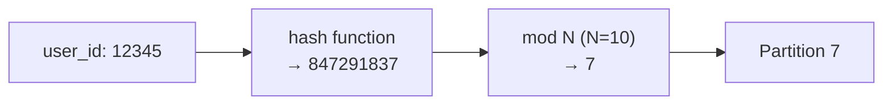
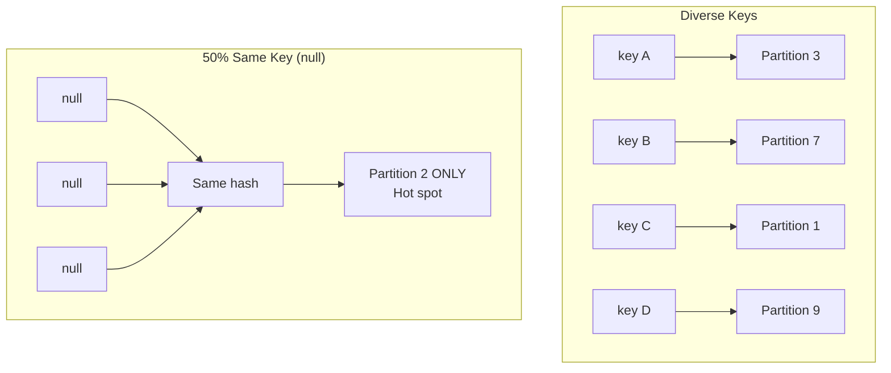

# Hash Partitioning Mechanics: The Modulo Operator and Uniformity

## 1. Why Hash Partitioning Exists

Manually deciding where every row in a petabyte-scale dataset should live is impossible. Distributed systems need an **automated, mathematical** way to scatter data so every node receives a fair share. **Hash partitioning** is the industry standard for achieving a pseudorandom but **predictable** spread — deterministic mapping that balances load without human intervention.

---

## 2. The Core Formula

The partition assignment formula is:

$P = \text{hash}(\text{key}) \mod N$

Where:
- **key** — the attribute chosen for partitioning (e.g., `user_id`, `order_id`)
- **hash(key)** — transforms any input (string, number, date) into a large consistent integer
- **N** — total number of partitions desired
- **P** — resulting partition index (target address)

| Component | Role |
|-----------|------|
| Key | Business attribute that identifies a record |
| Hash function | Maps arbitrary key types to a large integer space |
| Modulo ($\mod N$) | Scatters the integer across partition indices $0$ to $N-1$ |
| Result $P$ | Deterministic partition address for that key |

---

## 3. Step-by-Step Walkthrough

1. **Choose a key**: `user_id = 12345`
2. **Apply hash**: `hash(12345) → 847291837` (same input always yields same output)
3. **Apply modulo**: `847291837 mod 10 = 7`
4. **Assign**: Record goes to **Partition 7**

Because `hash(12345)` is always identical, user 12345 maps to partition 7 today, tomorrow, and forever. This **determinism** lets the system locate data without scanning every node.

---

## 4. Why Modulo Creates Uniform Distribution

The modulo operator naturally scatters values across the range $0$ to $N-1$. When keys are diverse and the hash function distributes well, roughly equal amounts of data land on every partition.

**Analogy — dealing a deck of cards:**
- The **hash function** shuffles the keys into a random-looking order
- The **modulo operator** deals them one by one to $N$ partition "hands"
- With a fair shuffle and many cards, each hand gets approximately the same count

| Property | Benefit |
|----------|---------|
| Deterministic | Same key → same partition every time |
| Automated | No manual assignment needed |
| Scattered | Keys spread across all partitions |
| Predictable | Enables direct lookup without full scan |

---

## 5. The Catch: Key Skew Breaks Uniformity

Hash partitioning assumes **diverse keys**. When keys are not diverse, the math collapses:

| Condition | What Happens |
|-----------|--------------|
| 50% of records share the same key (e.g., `null`, `"UNKNOWN"`) | Hash produces identical integer for all → modulo sends all to **one partition** |
| Low-cardinality key (e.g., `country` with 3 values) | Only 3 distinct hash outputs → only 3 partitions used, rest empty |
| Popular category dominates | **Hot spot** / **straggler** — one node overwhelmed |

This is not a flaw in the formula — it is a **data distribution** problem. Hash partitioning works perfectly under normal conditions but cannot fix inherently skewed keys.

---

## 6. Hash Function Properties (What Makes a Good Hash)

| Property | Requirement |
|----------|-------------|
| Deterministic | Same input → same output, always |
| Uniform distribution | Spreads keys evenly across integer space |
| Avalanche effect | Small key change → large hash change |
| Fast computation | Called for every record at scale |

Spark's default partitioner uses Java's `hashCode()` combined with modulo. Custom hash functions must preserve determinism for co-located joins to work.

---

## Common Pitfalls / Exam Traps

- **Trap**: "Hash partitioning guarantees equal partition sizes." It guarantees **probabilistic** balance only when keys are diverse — skewed keys break uniformity.
- **Trap**: "Hash of 101 and 102 will land on adjacent partitions." Numerically close keys produce **completely different** hashes — hash scatters, it does not preserve order.
- **Trap**: Confusing **hash** (scrambles) with **range** (preserves order). Hash is for balance and point lookups; range is for ordered queries.
- **Trap**: Using a low-cardinality column as hash key (e.g., `gender` with 2 values) — only 2 partitions will ever be used regardless of $N$.
- **Trap**: Forgetting that `null` keys all hash to the same value — a classic hot-spot source in real datasets.

---

## Quick Revision Summary

- Hash partitioning formula: $P = \text{hash}(\text{key}) \mod N$
- **Deterministic**: same key always maps to the same partition — enables direct lookup
- Modulo operator scatters hash integers across partitions $0$ to $N-1$
- Works like dealing shuffled cards — fair spread when keys are diverse
- **Key skew** (duplicate/null keys) sends disproportionate data to one partition → hot spot
- Hash preserves no ordering — numerically adjacent keys land on unrelated partitions
- Best for uniform key distribution; fails when keys are concentrated on few values
- Next: strategic use cases where hash partitioning excels (point lookups, joins)
