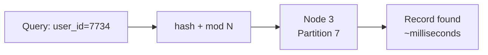
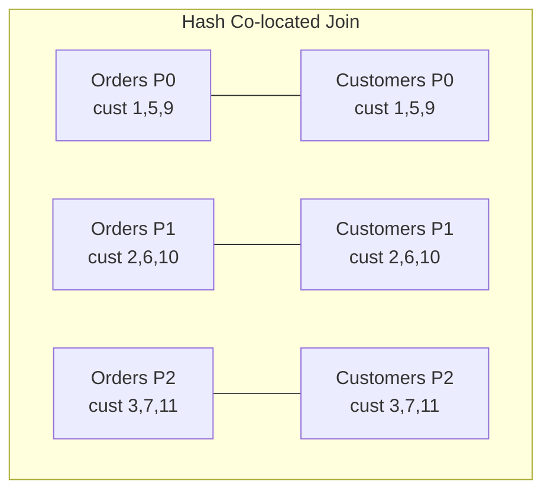

# Use Cases: When to Choose Hash Partitioning

## 1. Default Does Not Mean Universal

Hash partitioning is the default in many distributed systems, but **default does not mean always correct**. Choosing a partitioning strategy is an architectural decision driven by query patterns, key cardinality, and join behavior. Four key scenarios guide when hash partitioning is the right choice — and one critical scenario where it is the wrong choice.

---

## 2. Scenario 1: Uniform Key Distribution

**When**: Dataset has **high cardinality** — many unique keys (Social Security numbers, UUIDs, transaction IDs).

**Why hash works**: The hash function scrambles diverse keys so no single partition accumulates disproportionate data.

| Key Type | Cardinality | Hash Suitability |
|----------|-------------|------------------|
| UUID | Very high (unique per record) | Excellent |
| User ID (millions) | High | Excellent |
| Product SKU (thousands) | Medium-high | Good |
| Country code (200) | Low | Poor |
| Boolean flag | Very low (2) | Terrible |

**Assumption**: Keys must be genuinely diverse. High cardinality alone is not enough if a few values dominate frequency.

---

## 3. Scenario 2: Point Lookups

**When**: Queries fetch a **single record by exact key** — "find order #48291" or "get user profile for ID 7734."

**Why hash works**: Deterministic mapping means the system computes $P = \text{hash}(\text{key}) \mod N$ and goes **directly** to the target node. No cluster-wide scan required.

| Lookup Type | Hash Partitioning | Range Partitioning |
|-------------|-------------------|-------------------|
| Exact key match (`WHERE id = X`) | Direct — one node | May require scan |
| Key in (`WHERE id IN (...)`) | Direct — few nodes | Variable |
| Range (`WHERE id BETWEEN 100 AND 200`) | **Full cluster scan** | Targeted nodes |

Point lookups with hash partitioning are nearly instantaneous because the math always points to the same index for the same key.

---

## 4. Scenario 3: Join Optimization via Data Co-location

**When**: Two large datasets must be joined on a common key (e.g., `orders` and `customers` both keyed on `customer_id`).

**The problem with unco-located data**: In a typical distributed join, the system must **shuffle** data across the network so matching keys from both tables end up on the same machine. Network shuffles are among the most expensive operations in big data.

**The hash co-location solution**: Partition **both** datasets on `customer_id` using the **same hash function** and the **same number of partitions**.

| Property | Requirement for Co-location |
|----------|---------------------------|
| Same partition key | Both tables keyed on `customer_id` |
| Same hash function | Identical hash algorithm |
| Same partition count | Both RDDs/DataFrames have $N$ partitions |

**Result**: Matching keys are **already on the same nodes** → **shuffle-less join** → performance improvement by orders of magnitude.

No network movement needed — each node joins its local partitions independently.

---

## 5. Scenario 4 (Red Flag): No Range Scans

**When NOT to use hash**: Queries rely on **range filters** — `BETWEEN`, `>`, `<`, date ranges, alphabetical segments.

**Why hash fails**: Hash partitioning **scatters** data. IDs 101 and 102 are numerically adjacent but their hashes land on entirely different nodes. The system has no metadata about where a range begins or ends.

| Query Pattern | Hash Behavior | Cost |
|---------------|---------------|------|
| `WHERE date BETWEEN '2024-03-01' AND '2024-03-15'` | Scan **every node** | Full cluster IO |
| `WHERE name > 'M'` | Scan **every node** | Full cluster IO |
| `WHERE amount > 10000` | Scan **every node** | Full cluster IO |

Hash partitioning has **no concept of order** — it cannot prune nodes for range queries.

---

## 6. Decision Matrix

| Requirement | Hash Partitioning | Alternative |
|-------------|-------------------|-------------|
| High-cardinality keys | Best choice | — |
| Point lookups by ID | Best choice | — |
| Co-located joins | Best choice (same hash + N) | Broadcast join (small table) |
| Chronological queries | **Avoid** | Range partitioning |
| Alphabetical range scans | **Avoid** | Range partitioning |
| Skewed keys | **Avoid** (hot spots) | Salting, custom partitioner |

---

## Common Pitfalls / Exam Traps

- **Trap**: "Hash partitioning is always the best default." It fails for range scans and skewed keys — context determines the right strategy.
- **Trap**: "Co-located join works if both tables are hash-partitioned." Both must use the **same key, same hash function, and same N** — any mismatch triggers a shuffle.
- **Trap**: "Hash preserves numeric proximity." IDs 101 and 102 hash to unrelated partitions — hash scatters, never preserves order.
- **Trap**: Using hash for time-series analytics (daily/monthly reports) — every query scans the entire cluster.
- **Trap**: Confusing **broadcast join** (replicate small table) with **co-located join** (both large tables pre-partitioned on same key).

---

## Quick Revision Summary

- Hash partitioning excels with **high-cardinality, diverse keys** for uniform distribution
- **Point lookups** are near-instant — deterministic mapping goes directly to one node
- **Co-located joins**: partition both tables on same key + same hash + same $N$ → shuffle-less join
- Shuffle-less joins can improve performance by **orders of magnitude**
- **Red flag**: hash is terrible for range scans (`BETWEEN`, `>`, `<`) — forces full cluster scan
- Hash scatters data with no ordering — numerically close keys land on different nodes
- For chronological or alphabetical queries, use **range partitioning** instead
- Strategy choice depends on query patterns, not just data shape
