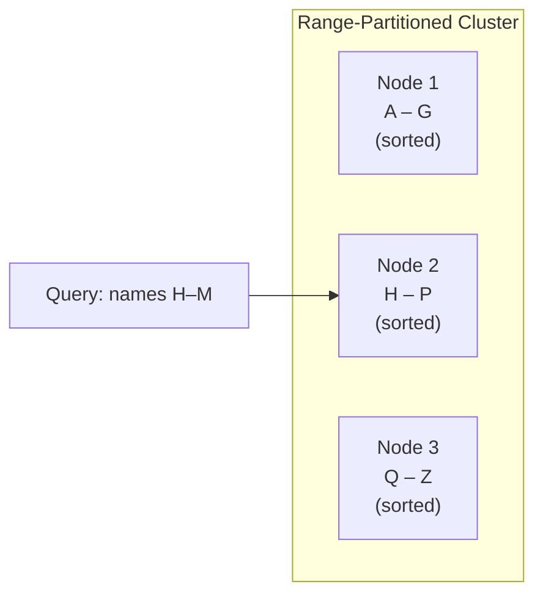
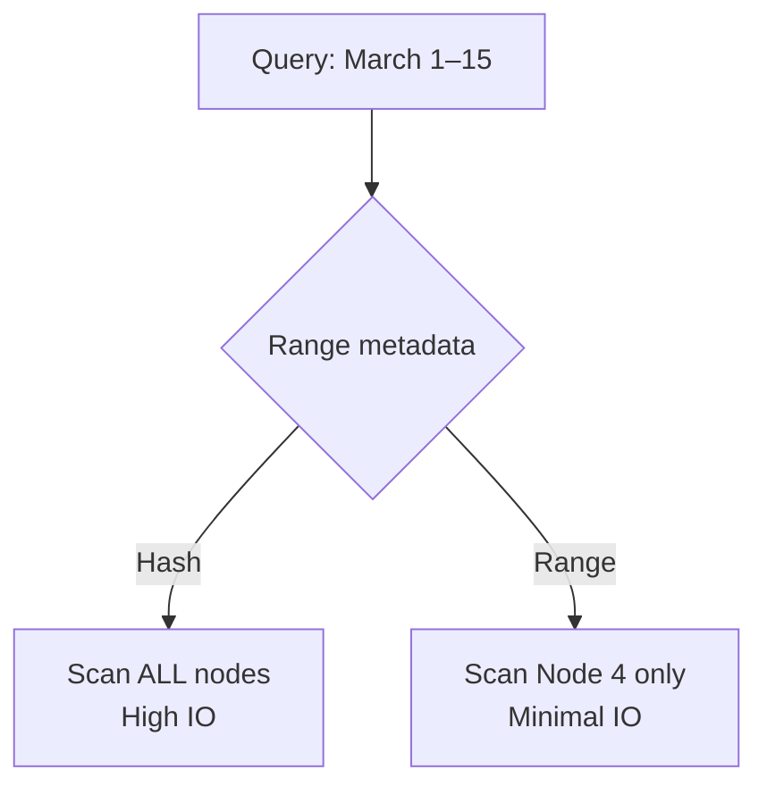

# Range Partitioning Mechanics: Key Ranges and Sorted Data

## 1. When Hash Is the Wrong Tool

Hash partitioning excels at scattering data for balance and point lookups, but it is **terrible for range-based queries**. When the business needs to analyze data within specific time frames, numeric bands, or alphabetical segments, a different strategy is required: **range partitioning**.

Range partitioning optimizes for **sorted data** and **continuous queries** — it organizes data instead of scrambling it.

---

## 2. Core Concept: Continuous, Non-Overlapping Ranges

Range partitioning divides data into **continuous, non-overlapping ranges** based on a **sortable key**. Each range maps to a specific node or partition.

**Library shelf analogy**: Just as a library arranges books alphabetically on shelves, range partitioning groups related records together.

| Partition | Key Range | Example (names) |
|-----------|-----------|-----------------|
| Node 1 | A – G | Adams, Garcia |
| Node 2 | H – P | Harris, Parker |
| Node 3 | Q – Z | Quinn, Zimmerman |

Within each partition, data is typically **sorted**. This creates a predictable, structured map of the entire dataset across the cluster.

---

## 3. Query Efficiency: Range Pruning

The primary advantage of range partitioning is **query efficiency through partition pruning**.

### Example: Date range query

**Query**: All records from March 1 to March 15.

| Strategy | System Behavior | Nodes Scanned |
|----------|----------------|---------------|
| Hash partitioning | Records scattered everywhere — no metadata about date location | **All nodes** |
| Range partitioning | Metadata says "March dates live on Node 4" | **Node 4 only** |

The system inspects partition boundary metadata, identifies the relevant node(s), and **ignores all others**. This dramatically reduces IO overhead and makes chronological or alphabetical searches fast.

---

## 4. Hash vs Range: Side-by-Side

| Dimension | Hash Partitioning | Range Partitioning |
|-----------|-------------------|-------------------|
| Data arrangement | Scattered (pseudorandom) | Ordered (contiguous ranges) |
| Point lookup (`id = X`) | Direct (one node) | May require binary search on boundaries |
| Range query (`date BETWEEN ...`) | Full cluster scan | Targeted node(s) only |
| Join co-location | Yes (same hash + key) | Possible if same range key |
| Ordering preserved | No | **Yes** |
| Hot spot risk | Key skew | **Range skew** (uneven ranges) |
| Best for | Uniform keys, point lookups, joins | Time series, sorted scans, reporting |

---

## 5. The Hidden Assumption: Even Distribution Across Ranges

Range partitioning sounds ideal, but it relies on a **dangerous assumption**: data is evenly distributed across the defined ranges.

**Library analogy**: If every author's name started with "S", the S shelf collapses under the weight while A–R and T–Z shelves stand empty.

| Assumption | Reality |
|------------|---------|
| Names evenly spread A–Z | Regional datasets skew toward certain letters |
| Dates evenly spread across months | Seasonal spikes, event-driven bursts |
| Revenue evenly spread across brackets | Power-law distribution — few high-value records |

When data concentrates in one range, that partition becomes a **hot spot** — the exact straggler problem hash partitioning tries to avoid, but through a different mechanism.

---

## 6. When to Choose Range Partitioning

| Use Case | Why Range Wins |
|----------|----------------|
| Time-series analytics | Date-range queries prune to relevant partitions |
| Chronological reporting | Monthly/quarterly reports hit specific nodes |
| Alphabetical browsing | Name-range queries are localized |
| Ordered aggregations | Sorted data within partitions enables efficient scans |
| Log analysis by timestamp | Recent vs historical queries target different ranges |

---

## Common Pitfalls / Exam Traps

- **Trap**: "Range partitioning is always better because it's organized." Uneven data distribution creates hot spots worse than hash skew in some cases.
- **Trap**: "Range partitioning helps point lookups." Point lookups by non-range-key attributes still require scanning; range helps **range queries on the partition key**.
- **Trap**: Choosing alphabetical ranges without knowing name distribution — a regional dataset may overload one letter range.
- **Trap**: Assuming fixed ranges work forever — data distribution shifts over time; boundaries need maintenance.
- **Trap**: Confusing **sorted within partition** with **globally sorted** — each partition is sorted locally, not necessarily globally ordered across the cluster.

---

## Quick Revision Summary

- Range partitioning divides data into **continuous, non-overlapping ranges** on a sortable key
- Data within each partition is typically **sorted** — like books on a library shelf
- **Query pruning**: range queries (dates, names) target only relevant nodes — massive IO savings
- Hash scatters; range **organizes** — opposite strategies for opposite query patterns
- Critical assumption: data must be **evenly distributed across ranges** — otherwise hot spots form
- Range skew (e.g., all names starting with "S") creates stragglers identical to hash hot spots
- Best for time-series, chronological reports, and alphabetical range scans
- Next: boundary skew and dynamic range challenges in real-world data
