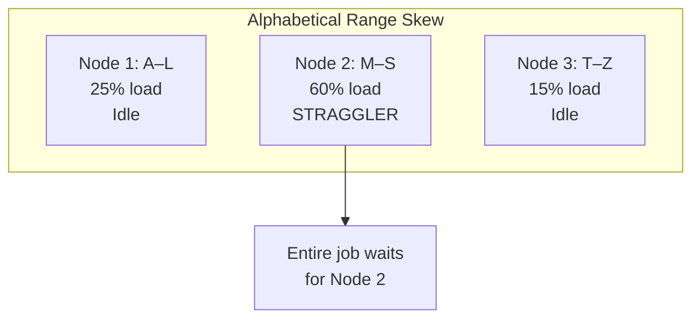
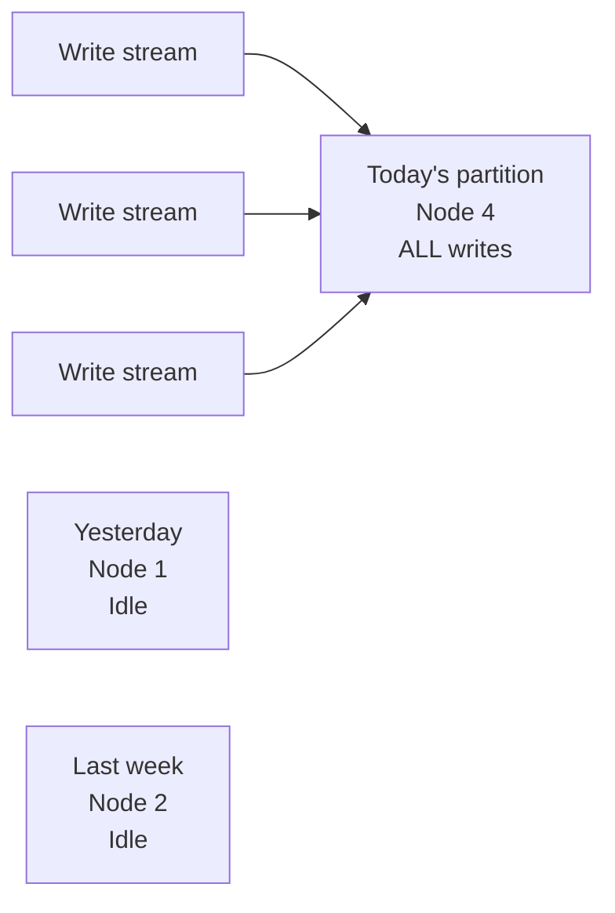

# Handling Dynamic Ranges and Boundary Issues

## 1. Real-World Data Is Not Well-Behaved

Range partitioning creates an elegant, ordered library of data — but real-world datasets rarely conform to neat boundaries. The single biggest risk of range partitioning is **data skew**, also known as **hot spots**. While range partitioning is efficient for queries, it is **incredibly vulnerable** to uneven data distribution across defined ranges.

---

## 2. Range Skew: When Boundaries Look Fair on Paper

Consider alphabetical partitioning across three nodes:

| Node | Range | Expected Load |
|------|-------|---------------|
| Node 1 | A – L | ~33% |
| Node 2 | M – S | ~33% |
| Node 3 | T – Z | ~33% |

On paper, this is an even split. But if the dataset represents users from a region where names starting with **S** are disproportionately common:

| Node | Actual Load | Status |
|------|-------------|--------|
| Node 1 (A–L) | ~25% | Underutilized |
| Node 2 (M–S) | ~60% | **Hot spot — overwhelmed** |
| Node 3 (T–Z) | ~15% | Underutilized |

Node 2 becomes a **straggler** — the entire job slows to the pace of that one overloaded node while Node 1 and Node 3 sit idle.

This is **range skew** — boundaries that appear balanced in design but fail in practice because the underlying data distribution is non-uniform.

---

## 3. Boundary Skew: The Write Bottleneck

Beyond volume skew, **boundary skew** is a distinct and often more damaging problem — especially with **time-series data**.

### The "today's partition" problem

When data is partitioned by date and new records continuously append to the **most recent date range**:

| Time | Write Target | Problem |
|------|-------------|---------|
| Every new record | Latest partition (today's date) | All writes hit **one node** |
| All other partitions | Historical — read-only | **Zero write load** |

Every single write operation targets the same partition. One node handles all ingestion while others do nothing.

| Impact | Consequence |
|--------|-------------|
| Write throughput | Capped by single-node capacity — cannot scale out writes |
| Query latency | Latest partition grows unboundedly — reads slow down |
| Fault tolerance | Single point of failure for all incoming data |
| Resource waste | Cluster write capacity underutilized by $N-1$ nodes |

This is not just a slow query — it is a **critical failure** that prevents the system from scaling write capacity horizontally.

---

## 4. Volume Skew vs Boundary Skew

| Type | Cause | When It Appears | Primary Impact |
|------|-------|-----------------|----------------|
| **Range skew** | Uneven data density within fixed ranges | Query time | Straggler tasks, slow reads |
| **Boundary skew** | All new data appends to latest range boundary | Ingestion time | Write bottleneck, cannot scale writes |

Both create hot spots, but boundary skew is particularly insidious because it affects the **live ingestion pipeline**, not just batch analytics.

---

## 5. Mitigation Strategies

| Strategy | How It Helps | Trade-off |
|----------|-------------|-----------|
| **Analyze distribution first** | Set boundaries based on actual data histograms | Requires upfront analysis; boundaries may drift |
| **Dynamic re-partitioning** | Split overloaded ranges, merge empty ones | Operational complexity, rebalancing cost |
| **Salting** | Append random suffix to spread writes across partitions | Breaks range query pruning for salted key |
| **Composite keys** | Partition by `(date, hash_suffix)` for writes | More complex queries |
| **Custom partitioner** | Domain-specific logic when hash and range both fail | Requires manual engineering |

---

## 6. When to Abandon Fixed Range Partitioning

Fixed range boundaries fail when:

- Data distribution is **constantly shifting** (growing user base in new regions)
- Skew is **too unpredictable** for static boundaries
- **Write-heavy** workloads append to a single boundary (time-series ingestion)
- Neither hash nor range achieves balanced performance

In these cases, **custom partitioners** provide manual control over data routing.

---

## Common Pitfalls / Exam Traps

- **Trap**: "Equal letter ranges = equal load." Alphabetical ranges assume uniform name distribution — regional datasets violate this assumption.
- **Trap**: "Boundary skew only affects reads." Boundary skew primarily **cripples write throughput** — all ingestion hits one partition.
- **Trap**: "Range partitioning avoids hot spots." Range partitioning **introduces** a different class of hot spots (range skew + boundary skew).
- **Trap**: Confusing range skew (uneven volume within ranges) with boundary skew (all writes to latest range).
- **Trap**: Setting date ranges without planning for append-heavy workloads — today's partition becomes tomorrow's bottleneck.

---

## Quick Revision Summary

- **Range skew**: data concentrates in one range despite seemingly balanced boundaries → straggler at query time
- **Boundary skew**: all new writes hit the latest range partition → write bottleneck at ingestion time
- Alphabetical ranges fail when name distribution is regional or cultural (e.g., many "S" names)
- Time-series append workloads create severe boundary skew on the "today" partition
- Boundary skew prevents horizontal scaling of **write** capacity — critical production failure
- Fixed ranges require constant vigilance and understanding of actual data distribution
- When hash and range both fail, **custom partitioners** provide domain-specific control
- Partitioning strategy must evolve as data grows and distribution shifts
