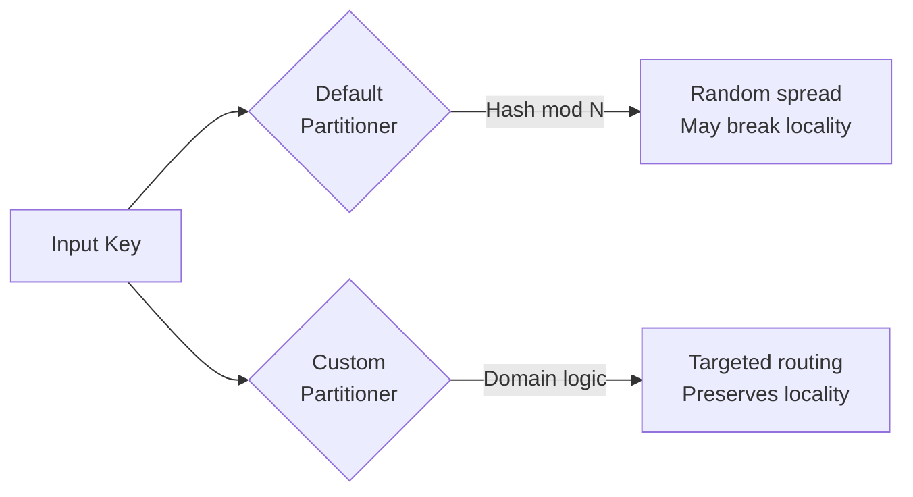
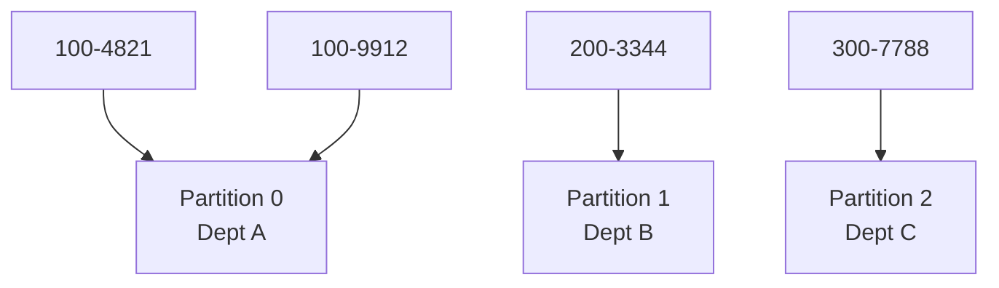

# When Default Partitioners Fail: Custom Partitioning Logic

## 1. Beyond the 80% Solution

Hash and range partitioning are off-the-shelf solutions that handle roughly **80% of use cases** well. But standard strategies struggle when data becomes **highly skewed** or follows a **complex, nonlinear distribution** that generic math cannot capture. This is the territory of **custom partitioners** — moving from general-purpose formulas to **domain-specific structures**.

---

## 2. What Is a Custom Partitioner?

When default partitioners fail to distribute data evenly, frameworks like Spark allow defining a **partitioner class** or **custom function**. This function:

1. Takes a **key** as input
2. Returns a specific **integer** representing the target partition index

Instead of letting $P = \text{hash}(\text{key}) \mod N$ decide routing, you write explicit logic — `if/else` statements, lookup tables, or complex algorithms — to control exactly which node processes which records.

---

## 3. When Defaults Fail

| Failure Mode | Why Defaults Break | Custom Solution |
|--------------|-------------------|-----------------|
| Geographical data | Hash puts neighboring addresses on different nodes | Group by geo-hash or map tile |
| Hierarchical IDs | Hash ignores business structure in ID prefix | Route by department/country prefix |
| Known skew | 50% null keys → one hash partition | Explicit null routing or salting |
| Spatial queries | Need neighbors co-located for local computation | Tile-based or grid partitioning |
| Multi-tenant data | Each tenant needs isolated partition | Tenant-ID-based routing |

---

## 4. Use Case 1: Geographical Coordinates

**Problem**: Processing delivery or traffic data where spatial locality matters.

Standard hashing puts two neighboring street addresses on **completely different nodes**. But calculating local traffic patterns requires neighbors on the **same node**.

**Custom solution**: Group data by **map tiles** or **geo-hashes** — a hierarchical spatial encoding where geographically close points share a geo-hash prefix.

| Approach | Behavior |
|----------|----------|
| Standard hash | Address A → Node 7, Address B (next door) → Node 2 |
| Geo-hash partitioner | Address A → Tile `9q8yy`, Address B → Tile `9q8yy` → **Same node** |

This ensures **spatial locality** — processing stays close to where related data resides, minimizing expensive network shuffles.

---

## 5. Use Case 2: Hierarchical Business IDs

**Problem**: Company IDs encode organizational structure — first three digits represent country or department.

| ID Pattern | Meaning |
|------------|---------|
| `100-xxxx` | Department A (US) |
| `200-xxxx` | Department B (EU) |
| `300-xxxx` | Department C (APAC) |

Standard hashing scatters all departments randomly. A custom partitioner reads the **prefix** and routes all Department A records together, regardless of the unique suffix.

**Benefit**: Department-level aggregations, reporting, and joins happen locally without cross-node shuffles.

---

## 6. Custom vs Default: Decision Framework

| Question | If Yes → | If No → |
|----------|----------|---------|
| Do keys have domain structure hash ignores? | Custom partitioner | Default hash |
| Is spatial/temporal locality required? | Custom partitioner | Default hash or range |
| Is data distribution known and stable? | Range or custom | Default hash |
| Is skew predictable and mappable? | Custom with explicit routing | Salting + hash |
| Does 80% of workload fit default patterns? | Start with default | Custom from the start |

---

## 7. Implementation Overview (PySpark)

Spark exposes custom partitioning through `RDD.partitionBy(numPartitions, partitionFunc)`:

| Component | Purpose |
|-----------|---------|
| `numPartitions` | Total partition count |
| `partitionFunc(key)` | Python function: key → integer in $[0, N)$ |
| Fail-safe default | Unknown keys routed to partition 0 (via `.get(key, 0)`) |

The custom function replaces the modulo operator with domain-aware routing logic. Verification uses `glom()` to inspect which records landed in each partition.

---

## Common Pitfalls / Exam Traps

- **Trap**: "Custom partitioners are always better." They add complexity — use only when defaults demonstrably fail for your data shape.
- **Trap**: "Custom partitioners fix skew automatically." You must **design** the logic to handle skew — custom logic that ignores distribution still creates hot spots.
- **Trap**: Forgetting fail-safe handling for unknown keys — unmapped keys can crash the pipeline or create silent misrouting.
- **Trap**: Custom partition count mismatch between joined datasets — co-location requires **identical partition count and compatible routing**.
- **Trap**: Using custom partitioners when **salting** (adding random suffix) would suffice for write skew.

---

## Quick Revision Summary

- Default hash/range partitioners handle ~80% of cases; custom partitioners handle the rest
- Custom partitioner: function `(key) → partition_index` replacing generic hash/modulo logic
- **Geographical data**: group by geo-hash/map tiles for spatial locality
- **Hierarchical IDs**: route by prefix (country, department) to keep related records co-located
- Custom partitioners preserve **data locality** — processing near where data lives
- Use when data has domain-specific structure that generic math cannot capture
- Requires fail-safe defaults for unknown/messy keys
- Next: PySpark implementation walkthrough with geographic region routing
