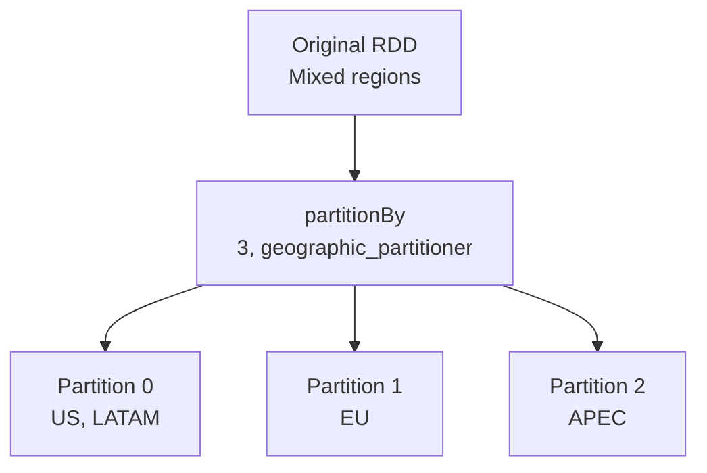

# Building Custom Partitioning Logic in PySpark

## 1. From Theory to Code

When default hash and range partitioners cannot handle specific data distributions, PySpark allows explicit control over data routing through **custom partition functions**. This walkthrough builds a geographic region partitioner from scratch — routing transaction records to partitions based on business region keys (US, EU, APEC).

---

## 2. Setup: Spark Session and Sample Data

Every PySpark application begins with a Spark session. The sample data is a list of **key-value pairs**:

| Key (Region) | Value (Transaction ID) |
|--------------|----------------------|
| `"US"` | `"txn-001"` |
| `"EU"` | `"txn-002"` |
| `"APEC"` | `"txn-003"` |
| `"LATAM"` | `"txn-004"` |

```python
from pyspark.sql import SparkSession

spark = SparkSession.builder.appName("CustomPartitioner").getOrCreate()
sc = spark.sparkContext

data = [
    ("US", "txn-001"),
    ("EU", "txn-002"),
    ("APEC", "txn-003"),
    ("LATAM", "txn-004"),
    ("US", "txn-005"),
]
rdd = sc.parallelize(data)
```

When parallelized with defaults, Spark assigns a standard number of partitions using hash-based routing — regions may be scattered unpredictably.

---

## 3. Defining the Custom Partition Function

The core logic maps region keys to specific partition indices:

```python
num_partitions = 3

region_map = {
    "US": 0,
    "EU": 1,
    "APEC": 2,
}

def geographic_partitioner(key):
    return region_map.get(key, 0)  # unknown keys → partition 0
```

| Key | Return Value | Target Partition |
|-----|-------------|-----------------|
| `"US"` | 0 | Partition 0 |
| `"EU"` | 1 | Partition 1 |
| `"APEC"` | 2 | Partition 2 |
| `"LATAM"` (unknown) | 0 (fail-safe default) | Partition 0 |

### Fail-safe with `.get(key, 0)`

Real data is messy — not every key appears in the mapping. Using Python's `dict.get(key, default)` prevents pipeline crashes:

- Known keys route to their designated partition
- Unknown keys (e.g., `"LATAM"`) fall back to partition 0
- The job continues instead of throwing an exception

---

## 4. Applying the Custom Partitioner

```python
partitioned_rdd = rdd.partitionBy(num_partitions, geographic_partitioner)
```

`partitionBy` requires two arguments:

| Argument | Value | Purpose |
|----------|-------|---------|
| `numPartitions` | `3` | Total partition count |
| `partitionFunc` | `geographic_partitioner` | Custom routing function |

This triggers a **shuffle** — Spark redistributes all records according to the custom function. After this transformation, data is physically separated by region.



---

## 5. Verifying with `glom()`

The `glom()` action collects all elements **within each partition** into a list — making partition contents visible:

```python
result = partitioned_rdd.glom().collect()
for i, partition in enumerate(result):
    print(f"Partition {i}: {partition}")
```

**Expected output:**

```
Partition 0: [('US', 'txn-001'), ('US', 'txn-005'), ('LATAM', 'txn-004')]
Partition 1: [('EU', 'txn-002')]
Partition 2: [('APEC', 'txn-003')]
```

| Verification | Confirms |
|-------------|----------|
| US + LATAM in Partition 0 | US mapped correctly; LATAM hit fail-safe default |
| EU in Partition 1 | EU mapped correctly |
| APEC in Partition 2 | APEC mapped correctly |

---

## 6. Why This Matters: Data Locality

By explicitly defining data distribution, processing stays **close to where data resides**:

| Without Custom Partitioner | With Custom Partitioner |
|---------------------------|------------------------|
| Regions scattered by hash | All US transactions on one node |
| Cross-region aggregations require shuffle | Region-level aggregations are local |
| Network overhead for every join | Minimal network movement |

**Data locality** — keeping computation near data — is the secret to unlocking peak performance in distributed systems. Custom partitioners are the tool for achieving locality when domain structure matters more than generic hash balance.

---

## 7. Extending the Pattern

| Extension | Implementation |
|-----------|---------------|
| More regions | Add entries to `region_map` |
| More partitions | Increase `num_partitions`, expand mapping |
| Hierarchical routing | Nested dict or prefix parsing in partition function |
| DataFrame API | Use `repartition(num, *cols)` or `partitionBy(*cols)` for DataFrames |
| Production fail-safe | Log unknown keys instead of silently routing to 0 |

---

## Common Pitfalls / Exam Traps

- **Trap**: "Custom partition function can return any integer." Must return values in range $[0, N)$ where $N$ = `numPartitions` — out-of-range values cause errors.
- **Trap**: Forgetting fail-safe for unknown keys — production pipelines crash on unexpected data without `.get(key, default)`.
- **Trap**: "partitionBy doesn't cause a shuffle." It **always shuffles** — expensive operation, use deliberately.
- **Trap**: Mismatch between `num_partitions` and mapping size — 3 partitions with a mapping that returns index 5 will fail.
- **Trap**: Using `glom()` on large datasets — collects all partition data to driver; only for verification on small samples.

---

## Quick Revision Summary

- Custom partitioner: Python function `key → int` passed to `RDD.partitionBy(N, func)`
- Geographic example maps `"US"→0`, `"EU"→1`, `"APEC"→2` for region-based routing
- **Fail-safe**: `dict.get(key, 0)` routes unknown keys to default partition — prevents crashes
- `partitionBy` triggers a shuffle to physically redistribute data by custom logic
- `glom()` verifies partition contents — collects each partition's elements into a list
- Custom partitioners achieve **data locality** — processing near where data lives
- Reduces expensive network shuffles for domain-structured workloads
- Extend by expanding the mapping dict and adjusting `num_partitions`
