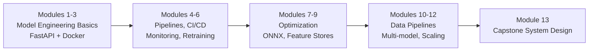

# Production ML and Model Engineering: Course Overview

## The Gap Between Notebook and Production

Most ML education focuses on training models in notebooks and optimizing offline metrics like accuracy, F1, or AUC. In real products, the harder problem is everything that comes after: deploying the model, keeping it healthy, and operating it reliably as traffic, data, and requirements change.

This course bridges that gap — moving from "I have a model in a notebook" to "we have a reliable ML service in production."

---

## Prerequisites and Focus

| Assumed Knowledge | Out of Scope |
|-------------------|--------------|
| Basic ML training experience | Proving theorems or deriving algorithms from scratch |
| Metrics like accuracy, F1, AUC | Pure research methodology |
| Python programming | |
| Basic Git usage | |

The emphasis is **engineering**: turning models into APIs, keeping them fast and observable, and integrating them into the broader data and deployment ecosystem.

---

## Learning Outcomes

By the end of this course, you should be able to:

- **Own the full production lifecycle** of a model — not just train it once
- **Expose models as APIs** and choose among batch, online, and streaming inference patterns
- **Integrate models into CI/CD pipelines** so updates are automated, not manual and fragile
- **Set up monitoring** for latency, data drift, and model quality
- **Practice retraining and versioning** using a simple model registry
- **Reason about trade-offs** — accuracy vs latency, cost, user experience, security, fairness, and auditability

---

## Module Roadmap

| Module Range | Topics |
|--------------|--------|
| 1–3 | What model engineering is; first model service with FastAPI and Docker |
| 4–6 | Pipelines, CI/CD, monitoring, retraining — the MLOps backbone |
| 7–9 | Model optimization (ONNX, optimized runtimes), feature stores for consistency |
| 10–12 | Data pipelines, multimodal systems, multi-model/tenant scaling |
| 13 | Capstone — full ML system design tying everything together |

Each module follows: **short theory → hands-on lab**.

---

## Lab Progression

Across the course, labs build incrementally toward a realistic production setup:

1. Turn a ready model into a live HTTP service
2. Build batch and online clients; measure latency and throughput
3. Package the service in Docker and run locally
4. Use MLflow-style tracking for training runs and metrics
5. Implement a tiny feature store to keep training and serving in sync
6. Wire up retraining and a model registry (versioned folders + `current_best.json`)
7. Experiment with ONNX compression — observe file size and latency changes

Labs are designed as **slices of real production**, not isolated toy exercises.

---

## Assessment Structure

- **Practice quizzes** after key modules (recall reinforcement)
- **Graded quizzes and assignments** combining ideas across modules
- **Capstone-style exam questions** requiring system design reasoning and trade-off analysis — not just definitions

---

## How to Learn Effectively

1. **Code along with every lab** — type things yourself, pause and experiment
2. **Use the Module 13 layered architecture diagram** as a mental map: data → features → training → serving → monitoring
3. **Maintain a playground repository** where you break things and fix them — that is where deep understanding forms

---

## Common Pitfalls / Exam Traps

- Treating high offline accuracy as sufficient for production readiness — deployment, monitoring, and operations are separate skill sets
- Skipping labs because theory feels sufficient — production ML is learned by building and measuring
- Confusing this course with algorithm design — the focus is engineering and operations, not novel model architectures
- Ignoring trade-offs (latency, cost, reliability) when evaluating model choices

---

## Quick Revision Summary

- Production ML = deploy + monitor + retrain, not just train
- Course bridges notebook models to reliable ML services
- Modules 1–3: serving basics; 4–6: MLOps backbone; 7–9: optimization and features; 10–12: scale; 13: capstone
- Labs build a realistic stack: API, Docker, MLflow, feature store, registry, ONNX
- Assessments test system design and trade-offs, not just definitions
- Code along, use the layered architecture diagram, keep a playground repo
