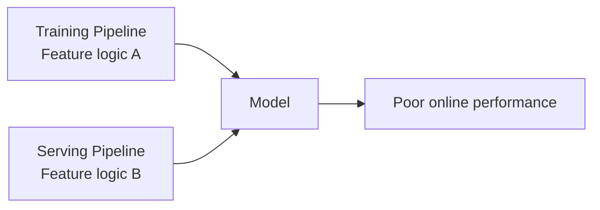
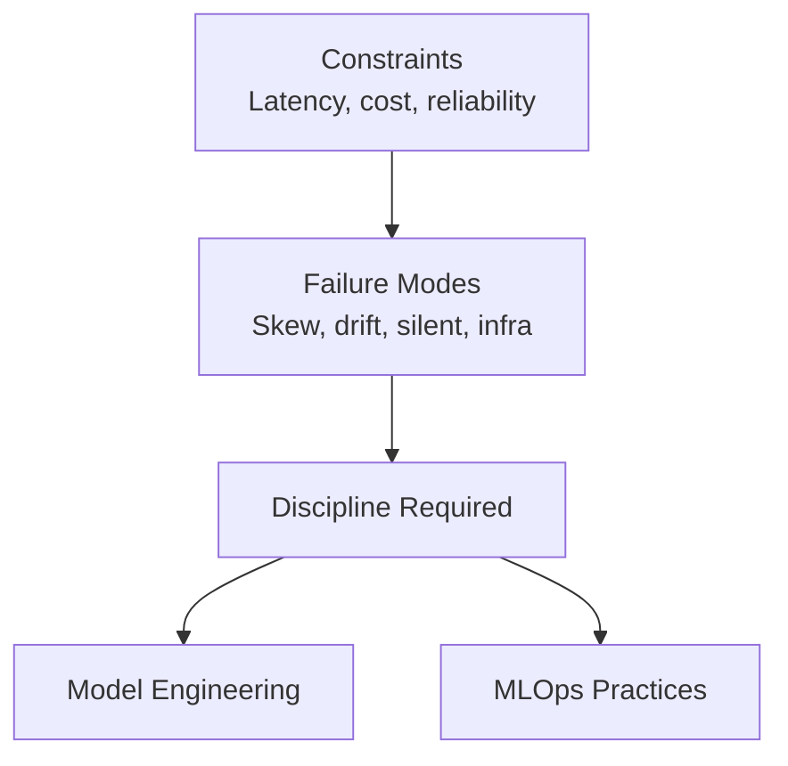

# Common Production Failure Modes

Even with good architecture and strong offline metrics, production ML systems fail in predictable, recurring ways. These are **engineering and operations problems** — not solved by swapping one algorithm for another.

---

## Failure Mode 1: Training-Serving Skew

**Definition:** Features computed during training differ from features computed during serving.

| Divergence Source | Example |
|-------------------|---------|
| Different preprocessing code | Offline script vs online service |
| Different missing value handling | Training fills with median; serving fills with zero |
| Different encoding/normalization | Training uses one-hot; serving uses label encoding |

The model effectively sees **two different worlds**. Offline metrics look good; online performance drops unexpectedly. Engineers cannot reproduce production issues locally because data paths differ slightly.

**Fix:** Shared feature pipelines or a common feature store — same code and transformations for both training and serving. Not more hyperparameter tuning.

---

## Failure Mode 2: Data Drift and Stale Models

The real world changes:

- User behavior shifts
- Products evolve
- New markets, countries, or segments appear

When input data distribution changes but the model stays fixed → **data drift**. The model predicts in a world that looks different from its training distribution.

Without reaction, models slowly become **stale** — performance degrades incrementally, easy to miss day-to-day.

**Mitigation:** Monitor input features and output quality; establish retraining/fine-tuning processes on fresh data.

---

## Failure Mode 3: Silent Failures

The scariest failure mode — everything looks fine at a glance:

| Surface Signal | Hidden Problem |
|----------------|----------------|
| API returns 200s | Label pipeline broke; offline metrics are nonsense |
| Latency OK | Feature pipeline dropped a column; model gets garbage input |
| Logs normal | Monitoring dashboard stopped updating; alerts never configured |

Model quality quietly degrades over days or weeks. Nobody notices until business KPIs worsen or users complain.

**Mitigation:** Data quality checks, end-to-end monitoring covering data and model behavior — not just system health.

---

## Failure Mode 4: Infrastructure and Dependency Issues

Even a perfect model fails when the environment breaks:

| Category | Examples |
|----------|----------|
| **Infrastructure** | Timeouts under peak load; autoscaling fails; network/storage bottlenecks |
| **Dependencies** | Library upgrade changes serialization; upstream API schema change; uncoordinated config changes |

The model appears to perform poorly even though weights never changed.

**Mitigation:** Versioning, rollbacks, strong observability (logs, metrics, traces), close collaboration with infrastructure teams.

---

## The Pattern

| Problem Type | Solution Category |
|--------------|-------------------|
| Integration, code, infrastructure | Model engineering |
| Monitoring, alerts, processes over time | MLOps |

Neither is solved by simply choosing a different model architecture.

---

## Common Pitfalls / Exam Traps

- Debugging training-serving skew with more tuning — fix the feature pipeline, not hyperparameters
- Monitoring only HTTP status codes — silent failures hide behind 200 responses
- Assuming offline evaluation catches drift — production distribution changes require live monitoring
- Blaming the model when a dependency upgrade broke preprocessing — infrastructure issues masquerade as model problems

---

## Quick Revision Summary

- Four recurring failure modes: training-serving skew, data drift/staleness, silent failures, infra/dependency issues
- Training-serving skew: different feature logic offline vs online — fix with shared pipelines/feature store
- Data drift: world changes, model does not — monitor inputs, retrain proactively
- Silent failures: healthy infra metrics masking broken data/model pipelines
- Infra issues: timeouts, scaling failures, dependency changes — versioning, observability, collaboration
- These are engineering/operations problems, not algorithm problems
