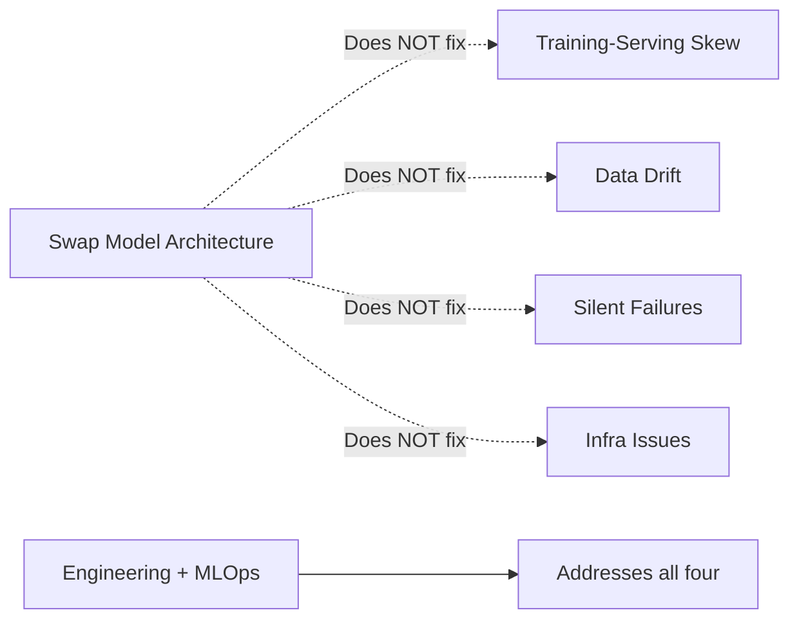

# Why ML Needs Engineering and Operations

## Connecting Constraints to Failures

The production constraints (latency, throughput, cost, reliability, compliance) and the common failure modes (training-serving skew, data drift, silent failures, infrastructure issues) together explain **why ML needs dedicated engineering and operations** — not just clever modeling.

---

## The Core Insight

| What Looks Like a Model Problem | What It Actually Is |
|--------------------------------|---------------------|
| Poor online accuracy after great offline metrics | Training-serving skew (integration) |
| Gradual business metric decline | Data drift + stale model (operations) |
| "Everything is fine" but users complain | Silent failure (monitoring gap) |
| Sudden performance drop, weights unchanged | Infrastructure/dependency issue (deployment) |

Most production ML failures are about **how the model is integrated, deployed, monitored, and maintained** — not which algorithm was chosen.

---

## Why Better Models Alone Do Not Help

Swapping one model architecture for another does not fix:

- Mismatched feature pipelines
- Missing monitoring and alerting
- Unversioned deployments with no rollback
- Dependency upgrades that break serialization

---

## The Disciplines That Address This

| Discipline | Scope |
|------------|--------|
| **Model engineering** | Services, deployment, scaling, integration, collaboration |
| **MLOps** | Automation, versioning, CI/CD, monitoring, retraining workflows |

Together they handle the real-world complexity **around** the model — not just training it once and hoping for the best.

---

## Design Decision Backdrop

Every design decision in this course — API patterns, containerization, feature stores, monitoring stacks, retraining triggers — traces back to these constraints and failure modes. Keep them as the backdrop when evaluating any production ML architecture.

---

## Common Pitfalls / Exam Traps

- Proposing "use a better model" as the fix for integration bugs — engineering discipline is required
- Treating MLOps as optional overhead — it prevents the silent degradation that kills production systems
- Separating model engineering from MLOps in practice — they are complementary, not competing

---

## Quick Revision Summary

- Constraints + failure modes = why ML needs engineering and operations
- Failures are integration, deployment, monitoring, maintenance — not algorithm choice
- Better models alone do not fix skew, drift, silent failures, or infra issues
- Model engineering + MLOps address complexity around the model
- Use constraints and failures as backdrop for every design decision in the course
