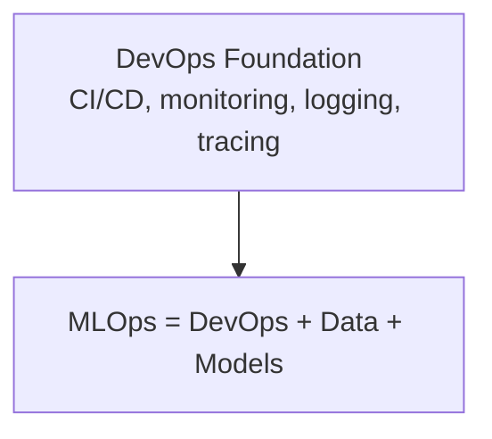

# MLOps: The Operating System for Production ML

## Why MLOps Exists

Production ML is not "train once, push to prod, forget." Real systems must handle:

- Constantly changing data and user behavior
- Complex infrastructure (services, databases, queues, cloud resources)
- Strict constraints: latency, cost, reliability, compliance

A disciplined approach to building, deploying, monitoring, and updating models safely and repeatedly is required. That discipline is **MLOps**.

---

## Definition

**MLOps** = applying DevOps-style practices to ML systems, with focus on:

| Pillar | Goal |
|--------|------|
| **Automation** | Training, testing, deployment, monitoring |
| **Reliability & scalability** | Model services as solid as any production service |
| **Collaboration** | Data scientists, ML engineers, infra engineers, product — working smoothly |
| **Ultimate goal** | Make it easy and safe to put models in production and keep them healthy as the world changes |

---

## MLOps vs DevOps

| Shared with DevOps | ML-Specific Twists |
|--------------------|-------------------|
| Automated builds, tests, deployments | Data and labels change even when code stays the same |
| CI/CD pipelines | Models degrade over time due to data drift |
| Monitoring, logging, tracing | Reproducibility = data + code + model artifact + config together |
| Fast, reliable releases | Must answer: which model version produced this prediction? |

**Mnemonic:** MLOps = DevOps + Data + Models

---

## Core Practice: Monitoring and Alerting

Monitoring must cover **both system and model health**:

| Layer | What to Monitor |
|-------|-----------------|
| **System** | Latency, error rates, uptime, resource usage |
| **Data & model** | Input distributions, missing values, out-of-range features, prediction distribution shifts |
| **Performance** | Actual metrics once labels arrive (delayed ground truth) |

**Alerts** must fire when:

- Distributions drift
- Metrics regress
- Pipelines break
- Dashboards stop updating

Without serious monitoring, ML systems suffer **silent failures** — infrastructure looks healthy while the model does the wrong thing. Good MLOps makes these issues visible and actionable.

---

## Common Pitfalls / Exam Traps

- Equating MLOps with "using Kubernetes" — it is a practice set, not a tool
- Applying DevOps CI/CD without ML-specific checks (data validation, model quality gates)
- Monitoring only infrastructure metrics — model and data health layers are essential
- Ignoring reproducibility requirements — must track data + code + model + config together

---

## Quick Revision Summary

- MLOps = DevOps practices adapted for ML systems
- Handles changing data, model degradation, reproducibility, auditability
- MLOps = DevOps + Data + Models
- Monitor system health AND data/model health
- Alerts for drift, regressions, pipeline failures — prevent silent failures
- Goal: safe, repeatable path from training to production and back
