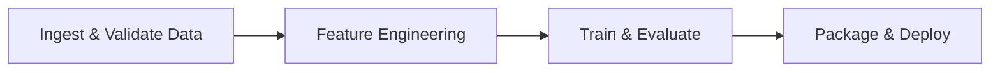
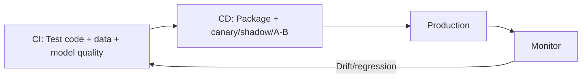

# MLOps Core Practices: Versioning, Pipelines, and CI/CD

Three foundational MLOps practices turn ML from ad hoc experimentation into an accountable, repeatable system.

---

## Practice 1: Versioning

In regular software, code is versioned. In MLOps, **everything** that affects model behavior must be versioned:

| Artifact | Examples |
|----------|----------|
| **Data** | Exact dataset or feature snapshot used for training |
| **Model** | Checkpoints, serialized artifacts |
| **Config** | Hyperparameters, thresholds, routing rules, feature flags |

**Why versioning matters:**

| Need | Requirement |
|------|-------------|
| **Reproducibility** | Recreate the exact model from 6 months ago with identical behavior |
| **Auditability** | Trace any prediction back to specific model + dataset (regulated industries) |
| **Safe rollback** | Quickly revert to a known-good version when a new model misbehaves |

Versioning everything is foundational to treating ML as a real, accountable system.

---

## Practice 2: Reproducible Pipelines

Replace ad hoc scripts and notebooks with an **end-to-end pipeline** describing:

**Reproducibility means:** Given the same input and environment, anyone on the team gets the same output — not just the original author.

| Without Pipelines | With Pipelines |
|-------------------|----------------|
| "Works on my laptop" | Shared, documented process |
| Debugging is person-dependent | Everyone uses the same steps |
| Collaboration is fragile | Onboarding and handoffs are smooth |

---

## Practice 3: CI/CD for ML

### Continuous Integration (CI)

Test on every change:

- Data transforms
- Training code
- Inference code
- Model quality checks (does this model beat the baseline?)

### Continuous Deployment (CD)

Automatically package and deploy new model versions using safe rollout patterns:

| Pattern | Description |
|---------|-------------|
| **Canary** | Route small percentage of traffic to new version |
| **Shadow** | Run new model alongside old; compare outputs; no user impact |
| **A/B test** | Split traffic between versions; measure real-world impact |

**Goal:** Ship small, frequent, safe changes — not giant risky releases every few months. Especially critical in ML because both data and models evolve continuously.

---

## Common Pitfalls / Exam Traps

- Versioning only the model artifact — data and config changes cause silent behavior shifts
- Pipelines that only one person can run — reproducibility requires team-wide execution
- CD without quality gates — deploying every trained model regardless of metrics causes regressions
- Giant quarterly releases instead of incremental canary/shadow rollouts — high blast radius

---

## Quick Revision Summary

- Version data, model artifacts, and config — for reproducibility, auditability, rollback
- Reproducible pipelines: ingest → features → train → deploy; same input = same output for anyone
- CI: test transforms, training, inference, model quality gates
- CD: canary, shadow, A/B — small frequent safe releases
- These three practices form the MLOps backbone alongside monitoring
