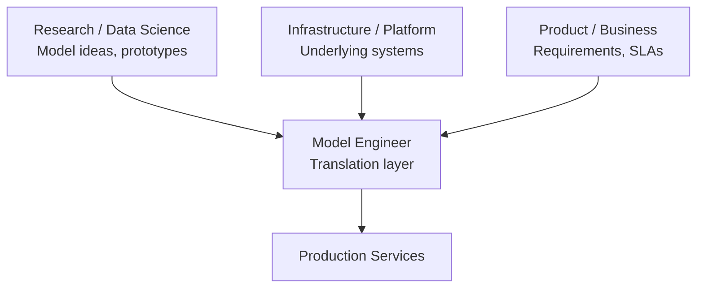

# The ML Model Engineer Role

## Position in the Organization

The model engineer sits at the intersection of three worlds:

---

## Mission

Take research prototypes and turn them into **robust, observable, scalable services**.

| Ownership Area | Scope |
|----------------|-------|
| **Serving path** | How inputs become predictions in production |
| **Deploy-monitor-retrain loop** | Safe deployment, observation, evolution |
| **Core principle** | Models must be usable in the real world — not just clever |

---

## Day-to-Day Responsibilities

### Translation

- Refactor experimental notebooks into clean, testable modules
- Build inference services: online APIs, batch jobs, or streaming consumers

### Engineering and Operations

- Implement logging, metrics, dashboards
- Set up CI/CD pipelines for model and data changes
- Handle versioning, controlled rollout, fast rollback

### Collaboration

| Partner | Interaction |
|---------|-------------|
| **Data engineers** | Define and maintain feature pipelines |
| **Infra/platform teams** | Deploy and scale services |
| **Product** | Understand SLAs, UX constraints, "good enough" thresholds |

---

## Placement on the Lifecycle

| Stage | Model Engineer Involvement |
|-------|---------------------------|
| Problem framing | Awareness |
| Data collection | Awareness |
| Feature engineering | Collaboration (consistency) |
| Training & evaluation | Awareness |
| **Deployment** | **Primary ownership** |
| **Monitoring** | **Primary ownership** |
| **Retraining / deprecation** | **Primary ownership** |

Model engineers anchor the **deploy → monitor → retrain** loop — ensuring models are deployed safely, watched in production, and updated as data and requirements change.

---

## Skill Profile

A highly cross-functional role combining:

- Machine learning understanding (know what the model does and why)
- Solid software engineering (APIs, testing, containers, CI/CD)
- Operations discipline (monitoring, incident response, SLOs)

---

## Common Pitfalls / Exam Traps

- Treating model engineer as "junior data scientist who deploys" — it is a distinct engineering specialization
- Owning only deployment without monitoring — the loop requires all three stages
- Ignoring collaboration skills — the role is as much translation as coding

---

## Quick Revision Summary

- Model engineer: intersection of research, infra, and product
- Mission: prototypes → robust, observable, scalable services
- Day-to-day: refactor code, build services, logging/metrics, CI/CD, versioning, collaboration
- Primary lifecycle stages: deployment, monitoring, retraining
- Anchors the deploy-monitor-retrain loop
- Combines ML knowledge + software engineering + operations
