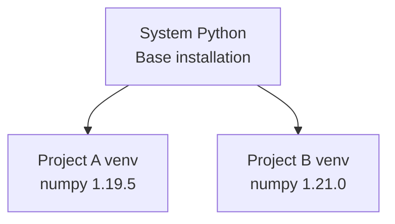

# Lab 1: Building an ML Project from Scratch

## Lab Objectives

This lab establishes the end-to-end workflow for building a real ML/AI application — focusing on understanding the **flow** before diving into implementation details.

| Component | Purpose |
|-----------|---------|
| Development environment | Clean, isolated workspace |
| Project structure | Organized files and dependencies |
| Experimentation | Jupyter notebooks for exploration |
| Model sourcing | Hugging Face Hub for pre-trained models |
| Prediction | Run inference locally |
| Packaging | Structured Python package from notebook code |


---

## Development Environment Setup

### IDE

VS Code (or PyCharm, etc.) provides the workspace. Open the project directory in the IDE to begin.

### Virtual Environments

**Why virtual environments are essential:**

- Keep project libraries isolated from system Python
- Different projects can use different dependency versions without conflict
- Installing/upgrading in one project does not break others



| Without venv | With venv |
|------------|-----------|
| Global dependency conflicts | Per-project isolation |
| "Works on my machine" | Reproducible environments |

### Package Manager: UV

UV is a fast package manager for creating environments and installing dependencies.

**Typical workflow:**

```bash
# Install UV (one-time)
# Verify: uv --version

# Create project directory
mkdir lab-1 && cd lab-1

# Create virtual environment
uv venv

# Activate (Linux/Mac)
source .venv/bin/activate

# Activate (Windows)
.venv\Scripts\activate
```

---

## Jupyter Notebook in VS Code

1. Install the Jupyter extension in VS Code
2. Create a `.ipynb` file (extension is required)
3. Select the virtual environment as the kernel
4. Verify with a simple print statement

Notebooks are for **experimentation** — testing ideas and exploring model behavior before packaging into production code.

---

## Use Case: Simple Text Assistant

**Goal:** Build a lightweight assistant that generates short, helpful text responses.

**Requirements for first lab:**

- Small model that downloads quickly
- Runs on a normal laptop (CPU only)
- No GPU or heavy infrastructure required

This constraints-driven selection mirrors real production decisions — start simple, validate the pipeline, then scale up.

---

## Common Pitfalls / Exam Traps

- Skipping virtual environments — dependency conflicts cause "works locally, fails in CI" bugs
- Running notebooks without selecting the correct kernel — uses system Python instead of project venv
- Choosing the largest available model for learning — pipeline understanding matters more than model power in early labs

---

## Quick Revision Summary

- Lab flow: environment → project → notebook → Hugging Face → prediction → package
- Virtual environments isolate dependencies per project
- UV: fast package manager for venv creation and dependency install
- Jupyter in VS Code for experimentation with correct kernel selection
- Start with a lightweight use case (text assistant) to validate the full pipeline
