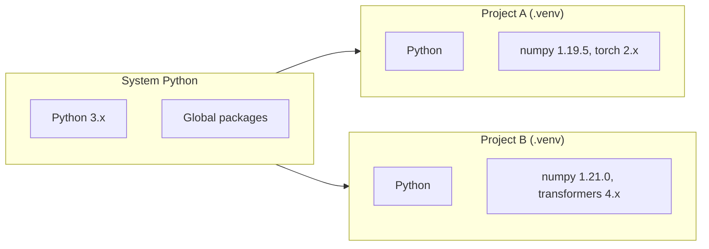

# Lab 1: Virtual Environments, Jupyter, and Hugging Face Setup

## Virtual Environment Workflow

After creating and activating a virtual environment, all subsequent package installs and code execution run in isolation.

| Platform | Activate Command |
|----------|------------------|
| Linux / Mac | `source .venv/bin/activate` |
| Windows CMD | `.venv\Scripts\activate` |

**Visual indicator:** Prompt shows `(.venv)` prefix when active.

---

## Why Isolation Matters

Each project gets dedicated dependencies. No cross-contamination.

---

## Jupyter Notebook Configuration

### Setup Steps

1. Install Jupyter extension in VS Code (Extensions → search "Jupyter")
2. Create file with `.ipynb` extension
3. Select virtual environment as kernel (click kernel selector in top-right)
4. Verify with a test cell

### Kernel Selection

If the venv does not appear automatically, click the kernel selector and choose the `.venv` interpreter manually. Running notebooks against the wrong kernel is a common source of "package not found" errors.

---

## Hugging Face Hub Introduction

**Hugging Face** is the primary ecosystem for discovering, downloading, and running pre-trained AI models — often described as the "GitHub of AI models."

| Component | Purpose |
|-----------|------|
| **Model Hub** | Thousands of pre-trained models (text, image, audio) |
| **Dataset Hub** | Real-world datasets for training and evaluation |
| **Libraries** | Transformers, Datasets, Accelerate (used throughout the course) |
| **Playground** | Try models in browser before downloading |

### Model Types

| Type | Access |
|------|--------|
| **Open models** | Download without login |
| **Gated models** (LLaMA, Qwen, etc.) | Free account + accept license + access token |

### Access Tokens

For gated models:

1. Create Hugging Face account (Google login works)
2. Settings → Access Tokens → Create new token
3. Token proves permission to download restricted models

---

## Use Case Definition

**Simple text assistant** — generates short, helpful responses.

Selection criteria for the first model:

- Lightweight (runs on CPU)
- Fast to download
- Easy to understand end-to-end workflow

The goal is **pipeline validation**, not model quality.

---

## Common Pitfalls / Exam Traps

- Forgetting to activate venv before `uv pip install` — packages install globally
- Using `.py` extension instead of `.ipynb` for notebooks — file won't open in Jupyter
- Attempting gated models without access token — download fails with authentication error
- Expecting production-quality output from a tiny model with short prompts — focus on pipeline mechanics

---

## Quick Revision Summary

- Activate venv before any installs: `source .venv/bin/activate` (Mac/Linux)
- Jupyter: install extension, use `.ipynb`, select venv as kernel
- Hugging Face = model hub + datasets + libraries + playground
- Gated models need account + license acceptance + access token
- First lab use case: lightweight text assistant on CPU — validate pipeline, not quality
