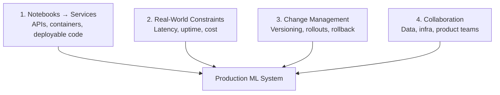

# Module 1 Summary: Model Engineering Foundations

## Core Definition

**Machine learning model engineering** is everything needed to make models usable by real systems and users — reliable under real-world conditions and scalable as usage grows.

---

## Four Major Responsibility Areas

| # | Responsibility | Key Activities |
|---|----------------|----------------|
| 1 | **Turn notebooks into services** | Refactor code, build inference pipelines, wrap in APIs, containerize |
| 2 | **Meet constraints** | P95/P99 latency, uptime SLOs, cost per request |
| 3 | **Manage change** | Version data/code/models, canary/shadow/A-B, rollback, retrain |
| 4 | **Collaborate** | Work with data, infrastructure, and product stakeholders |

---

## Lifecycle Context

The seven-stage ML lifecycle provides the broader map. Model engineering focuses primarily on:

- **Deployment** — exposing models as callable services
- **Monitoring** — catching drift, errors, and quality degradation
- **Retraining** — evolving models as the world changes

These three stages form a continuous loop, not a one-time handoff.

---

## Production Constraints Recap

| Constraint | Key Metric |
|------------|------------|
| Latency | P95, P99 — tail matters more than average |
| Throughput | Peak RPS, not average |
| Cost | Per-request compute at scale |
| Reliability | Uptime targets, graceful degradation |
| Compliance | Data residency, PII, auditability |

---

## Failure Modes Recap

1. **Training-serving skew** — fix with shared feature pipelines
2. **Data drift / stale models** — fix with monitoring + retraining
3. **Silent failures** — fix with data quality checks + end-to-end alerting
4. **Infrastructure issues** — fix with versioning, observability, collaboration

---

## MLOps Recap

MLOps = DevOps + Data + Models. Core practices:

- Version everything (data, code, model, config)
- Reproducible end-to-end pipelines
- CI/CD with ML-specific quality gates
- Monitoring and alerting for system AND model health

---

## Lab 1 Recap

Established the foundational workflow:

1. Virtual environment with UV
2. Jupyter notebook experimentation
3. Hugging Face model discovery and download
4. End-to-end text generation pipeline (DistilGPT-2)
5. Path from notebook experiments to structured Python packages

---

## Common Pitfalls / Exam Traps

- Treating Module 1 as "just introduction" — these concepts recur in every subsequent module
- Memorizing definitions without understanding the notebook-to-production gap
- Skipping Lab 1 because it feels basic — the Hugging Face and venv workflow underpins later serving labs

---

## Quick Revision Summary

- Model engineering = making models usable, reliable, scalable in production
- Four responsibilities: services, constraints, change management, collaboration
- Lifecycle focus: deployment → monitoring → retraining (continuous loop)
- Five constraints: latency (P95/P99), throughput, cost, reliability, compliance
- Four failure modes: skew, drift, silent failures, infra issues
- MLOps = DevOps + Data + Models; version, pipeline, CI/CD, monitor
- Lab 1: venv → Jupyter → Hugging Face → inference pipeline → packaging path
