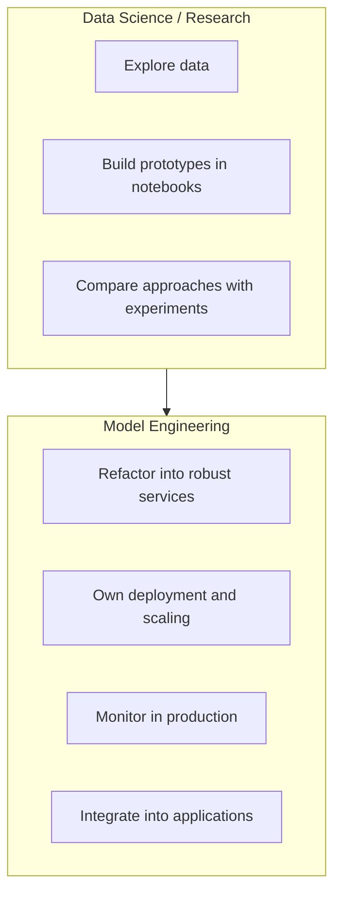

# Defining Model Engineering: From Artifact to Production Service

## Core Definition

**Machine learning model engineering** is everything needed to make models usable by other systems and teams — reliable under real-world conditions and scalable as traffic grows or shrinks.

Practically, this means taking a trained model artifact (`.pkl`, `.pt`, saved checkpoint) and turning it into a **production-grade service** that is integrated, monitored, and trusted by the rest of the organization.

---

## What Model Engineering Is Not

Model engineering is **not** about inventing model ideas or proving new algorithms. It is about making existing models **work in the real world**.

---

## Data Science vs Model Engineering

| Focus Area | Data Science | Model Engineering |
|------------|--------------|-------------------|
| Question answered | What model should we use? | How do we run this safely in production every day? |
| Deliverable | Prototype + offline metrics | Callable, observable, versioned service |
| Time horizon | Experiment cycles | Continuous operation over months/years |

---

## The Production Transformation

| Stage | State |
|-------|-------|
| Input | Trained artifact on disk |
| Process | Refactor code, build inference pipeline, wrap in API, containerize, deploy, monitor |
| Output | Service other teams and systems can call with confidence |

---

## Why the Roles Overlap in Small Teams

Startups often have one "ML person" doing both. As systems mature, the split becomes necessary because:

- Research velocity conflicts with production stability requirements
- Serving code has different quality bars than experiment code (testing, error handling, SLOs)
- Operations expertise (Kubernetes, observability, CI/CD) diverges from statistical modeling

---

## Common Pitfalls / Exam Traps

- Defining model engineering as "deployment only" — monitoring, versioning, and collaboration are equally core
- Assuming a saved `.pkl` file is a deliverable — artifacts need services around them
- Conflating "works on my laptop" with production readiness

---

## Quick Revision Summary

- Model engineering = making models usable, reliable, and scalable in production
- Takes artifacts (checkpoints, pickles) and produces integrated, monitored services
- Data science: *what model*; model engineering: *how to run it*
- Not about inventing algorithms — about real-world operation
- Roles overlap in small teams but responsibilities remain distinct
