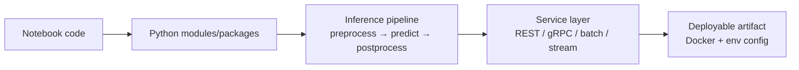
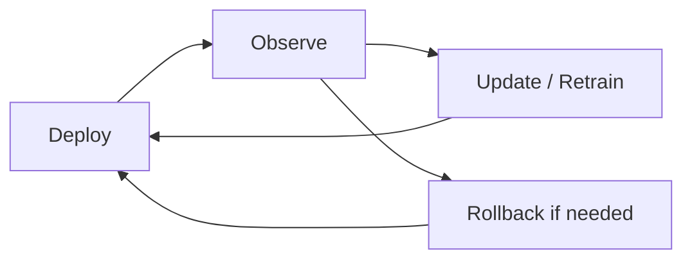

# Four Core Responsibilities of Model Engineering

Model engineering spans four interconnected responsibility areas. Each addresses a distinct production challenge.

---

## 1. Turning Notebooks into Services

The first movement where a model becomes something other systems can reliably call.

**Typical workflow:**

| Step | Detail |
|------|--------|
| Refactor | Notebook code → proper Python modules with tests |
| Inference logic | Preprocessing, model call, postprocessing — explicit and reusable |
| Service wrapper | REST API, gRPC, batch job, or streaming consumer |
| Deployability | Containers (Docker), environment-specific config (dev/staging/prod) |

---

## 2. Meeting Real-World Constraints

Model engineers must balance prediction quality with operational reality.

| Constraint | What to Measure |
|------------|-----------------|
| **Latency** | P95, P99 tail latencies — not just average; behavior under traffic spikes |
| **Reliability** | SLOs/SLAs, error handling, timeouts, partial failure modes |
| **Cost** | Compute, memory, storage per request; cost at 1M requests/day |
| **Trade-off** | A model 10x more expensive for 1% accuracy gain may be unusable in production |

**Key insight:** Slightly less accurate but fast and cheap often wins over a marginally better but expensive model.

---

## 3. Managing Change

Models do not stay static. The world changes; models must evolve safely.

| Practice | Purpose |
|----------|---------|
| **Versioning** | Track training data, code, model artifact, config — answer "which version made this prediction?" |
| **Safe rollouts** | Canary, shadow deployments, A/B tests on real traffic |
| **Rollback** | Quickly revert when a new version misbehaves |
| **Regular updates** | Retrain/fine-tune as data drifts and requirements shift |

---

## 4. Collaboration

Model engineering is a team sport, not a solo activity.

| Stakeholder | Model Engineer Needs From Them |
|-------------|-------------------------------|
| **Data team** | Stable, well-defined feature pipelines and data quality |
| **Infrastructure/platform** | Kubernetes, observability stacks, scaling strategies |
| **Product/business** | SLAs, UX constraints, definition of "good enough" |

Model engineers sit in the middle — translating constraints between groups. Communication and alignment are as important as technical skills.

---

## Common Pitfalls / Exam Traps

- Focusing only on accuracy while ignoring P99 latency — users feel the slow tail, not the average
- Skipping versioning in regulated industries — auditability requires tracing predictions to exact model + data versions
- Deploying without rollback strategy — a bad model version can cause days of silent degradation
- Working in isolation — production ML fails without cross-functional alignment on features, infra, and SLAs

---

## Quick Revision Summary

- Four responsibilities: services, constraints, change management, collaboration
- Notebook → modules → inference pipeline → API → Docker/deployable
- Balance accuracy with latency (P95/P99), uptime, and cost per request
- Version everything; use canary/shadow/A-B; enable fast rollback
- Collaborate with data, infra, and product teams — translation role is central
