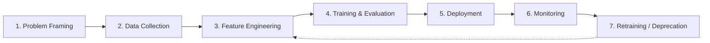

# The Seven-Stage ML Lifecycle

## Mental Model

Most ML projects move through seven key stages. Different companies may slice them differently, but these core stages appear almost everywhere. Understanding which stages are research-heavy vs production-heavy clarifies where model engineering focuses.

---

## Stage 1: Problem Framing

Before any models or pipelines, answer foundational questions:

- What decision or workflow are we improving?
- What metrics are we trying to move? (CTR, revenue, fraud loss, time saved, error rate)
- Is ML even the right tool, or would a heuristic suffice?
- How does this fit into the product? (recommendations, rankings, alerts)

**Good problem framing saves enormous time later** — it gives a clear target for every subsequent stage.

---

## Stage 2: Data Collection and Labelling

| Question | Why It Matters |
|----------|----------------|
| Where does data come from? | Logs, databases, third-party, sensors, user behavior |
| Do we have labels? | Ground truth vs manual labelling vs weak supervision |
| Is data representative? | Training distribution must match production |
| Privacy/compliance constraints? | GDPR, HIPAA, regional data residency |

Without the right data, even the best architecture fails.

---

## Stage 3: Feature Engineering

Turn raw data into signal the model can consume:

- Aggregations (counts, averages, time windows)
- Categorical encodings
- Text preprocessing, embeddings
- Image transformations

**Critical production concern — training-serving consistency:**

Features computed during training must match features computed during serving **exactly**. Divergence causes **training-serving skew** — one of the most common production ML bugs.

---

## Stage 4: Model Training and Evaluation

The stage most people associate with "ML":

- Train candidate models (baselines, classical, deep learning, fine-tuned LLMs)
- Evaluate with appropriate metrics (accuracy, F1, AUC, calibration, regression error)
- Use validation/test sets for honest performance estimates

**Key question:** Does this model move the **business metric** from Stage 1?

A model with great AUC that does not improve product outcomes is not a success.

| Stage | Primary Focus | Research vs Production |
|-------|---------------|------------------------|
| 1–4 | Discovery, experimentation | Research-heavy |
| 5–7 | Operation, evolution | Production-heavy (model engineering) |

---

## Common Pitfalls / Exam Traps

- Skipping problem framing and jumping to model selection — optimizes the wrong metric
- Training on non-representative data — great offline metrics, poor production performance
- Computing features differently in training vs serving — classic training-serving skew
- Celebrating AUC without checking business impact — offline metrics are necessary but not sufficient

---

## Quick Revision Summary

- Seven stages: framing → data → features → training → deployment → monitoring → retraining
- Stages 1–4 are research/exploration; 5–7 are production (model engineering focus)
- Problem framing defines success metrics before any code is written
- Feature consistency between training and serving prevents skew
- Offline metrics must connect to business/product outcomes
