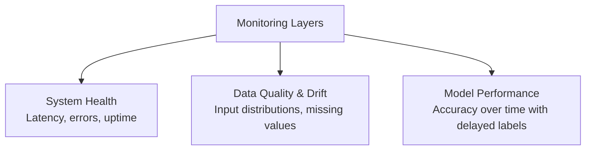
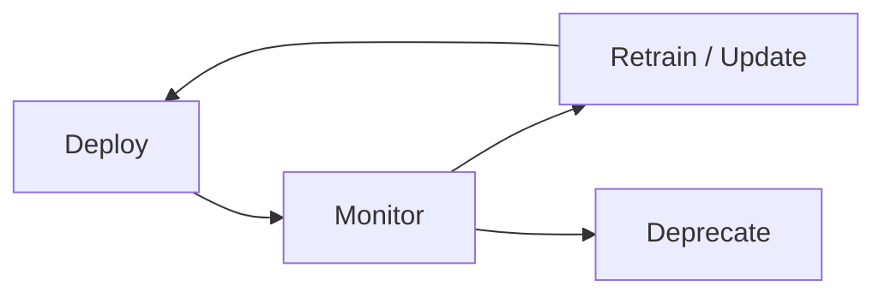

# Deployment, Monitoring, and Retraining: The Production Loop

Stages 5–7 of the ML lifecycle are where model engineering becomes central. These stages form a **continuous loop**, not a straight line.

---

## Stage 5: Deployment

Deployment means exposing a trained model so other systems can call it and integrating predictions into the product experience.

| Deployment Mode | Example Use Case |
|-----------------|------------------|
| **Online API** | Real-time fraud score, search ranking |
| **Batch job** | Nightly churn predictions written to a warehouse |

Once deployed, accuracy alone is insufficient. Engineers must also optimize:

- **Latency** — response time under load
- **Uptime and reliability** — availability targets
- **Cost** — compute at scale
- **Security** — safe operation with sensitive data

This is where much of the course's hands-on work focuses.

---

## Stage 6: Monitoring

Monitoring spans multiple layers:

| Layer | What to Watch |
|-------|---------------|
| **System health** | Within latency targets? Error rates spiking? Service up? |
| **Data quality / drift** | Input distributions changing? New categories? Unexpected patterns? |
| **Model performance** | With ground truth or delayed labels, are predictions still accurate? |

**Goal:** Catch issues before users notice degraded quality. Without monitoring, production ML systems **silently degrade**.

---

## Stage 7: Retraining and Deprecation

The world changes — user behavior shifts, markets evolve, products pivot. Models that do not update become stale.

| Action | When |
|--------|------|
| **Retrain** | Performance drops due to data drift; fresh data available |
| **Fine-tune** | Architecture still valid but needs adaptation |
| **Deprecate** | Use case no longer important; cost exceeds benefit |

---

## The Lifecycle Loop

After deployment, feedback flows from:

- User behavior
- Product metrics
- New or changed data

Successful ML systems result from **many small iterations** around this loop — not a single big launch.

**Model engineering spends most of its time in this deploy → monitor → retrain cycle.**

---

## Common Pitfalls / Exam Traps

- Treating deployment as a one-time event — it is the start of an ongoing loop
- Monitoring only system health (200 OK, latency) while ignoring data drift — silent quality degradation
- Never deprecating models — zombie models consume cost without delivering value
- Retraining without monitoring signals — wastes compute and may introduce regressions

---

## Quick Revision Summary

- Deployment: expose model via API or batch; integrate into product; balance latency, uptime, cost, security
- Monitoring: system health + data drift + model performance — catch issues early
- Retraining/deprecation: respond to drift; retire models when cost exceeds benefit
- Lifecycle is a loop: deploy → monitor → retrain → deploy again
- Model engineering lives primarily in stages 5–7
