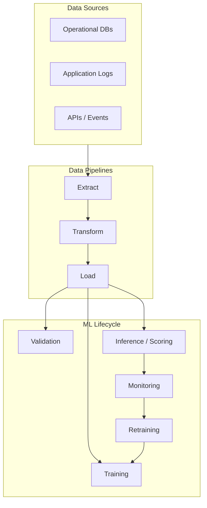

# Data Pipelines for Machine Learning: Module Introduction

## The Big Picture

Production machine learning is not only about model architecture, serving, monitoring, and retraining. Every stage depends on a layer beneath it: **data plumbing** — the automated systems that extract, transform, load, and deliver data to training, validation, and inference.

The governing principle is simple:

> **No data means no model. Bad data means a bad model** — regardless of how sophisticated the architecture.

---

## Why Data Engineering Matters for ML

A notebook workflow loads a static CSV, cleans it ad hoc, trains a model, and stops. Production requires:

- Data arriving on a **schedule** (daily, hourly) or **continuously** (per second)
- **Automated, repeatable** steps with no manual intervention
- **Observability** — logs, metrics, alerts when pipelines break
- **Lineage** — knowing which data version trained which model

Without reliable pipelines, monitoring has nothing to measure, retraining has nothing to learn from, and inference receives stale or wrong features.

---

## Three Ingestion Modes

This module introduces three ways to move data into ML systems:

| Mode | Pattern | Typical Latency | Best For |
|------|---------|-----------------|----------|
| **Batch** | Large chunks on a fixed schedule | Hours to a full day | Retraining, offline scoring, heavy aggregations |
| **Micro-batch** | Many small batches, frequent runs | 1–5 minutes | Near-real-time features without full streaming |
| **Streaming** | Continuous per-event processing | Sub-second to seconds | Fraud detection, live recommendations, dynamic pricing |

The choice depends on **latency requirements**, **complexity budget**, **infrastructure cost**, and **team expertise**. Most teams start with batch and escalate only when freshness demands it.

---

## Connection to the ML Lifecycle

Data pipelines feed at least three critical stages:

1. **Training** — historical labelled data builds and updates models
2. **Validation** — fresh or held-out data evaluates model quality
3. **Inference** — live features and predictions drive production decisions

| Failure Mode | Downstream Impact |
|--------------|-------------------|
| Late data | Training and batch scoring delayed; stale features in serving |
| Wrong data | Validation metrics lie; production decisions break silently |
| Missing data | Retraining triggers fire on empty sets; drift detection fails |

"Run the notebook again" is not a production strategy. Robust, scheduled data flow is the foundation.

---

## Module Roadmap

1. **Why ML needs pipelines** — notebook vs production contrast
2. **ETL and ELT** — classic data movement patterns adapted for ML
3. **Pipeline types** — batch, micro-batch, streaming and lifecycle links
4. **Streaming infrastructure** — events, topics, Kafka, Spark, Flink, Beam
5. **Data quality** — freshness, completeness, correctness, schema contracts
6. **Hands-on lab** — simulate daily data arrival, incremental ingestion, retraining hook

---

## Common Pitfalls / Exam Traps

- **Treating data pipelines as optional** — models cannot self-heal from upstream data failures; pipeline outages cascade into monitoring and retraining blindness.
- **Confusing ingestion mode with inference mode** — batch ingestion can still feed online APIs if features are precomputed; streaming ingestion is not required for every real-time use case.
- **Assuming good offline metrics imply good production data** — a pipeline that silently drops 30% of events will not crash code but will degrade model decisions.
- **One-size-fits-all freshness** — fraud features may need sub-minute freshness; churn models may tolerate daily batches. SLAs must be per use case.

---

## Quick Revision Summary

- Data pipelines are the **circulatory system** of production ML — they feed training, validation, inference, monitoring, and retraining.
- Core principle: **no data → no model; bad data → bad model**, regardless of model sophistication.
- Three ingestion modes: **batch** (scheduled large chunks), **micro-batch** (frequent small chunks), **streaming** (continuous events).
- Production pipelines must be **automated, repeatable, and observable** — notebooks are insufficient.
- Pipeline failures cause **delayed training**, **lying validation metrics**, and **broken production decisions**.
- Mode selection trades **latency vs complexity vs cost** — start simple, escalate when freshness requirements are clear.
- This module connects data plumbing to prior work on **serving, monitoring, feature stores, and retraining**.
