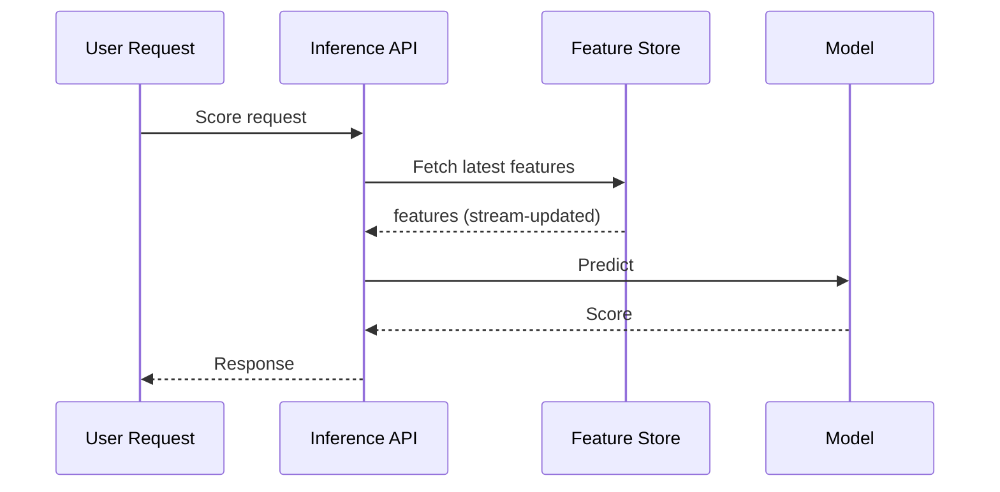
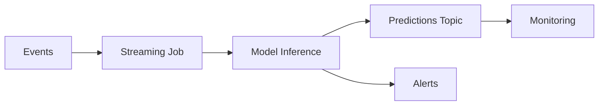
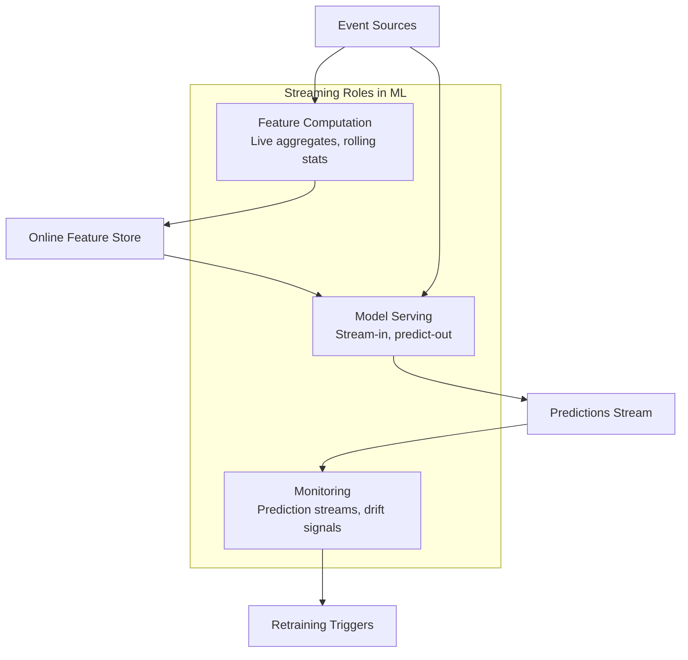
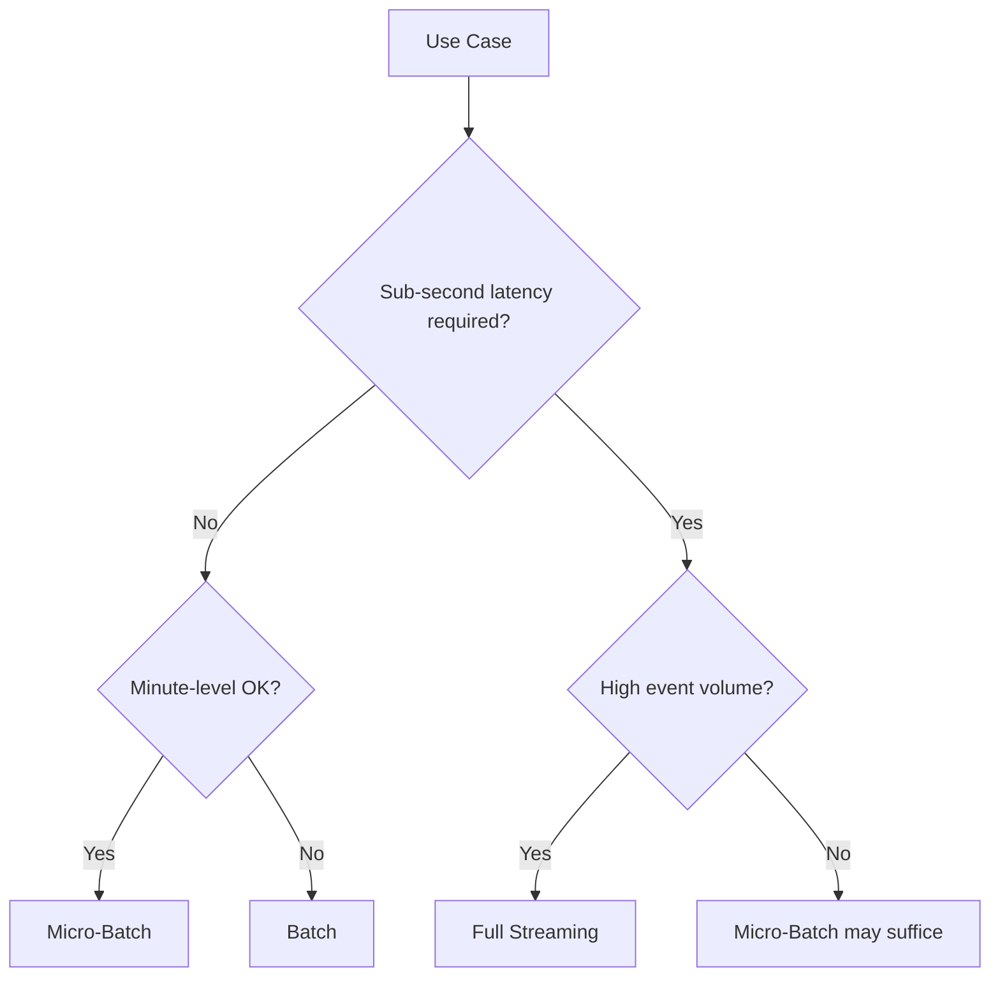

# Streaming Machine Learning: Use Cases and Architecture

## Where Streaming ML Shines

Streaming is not an end in itself — it earns its complexity when ML systems must **react within seconds** to evolving data.

| Use Case | Why Streaming | Latency Requirement |
|----------|---------------|---------------------|
| **Real-time anomaly detection** | Unusual traffic, suspicious transactions, system failures | Seconds |
| **Live recommendations** | React to clicks and views in active session | Seconds to minutes |
| **Dynamic pricing / bidding** | Respond to market data and demand signals | Sub-second to seconds |
| **Real-time fraud checks** | Block fraudulent transactions before settlement | Sub-second |
| **Observability / ML monitoring** | Stream predictions and metrics for live alerting | Seconds |

---

## Inference Patterns in Streaming ML

Streaming ML pairs with two inference architectures:

### 1. Online Inference (Request-Driven)

An API receives a request per prediction. Features may come from a streaming-computed feature store.

### 2. Streaming Inference (Event-Driven)

A streaming job consumes events, runs the model, and emits predictions or alerts directly on the stream — no per-request API call.

| Pattern | Trigger | Output | Example |
|---------|---------|--------|---------|
| Online inference | HTTP/gRPC request | Synchronous response | Fraud API per transaction |
| Streaming inference | Event arrival | Async prediction/alert | Anomaly alert on metric stream |

---

## Streaming Across the ML Lifecycle

Streaming is not limited to feature computation. It can touch multiple lifecycle stages:

| Lifecycle Stage | Streaming Contribution |
|-----------------|------------------------|
| **Feature computation** | Maintain live aggregates and latest values feeding online feature stores |
| **Model serving** | Streaming job consumes events, runs model, writes predictions to topic or store |
| **Monitoring** | Stream predictions, feature values, and eventual labels for real-time drift detection |
| **Retraining triggers** | Alert when prediction distributions shift, feeding automated retrain decisions |

---

## Micro-Batch vs Full Streaming: Decision Guide

| Criterion | Micro-Batch | Full Streaming |
|-----------|-------------|----------------|
| Freshness need | Minute-level (1–5 min) | Second or sub-second |
| Existing tooling | Batch tools (Spark, SQL) | Requires stream expertise |
| Event volume | Moderate | Very high |
| Feature type | Periodic refresh | Continuous per-event features |
| Complexity | Medium | High |
| Cost | Moderate | Higher (always-on) |

### Decision Rules

1. **Start with batch or micro-batch** — sufficient for most ML systems
2. **Move to full streaming when:**
   - Sub-second reaction is a hard requirement
   - Minute-level freshness is insufficient
   - Event volume overwhelms periodic batch windows
   - Continuous stateful features are needed (not periodic snapshots)

---

## Real-World Examples

### Fraud Detection (Streaming)

1. Payment events arrive on Kafka `transactions` topic
2. Flink job maintains per-user state: `spend_60s`, `txn_count_60s`, `geo_velocity`
3. Model scores each transaction within 100ms
4. High-risk transactions routed to alert topic; low-risk auto-approved

### Live E-commerce Recommendations (Micro-Batch or Streaming)

1. Click events stream to `click_events` topic
2. Job computes `recent_views_10m` per user
3. Feature store updated every 30 seconds (streaming) or 2 minutes (micro-batch)
4. Recommendation API reads fresh features at request time

### Model Monitoring (Streaming)

1. Prediction service logs every score to `predictions` topic
2. Streaming job computes rolling distribution statistics
3. Alert fires when prediction mean shifts beyond 3 standard deviations from baseline

---

## Common Pitfalls / Exam Traps

- **Adopting streaming without a latency requirement** — operational cost and complexity rarely justify streaming for daily-retrained models.
- **Confusing streaming features with streaming inference** — features can be stream-computed while inference remains request-driven (online API).
- **Ignoring eventual labels in monitoring streams** — prediction streams need ground-truth labels arriving later for performance measurement.
- **Assuming streaming solves training** — most model training still uses batch data; streaming feeds serving and monitoring, not typically the training loop directly.
- **Underestimating state management complexity** — rolling features require durable, fault-tolerant state backends.

---

## Quick Revision Summary

- Streaming ML excels at **anomaly detection, live recommendations, dynamic pricing, fraud, and real-time monitoring**.
- Two inference patterns: **online** (API per request) and **streaming** (event-driven, predict-on-stream).
- Streaming touches **features, serving, and monitoring** — not just one lifecycle stage.
- **Micro-batch** suffices for minute-level freshness; **full streaming** for sub-second requirements.
- Decision rule: **start simple** (batch/micro-batch), escalate to streaming only with clear latency or volume needs.
- Streaming can become the **backbone** for real-time data serving and monitoring in ML systems.
- Training typically remains **batch**; streaming primarily feeds inference and observability paths.
