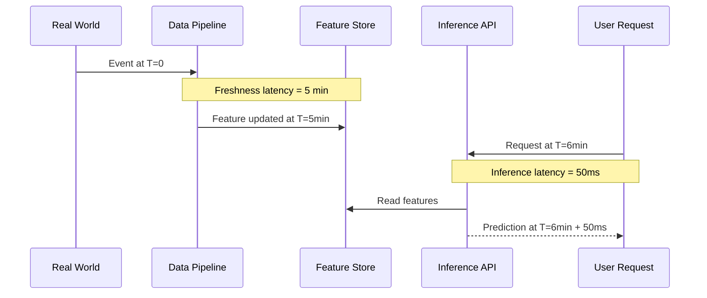
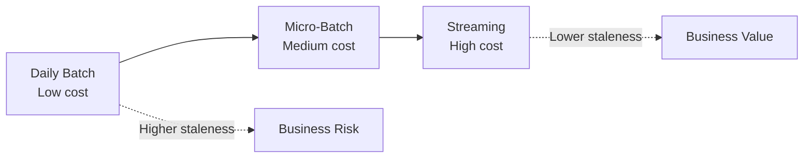

# Data Freshness and Latency in Real-Time ML

## Why Data Quality Matters in Real-Time Systems

Real-time ML systems rarely crash when data goes bad. They **quietly make worse decisions** — predictions based on stale features, missing events, or corrupted values degrade performance without obvious errors. Data quality must be reasoned about explicitly.

---

## Two Types of Latency

A critical distinction: **inference latency** and **data freshness latency** are independent dimensions.

| Type | Definition | Example |
|------|------------|---------|
| **Inference latency** | Time from receiving a request to returning a prediction | API responds in 50 ms |
| **Data freshness latency** | Time from a real-world event to that event appearing in features | Transaction at 10:00 AM visible in features at 10:05 AM (5-min micro-batch) |

### Why Both Matter

A **fast model on stale features** still produces bad decisions:

- Inference API responds in 20 ms — excellent
- Features reflect data from 2 hours ago — the model scores based on outdated behaviour
- Result: fraud missed, wrong recommendations served, incorrect risk classification

---

## Freshness SLAs

Good teams define **Service Level Agreements (SLAs) for features**, not just for prediction latency.

| Feature Category | Example SLA | Rationale |
|------------------|-------------|-----------|
| User profile features | Updated within 10 minutes | Slow-changing attributes; micro-batch sufficient |
| Fraud-related features | Include events from last 30 seconds | Sub-minute freshness critical for blocking fraud |
| Session features | Updated within 2 minutes | Active browsing context decays quickly |
| Aggregate statistics (30-day spend) | Updated daily | Historical window; batch is fine |

### Measuring Freshness

Monitor two metrics:

1. **Average lag** — mean time between an event's timestamp and its appearance in features
2. **SLA compliance rate** — percentage of features meeting the freshness target

$$\text{freshness\_lag} = t_{\text{feature\_updated}} - t_{\text{event\_occurred}}$$

$$\text{SLA compliance} = \frac{\text{features meeting SLA}}{\text{total features evaluated}} \times 100\%$$

---

## Freshness vs Cost Trade-off

Fresher data costs more:

| Freshness Target | Typical Mode | Relative Cost |
|------------------|--------------|---------------|
| Daily | Batch | Low |
| 1–5 minutes | Micro-batch | Medium |
| Sub-second | Streaming | High |

**Choose SLA per use case, not one-size-fits-all.** A churn model tolerates daily features; a fraud model does not.

---

## Freshness in Different Ingestion Modes

| Mode | Typical Freshness Lag | SLA Achievable |
|------|----------------------|----------------|
| Batch (daily) | Up to 24 hours | Daily refresh features |
| Batch (hourly) | Up to 1 hour | Hourly dashboards |
| Micro-batch (5 min) | Up to 5 minutes | Session features, periodic risk scores |
| Streaming | Sub-second to seconds | Fraud, live personalisation |

---

## Designing for Freshness

### 1. Define Requirements Per Feature

Not every feature needs sub-second freshness. Classify features:

| Tier | Freshness | Examples |
|------|-----------|----------|
| **Tier 1: Real-time** | < 30 seconds | Fraud signals, live bidding features |
| **Tier 2: Near-real-time** | 1–5 minutes | Session features, active user metrics |
| **Tier 3: Periodic** | Hourly to daily | Aggregate statistics, profile attributes |

### 2. Match Ingestion Mode to Tier

- Tier 1 → streaming
- Tier 2 → micro-batch
- Tier 3 → batch

### 3. Monitor and Alert

- Track freshness lag per feature
- Alert when SLA compliance drops below threshold (e.g., 95%)
- Correlate freshness degradation with model performance drops

---

## Real-World Example: Payment Fraud System

| Component | Freshness SLA | Implementation |
|-----------|---------------|----------------|
| `spend_last_60s` | 30 seconds | Flink streaming job |
| `failed_logins_24h` | 5 minutes | Micro-batch job |
| `customer_tenure_days` | Daily | Batch job |
| Inference API latency | 50 ms | Optimised model serving |

The fraud model's decision quality depends on **all four** being within SLA — not just the API response time.

---

## Common Pitfalls / Exam Traps

- **Optimising inference latency while ignoring freshness** — a 10 ms API on 2-hour-old features is worse than a 100 ms API on 30-second-old features for fraud.
- **One global freshness SLA** — different features have different decay rates; uniform SLAs waste money or miss risks.
- **Measuring processing time instead of event-to-feature lag** — job duration ≠ freshness; what matters is when the real-world event becomes visible in features.
- **Assuming batch features are always stale** — a daily batch run at 6 AM may be perfectly fresh for features that only change daily (e.g., `account_age_days`).
- **No freshness monitoring** — without measurement, staleness is discovered only when business metrics degrade.

---

## Quick Revision Summary

- Real-time ML systems **fail quietly** with bad data — they do not crash, they make worse decisions.
- **Inference latency** (request → prediction) and **data freshness latency** (event → feature) are **independent** — both must be managed.
- Define **freshness SLAs per feature category**, not just prediction latency SLAs.
- Measure: **average event-to-feature lag** and **SLA compliance percentage**.
- Fresher data costs more — choose SLAs **per use case**, not one-size-fits-all.
- Match ingestion mode to freshness tier: streaming (< 30s), micro-batch (1–5 min), batch (hourly/daily).
- A fast model on **stale features** produces unreliable production decisions.
- Freshness monitoring is as critical as model performance monitoring.
