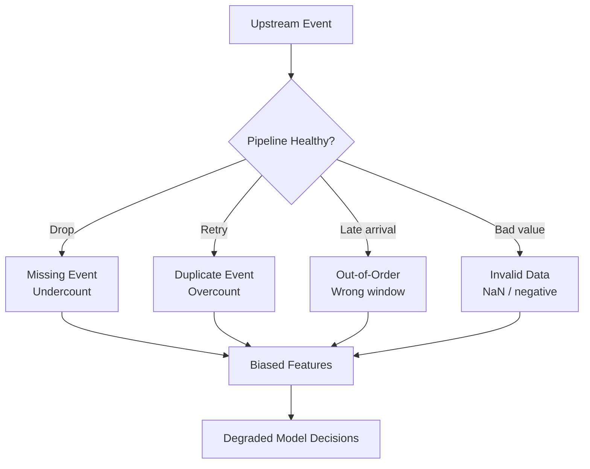
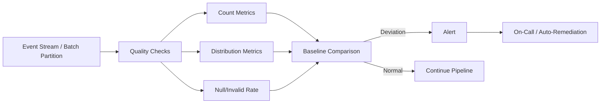

# Data Completeness and Correctness for ML Pipelines

## Beyond Freshness: The Other Dimensions

Freshness is one dimension of data quality. **Completeness** (is all expected data present?) and **correctness** (is the data valid and accurate?) are equally critical. Issues in these dimensions rarely crash code — they silently bias features and degrade model performance.

---

## What Can Go Wrong

| Issue | Cause | Impact on ML |
|-------|-------|--------------|
| **Missing events** | Upstream system drops messages, pipeline failure, network partition | Features undercount activity; model sees inactive users as inactive |
| **Duplicates** | Retries, at-least-once delivery semantics | Features overcount; inflated spend, click counts |
| **Out-of-order events** | Network delays, distributed clocks, late arrivals | Windowed features miss or double-count events |
| **Invalid values** | Schema violations, upstream bugs | `NaN`, negative amounts, impossible categories poison training and inference |



---

## Delivery Semantics and Duplicates

Streaming systems typically guarantee **at-least-once delivery** — events may be delivered more than once but never lost. This is a deliberate trade-off for reliability.

| Semantics | Guarantee | Duplicate Risk | Missing Risk |
|-----------|-----------|----------------|--------------|
| **At-most-once** | No duplicates | None | Events may be lost |
| **At-least-once** | No loss (with retries) | Duplicates possible | None (with acks) |
| **Exactly-once** | Neither loss nor duplication | None (with overhead) | None |

For ML features, at-least-once delivery means **deduplication logic is mandatory** — typically using event IDs or idempotent aggregation.

---

## Simple Monitoring Without a Heavy Framework

You do not need an enterprise data quality platform to start. Per-window checks catch most issues:

### 1. Event Count Monitoring

For each time window (5 minutes, 1 hour):

- **Total event count** — watch for sudden drops or spikes
- **Count per key** — events per user, per topic, per source

```
Alert: event_count < 0.5 × historical_baseline  →  possible pipeline failure
Alert: event_count > 3.0 × historical_baseline  →  possible duplicate storm
```

### 2. Distribution Monitoring

Track distributions of important fields against historical baselines:

| Metric | What to Watch |
|--------|---------------|
| Mean / std of numeric fields | Sudden shift in `amount`, `duration` |
| Min / max | Impossible values (negative amounts) |
| Category frequencies | New unexpected categories, missing expected ones |

### 3. Null and Invalid Rate

For key fields, measure:

$$\text{null\_rate} = \frac{\text{records with null/invalid value}}{\text{total records}}$$

Alert when null rate exceeds historical baseline by a threshold (e.g., 2×).

---

## Monitoring Architecture



---

## Correctness Checks by Data Type

| Field Type | Check | Example |
|------------|-------|---------|
| Numeric | Range, non-negative | `amount >= 0`, `age in [0, 150]` |
| Categorical | Allowed values set | `status in {active, inactive, churned}` |
| Timestamp | Not in future, not too old | `event_time <= now()`, `event_time > now() - 90d` |
| ID fields | Non-null, format match | `user_id` matches UUID pattern |
| Cross-field | Logical consistency | `refund_amount <= original_amount` |

---

## Impact on ML: Silent Degradation

Unlike a code crash (immediate, visible), data quality issues cause **silent degradation**:

| Issue | Symptom | Detection Difficulty |
|-------|---------|---------------------|
| 30% events dropped | Features undercount; model underestimates activity | Hard — no error logs |
| Duplicate storm | Features overcount; inflated risk scores | Medium — count spikes visible if monitored |
| Schema change (string → int) | Type coercion produces garbage values | Hard — pipeline may not crash |
| Stale categories | New product categories mapped to `unknown` | Very hard — gradual accuracy decline |

This is why **proactive monitoring** with baselines is essential — waiting for model metrics to degrade means the damage has already propagated.

---

## Windowed Check Example

For a 5-minute micro-batch fraud pipeline:

```python
# Pseudocode: per-window quality checks
window_stats = {
    "event_count": len(events),
    "null_user_id_rate": count_null(events, "user_id") / len(events),
    "negative_amount_count": count_where(events, "amount < 0"),
    "mean_amount": mean(events, "amount"),
}

# Compare against rolling 7-day baseline
if window_stats["event_count"] < 0.5 * baseline["event_count"]:
    alert("EVENT_COUNT_DROP", window_stats)

if window_stats["null_user_id_rate"] > 2.0 * baseline["null_user_id_rate"]:
    alert("NULL_RATE_SPIKE", window_stats)
```

---

## Common Pitfalls / Exam Traps

- **Assuming pipeline success means data correctness** — a job completing without error does not guarantee all events were processed correctly.
- **Ignoring at-least-once duplicates** — without deduplication, retry semantics inflate feature counts silently.
- **No baseline for comparison** — absolute thresholds (e.g., "alert if count < 100") fail at scale; relative baselines adapt to growth.
- **Checking only total counts, not per-key counts** — a global count can look normal while a specific user's events are entirely missing.
- **Treating data quality as a one-time validation** — distributions shift over time; monitoring must be continuous.

---

## Quick Revision Summary

- Data quality has three dimensions: **freshness**, **completeness**, and **correctness**.
- Common issues: **missing events**, **duplicates** (at-least-once delivery), **out-of-order arrivals**, **invalid values**.
- Issues cause **silent feature bias** — code does not crash, model performance degrades.
- Simple per-window checks: **event counts**, **field distributions**, **null/invalid rates**.
- Compare metrics against **historical baselines** and alert on significant deviation.
- **Deduplication** is mandatory under at-least-once delivery semantics.
- Proactive monitoring catches issues **before** they poison the ML pipeline.
- Data quality monitoring is a lightweight starting point — no enterprise framework required initially.
