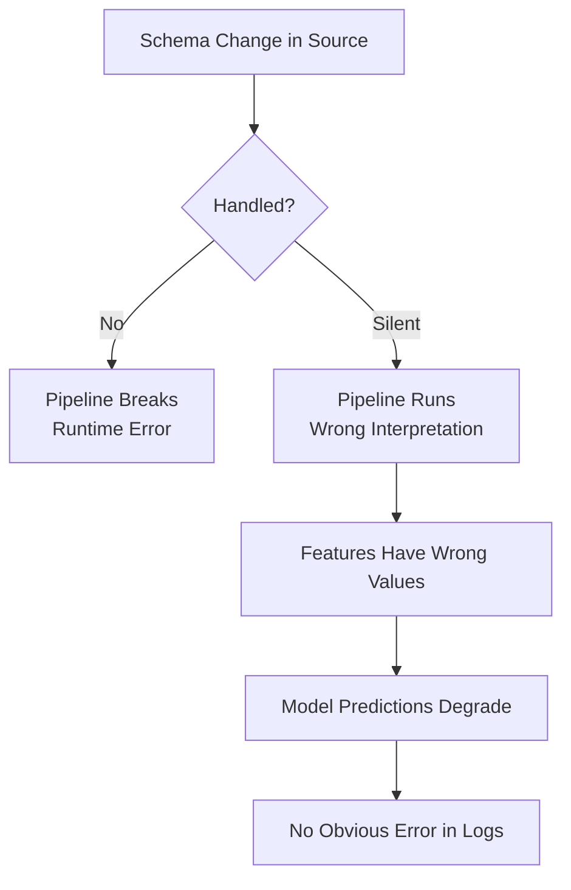
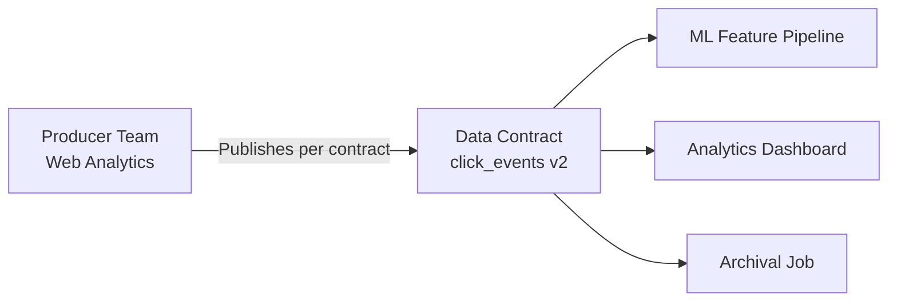
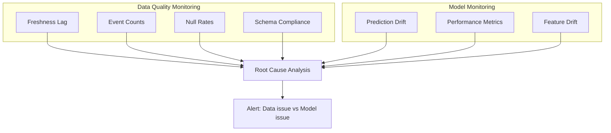

# Schema Evolution and Data Contracts

## The Schema Challenge

In production systems, data structure **changes over time** — by design and by accident:

| Change Type | Example | Risk |
|-------------|---------|------|
| **Field added** | New `device_type` column in click events | Downstream may ignore it (low risk) or fail if strict |
| **Field removed** | `legacy_id` column deprecated | Downstream jobs break or see nulls |
| **Field renamed** | `user_id` → `customer_id` | Silent misinterpretation if not coordinated |
| **Type changed** | `amount` from `integer` to `float` | Coercion errors or precision loss |

Without careful handling, downstream jobs either **crash at runtime** or worse — **keep running but silently misinterpret data**.

For ML, schema drift means the model sees a **different input shape or semantics** than it was trained on.

---

## Impact on Machine Learning

| Schema Change | ML Impact |
|---------------|-----------|
| New optional field | Usually safe if ignored |
| Removed field | Feature becomes null/default; model trained on non-null distribution |
| Renamed field | Feature computation uses wrong column or null |
| Type change | Values coerced incorrectly; `NaN` propagation |
| Semantic change | Same field name, different meaning — worst case |

---

## Data Contracts

A **data contract** is an explicit agreement between a **data producer** and **data consumer** defining:

| Contract Element | Description |
|------------------|-------------|
| **Fields** | Which fields exist and their names |
| **Types** | Expected data types (`string`, `int64`, `float64`, `timestamp`) |
| **Allowed values** | Enumerations, ranges, constraints |
| **Change policy** | How schema changes are rolled out |
| **Backward compatibility rules** | What changes are permitted without consumer coordination |

---

## Backward Compatibility Practices

| Practice | Description | Example |
|----------|-------------|---------|
| **Add fields as optional** | New fields have defaults; old consumers unaffected | Add `device_type` with default `"unknown"` |
| **Never remove without coordination** | Deprecation period, consumer migration | Mark `legacy_id` deprecated for 90 days before removal |
| **Never rename without alias** | Old name remains as alias during transition | `customer_id` added; `user_id` still populated for 2 releases |
| **Version topics/schemas** | New version for breaking changes | `click_events_v1` → `click_events_v2` |
| **Schema registry validation** | Enforce contract at publish time | Reject events violating schema at producer |

### Breaking vs Non-Breaking Changes

| Change | Breaking? | Safe Approach |
|--------|-----------|---------------|
| Add optional field with default | No | Deploy directly |
| Add required field | **Yes** | New schema version; migrate consumers |
| Remove field | **Yes** | Deprecation period + consumer update |
| Rename field | **Yes** | Dual-publish both names during transition |
| Widen type (`int` → `float`) | Usually no | Document precision change |
| Narrow type (`float` → `int`) | **Yes** | New schema version |

---

## Schema Registries

Tools like **Confluent Schema Registry**, **AWS Glue Schema Registry**, or **Protobuf/Avro** schemas enforce contracts at the transport layer:

1. Producer registers schema before publishing
2. Registry validates each event against registered schema
3. Consumer reads schema ID alongside data for deserialization
4. Incompatible changes are **rejected at publish time**, not discovered at training time

---

## Data Quality Monitoring vs Model Monitoring

Schema issues are one input to a broader monitoring strategy. Two complementary halves:

| Dimension | Data Quality Monitoring | Model Monitoring |
|-----------|------------------------|------------------|
| **Focus** | Freshness, completeness, schema, raw value distributions | Prediction distributions, drift, performance metrics |
| **Example alerts** | "Event counts dropped 50% on topic X" | "Prediction drift detected on segment Y" |
| | "Null rate spiked for feature Z" | "AUC dropped 5% on recent data" |
| | "Schema version mismatch detected" | "Feature importance shifted significantly" |
| **Root cause role** | Identifies upstream data problems | Identifies model-level problems |

**Looking at both together** helps quickly find root cause and avoid blaming the model when the real issue is upstream data.

---

## ML-Specific Contract Considerations

| Concern | Contract Requirement |
|---------|---------------------|
| Training feature schema | Frozen schema version per model artifact |
| Serving feature schema | Must match training schema exactly |
| Label schema | Field name, type, and semantics documented |
| Point-in-time correctness | Timestamp fields defined consistently |
| Null handling | Explicit default values documented |

A model trained on schema `v3` must be served with schema `v3` features. Deploying schema `v4` features to a `v3` model without retraining is a production incident.

---

## Common Pitfalls / Exam Traps

- **Treating schema changes as backward-compatible by default** — adding a required field breaks all existing consumers.
- **No contract between producer and ML team** — ML discovers schema changes when training jobs fail or metrics degrade.
- **Renaming without dual-publish** — a renamed field silently becomes null in feature computation.
- **Blaming model drift for schema-caused degradation** — prediction distribution shifts may be caused by a new field defaulting to zero, not model ageing.
- **No schema version pinned to model artifact** — cannot reproduce training or debug serving mismatches without knowing which schema version was used.

---

## Quick Revision Summary

- **Schema evolution** is inevitable — fields are added, removed, renamed, and retyped over time.
- Unhandled changes cause **runtime crashes** or **silent misinterpretation** — both harm ML systems.
- **Data contracts** define fields, types, allowed values, and change policies between producers and consumers.
- **Backward-compatible changes**: add optional fields with defaults; avoid breaking removals/renames without coordination.
- **Schema registries** enforce contracts at publish time, preventing bad data from entering the pipeline.
- **Data quality monitoring** (freshness, counts, schema) and **model monitoring** (drift, performance) are complementary halves of ML safety.
- ML models must be tied to a **specific schema version** — serving with a different schema causes silent degradation.
- Root cause analysis requires checking **both** data quality and model monitoring signals.
