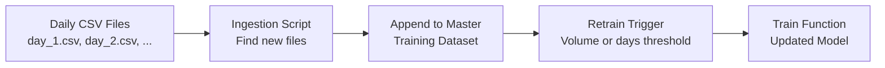
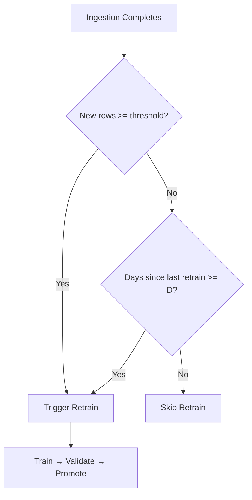

# Applying Data Quality Concepts in Practice

## From Theory to a Concrete Pipeline

Data quality concepts — freshness, completeness, correctness, schema contracts — become tangible when applied to a simple but realistic batch pipeline. A lab-style simulation demonstrates the full data-to-train flow without requiring production streaming infrastructure.

---

## Lab Architecture: Batch-Style Simulation



### Components

| Component | Purpose |
|-----------|---------|
| **Daily CSV simulator** | Mimics new data arriving each day (`day_1.csv`, `day_2.csv`, ...) |
| **Ingestion script** | Finds unprocessed day files, appends to master training dataset |
| **Retrain trigger** | Fires based on data volume threshold or days since last retrain |
| **Training function** | Consumes updated master dataset to produce a new model |

Even in this simple setup, core production concerns emerge: freshness, completeness, lineage, and idempotency.

---

## Applying Freshness Concepts

### What "Fresh" Means in a Batch Lab

| Concept | Batch Lab Interpretation |
|---------|--------------------------|
| Freshness SLA | "Training data must include events through yesterday" |
| Freshness lag | Days between latest event in master dataset and today |
| SLA violation | Ingestion script has not run; master dataset is $N$ days behind |

### Monitoring Freshness

```python
# Pseudocode: check training data freshness
latest_date = master_df["timestamp"].max()
lag_days = (today - latest_date).days
if lag_days > FRESHNESS_SLA_DAYS:
    alert(f"Training data is {lag_days} days stale")
```

In production, the same pattern applies at finer granularity — minutes for fraud features, days for churn models.

---

## Applying Completeness and Correctness

### Ingestion-Time Checks

Before appending new daily data, validate:

| Check | Action on Failure |
|-------|-------------------|
| File exists and is non-empty | Skip with alert; do not update state |
| Expected columns present | Reject file; alert schema violation |
| Row count within baseline range | Alert if count is $< 0.5 \times$ or $> 3 \times$ historical average |
| No null values in key fields (`customer_id`, `label`) | Quarantine rows or reject file |
| Label values in allowed set | Reject invalid labels |

### Logging for Lineage

Every ingestion run should log:

- Which files were ingested
- Row counts per file
- Timestamp of ingestion
- Resulting master dataset size
- Any quality check failures

This creates a basic **audit trail** — essential for debugging "why did the model train on wrong data?"

---

## Applying Schema Contracts

Even with CSV files, a contract applies:

| Field | Type | Constraints |
|-------|------|-------------|
| `timestamp` | datetime | Not null, not in future |
| `customer_id` | int | Not null, $> 0$ |
| `amount` | float | $\geq 0$ |
| `label` | int | $\in \{0, 1\}$ |

If `day_3.csv` arrives with a renamed column (`customer_id` → `cust_id`), the ingestion script should **reject** it rather than silently produce null `customer_id` values.

---

## Retrain Trigger Design

Two common trigger strategies:

| Trigger | Condition | Use Case |
|---------|-----------|----------|
| **Volume-based** | Retrain when master dataset grows by $N$ new rows | Growing datasets with steady daily volume |
| **Time-based** | Retrain every $D$ days since last retrain | Periodic refresh regardless of volume |
| **Hybrid** | Retrain when volume $\geq N$ OR days $\geq D$ | Balances responsiveness and cost |



---

## Data Quality + Model Monitoring Together

| Signal | Source | Indicates |
|--------|--------|-----------|
| Event count dropped | Data quality monitoring | Upstream pipeline failure |
| Null rate spiked | Data quality monitoring | Schema change or source bug |
| Prediction drift | Model monitoring | Possible data issue OR true concept drift |
| AUC dropped on recent data | Model monitoring | Investigate data quality first |

**Investigation order:** When model metrics degrade, check data quality signals first. Most "model drift" in production is actually **data pipeline failure**.

---

## End-to-End Safety Checklist

| Stage | Quality Gate |
|-------|-------------|
| **Data arrival** | File/partition exists; within expected schedule |
| **Ingestion** | Schema validation, row count check, null check |
| **Master dataset** | Freshness within SLA; lineage logged |
| **Retrain trigger** | Sufficient new data; not retraining on corrupted batch |
| **Training** | Feature distributions match historical baseline |
| **Deployment** | Model schema version matches serving feature schema |

---

## Common Pitfalls / Exam Traps

- **Skipping quality checks in "simple" lab pipelines** — bad habits in labs become production incidents; validate from day one.
- **Retraining on corrupted data** — if a bad file is ingested, retrain trigger fires on poisoned data; quarantine before append.
- **No ingestion logging** — without lineage, debugging "which data trained model v3.2?" is impossible.
- **Triggering retrain without checking data quality** — volume threshold met but data is 50% null; model retrains on garbage.
- **Treating lab simulation as trivial** — the patterns (incremental ingestion, state, idempotency, quality gates) are identical to production at scale.

---

## Quick Revision Summary

- Apply data quality concepts to a **concrete batch pipeline**: daily CSV → ingestion → master dataset → retrain trigger.
- **Freshness** in batch context: how many days behind is the training data?
- **Completeness/correctness** at ingestion: row counts, null checks, schema validation before append.
- **Log every ingestion** for lineage — which files, row counts, timestamps.
- **Schema contracts** apply even to CSV files — reject incompatible files, do not silently accept.
- **Retrain triggers**: volume-based, time-based, or hybrid — always gate on data quality first.
- **Data quality monitoring + model monitoring** together enable fast root cause analysis.
- Investigation order: **check data first**, then model, when performance degrades.
- Simple lab patterns mirror production patterns — incremental ingestion, state, idempotency, quality gates.
