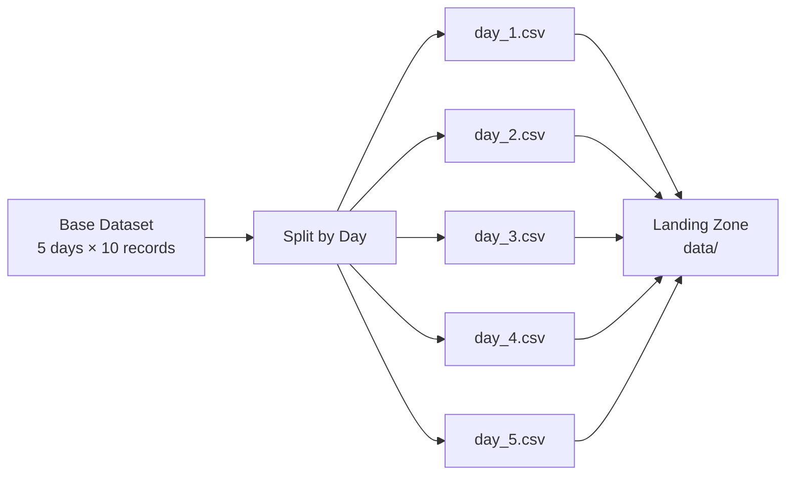

# Simulating Daily Data Arrival for Pipeline Development

## Why Simulate Data Arrival?

Building and testing data pipelines before touching live production requires a **predictable, repeatable source of new data**. A daily-file simulator mimics the production pattern where fresh data arrives on a schedule — without depending on real event streams or production databases.

**Core insight:** Pipeline development should not wait for production data. Simulate the arrival pattern first, then build ingestion logic against the simulation.

---

## The Daily Arrival Pattern

In production, data commonly arrives as **time-partitioned files**:

```
data/
  day_1.csv   ← arrives end of day 1
  day_2.csv   ← arrives end of day 2
  day_3.csv   ← arrives end of day 3
  ...
```

Each file contains events for exactly one day. An ingestion pipeline scans for new files, processes them, and appends to a master dataset.



---

## Step 1: Generate Base Dataset

### Reproducibility with Fixed Random Seed

Use a fixed random seed (`numpy.random.default_rng(seed=42)`) to ensure **identical data on every run**. Reproducibility is essential for:

- Debugging pipeline logic
- Consistent test assertions
- Comparing pipeline versions against the same input

### Data Shape

| Parameter | Value | Rationale |
|-----------|-------|-----------|
| Days | 5 | Enough to test multi-day ingestion |
| Records per day | 10 | Small enough for inspection, large enough for aggregation |
| Total records | 50 | Manageable for lab exercises |

### Record Schema

Each record is a dictionary representing an event:

| Field | Type | Generation Logic |
|-------|------|------------------|
| `day` | int | Day index (1–5) |
| `timestamp` | datetime | Base day + random minutes (simulates events throughout the day) |
| `customer_id` | int | Random customer identifier |
| `amount` | float | Random transaction amount (feature column) |
| `label` | int | Random binary label (target column) |

This mimics event data a real model would train on: entity ID, numeric features, timestamp, and a label.

### Timestamp Realism

Timestamps are not all identical — each event gets the base day plus a random number of minutes (0–1440), simulating events distributed throughout the day. This matters for time-window feature engineering later.

---

## Step 2: Split into Daily CSV Files

### GroupBy Pattern

Use pandas `groupby("day")` to iterate over unique day values, producing one mini-DataFrame per day:

```python
for day, group in df.groupby("day"):
    filepath = f"data/day_{day}.csv"
    group.to_csv(filepath, index=False)
```

| Design Choice | Reason |
|---------------|--------|
| `index=False` | Do not write DataFrame row index to CSV — cleaner files |
| One file per day | Matches production partition pattern (`events/YYYY/MM/DD/`) |
| Deterministic naming (`day_1.csv`) | Ingestion script can parse day number for incremental logic |

---

## Landing Zone Structure

After running the simulator:

```
lab10/
  data/
    day_1.csv   (10 rows)
    day_2.csv   (10 rows)
    day_3.csv   (10 rows)
    day_4.csv   (10 rows)
    day_5.csv   (10 rows)
  artifacts/    (created by ingestion script)
```

Each CSV contains columns: `day`, `timestamp`, `customer_id`, `amount`, `label`.

---

## What This Simulation Enables

| Capability | How Simulation Helps |
|------------|---------------------|
| Test incremental ingestion | Run ingestion after day 1, then add day 2, verify only day 2 is processed |
| Test idempotency | Run ingestion twice; verify no duplicate rows |
| Test state management | Verify `ingest_state.json` tracks last processed day |
| Test retrain triggers | Append days incrementally; trigger retrain at threshold |
| Test quality checks | Inject a bad file (wrong schema) and verify rejection |

---

## Production Parallels

| Lab Pattern | Production Equivalent |
|-------------|----------------------|
| `day_N.csv` files | S3 partitions `s3://bucket/events/dt=2024-09-01/` |
| Landing zone `data/` | S3 landing bucket, HDFS `/raw/events/` |
| Fixed seed reproducibility | Staging environment with snapshot data |
| 10 records/day | Millions of records/day (same pattern, different scale) |
| `groupby("day")` | Spark partition discovery or Airflow sensors |

---

## Extending the Simulator

| Extension | Purpose |
|-----------|---------|
| Add more days dynamically | Test pipeline over longer time horizons |
| Inject schema violations in `day_4.csv` | Test data contract enforcement |
| Add duplicate rows | Test deduplication logic |
| Vary record count per day | Test count-based anomaly detection |
| Add new columns mid-simulation | Test schema evolution handling |

---

## Common Pitfalls / Exam Traps

- **No fixed random seed** — non-reproducible data makes debugging ingestion failures nearly impossible.
- **Writing DataFrame index to CSV** — causes extra unnamed column that breaks downstream schema expectations.
- **All timestamps identical** — unrealistic; time-window features cannot be tested meaningfully.
- **Generating all data upfront without daily split** — misses the incremental arrival pattern that production pipelines must handle.
- **Assuming simulation is only for labs** — staging environments in production use the same pattern with snapshot data before go-live.

---

## Quick Revision Summary

- **Simulate daily data arrival** before building ingestion pipelines — predictable, repeatable test data.
- Generate base dataset with **fixed random seed** for reproducibility across runs.
- Schema: `day`, `timestamp`, `customer_id`, `amount`, `label` — mimics real event/training data.
- **Split by day** using `groupby` → one CSV per day in a landing zone.
- Realistic timestamps: base day + random minutes throughout the day.
- Pattern mirrors production: **time-partitioned files** arriving on schedule.
- Enables testing: **incremental ingestion, idempotency, state management, retrain triggers, quality checks**.
- Staging environments in production use the **same simulation pattern** at larger scale.
