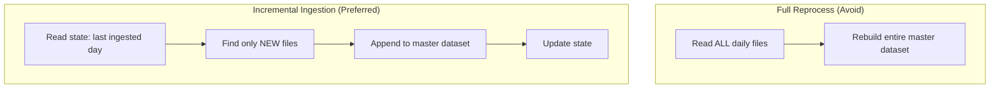
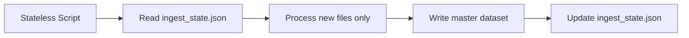

# Incremental Ingestion: State Management and Idempotency

## Full Reprocess vs Incremental Ingestion

When new daily data arrives, two approaches exist:

| Approach | Description | Scalability |
|----------|-------------|-------------|
| **Full reprocess** | Delete master dataset; rebuild from all daily files | Poor — re-reads years of data for one new day |
| **Incremental ingestion** | Process only new files; append to master dataset | Good — scales linearly with new data volume |

For production ML pipelines, **incremental ingestion is the standard pattern**. Re-reading terabytes to add one day's partition is economically and operationally unsustainable.



---

## State Management: The Pipeline's Memory

The most important concept in incremental pipelines is **state management** — the pipeline must know what it has already processed.

### State File Pattern

A simple but effective approach: a JSON state file (`ingest_state.json`) tracking progress:

```json
{
  "last_ingested_day": 3
}
```

| Property | Benefit |
|----------|---------|
| **Persistent** | Survives script restarts, machine changes |
| **Externalised** | Script itself remains stateless |
| **Simple** | No database required for lab/small-scale pipelines |

### Stateless Script, Stateful Artifact

By externalising state to a file, the Python script is **stateless**:

- Stop and restart the script — it resumes from state file
- Run on a different machine — copy state file, same behaviour
- Run twice — idempotent (see below)



---

## Incremental Ingestion Logic

### Step-by-Step Flow

| Step | Action |
|------|--------|
| 1 | Load `last_ingested_day` from state file (default: 0 if first run) |
| 2 | Scan landing zone for all `day_N.csv` files |
| 3 | Filter: keep only files where $N > \text{last\_ingested\_day}$ |
| 4 | If no new files → log "no new data" and exit |
| 5 | Load existing `master_training_data.csv` (or empty DataFrame if first run) |
| 6 | For each new file: read CSV, optionally validate, append via `pd.concat` |
| 7 | Save updated master CSV |
| 8 | Update state: `last_ingested_day = max(new days)` |
| 9 | Write state file |

### Example Execution

**First run** (state = 0):

```
Found 5 new files: day_1.csv through day_5.csv
Ingested 50 rows total
Updated state: last_ingested_day = 5
```

**Second run** (state = 5):

```
No new data files to ingest
State unchanged: last_ingested_day = 5
```

---

## Idempotency

**Idempotency:** Running the same operation multiple times has the same effect as running it once.

| Run | New Files Found | Action | Master Dataset |
|-----|-----------------|--------|----------------|
| 1st | day_1 – day_5 | Append 50 rows | 50 rows |
| 2nd | None | No-op | 50 rows (unchanged) |
| 3rd | None | No-op | 50 rows (unchanged) |

Idempotency is **vital for reliable scheduled pipelines**:

- Cron job runs twice due to retry → no duplicate data
- Network blip causes re-trigger → safe to re-run
- Manual re-run for debugging → no corruption

### Critical Ordering: State Update After Success

The state file must be updated **only after** the master dataset is successfully saved:

```
WRONG:  Update state → Save master (crash between = data loss)
RIGHT:  Save master → Update state (crash between = safe re-run)
```

If the script crashes after saving master but before updating state, the next run re-processes the same files. With idempotent append logic (or deduplication), this is safe. If state is updated before save, data is permanently lost.

---

## Directory Structure

```
lab10/
  data/                          ← Landing zone (input)
    day_1.csv ... day_5.csv
  artifacts/                     ← Pipeline outputs
    master_training_data.csv     ← Accumulated training data
    ingest_state.json            ← Pipeline state
```

---

## Quality Checks at Ingestion Time

Before appending each new file, optionally validate:

| Check | Purpose |
|-------|---------|
| Non-empty file | Catch upstream failures producing empty partitions |
| Expected columns | Detect schema changes early |
| Row count vs baseline | Detect missing or duplicate data |
| Null rate in key fields | Catch data corruption |

Failed files should be **quarantined**, not appended, with an alert logged.

---

## Scaling the Pattern

| Scale | State Storage | File Discovery |
|-------|---------------|----------------|
| Lab (5 days) | JSON file | Glob `day_*.csv` |
| Medium (years of daily files) | Database row or orchestrator variable | Partition metadata table |
| Large (streaming + batch) | Watermark in stream processor | Kafka offset or Spark checkpoint |

The pattern is identical; only the storage and discovery mechanisms change.

---

## Comparison: Full vs Incremental

| Dimension | Full Reprocess | Incremental |
|-----------|----------------|-------------|
| Data read per run | All historical data | Only new data |
| Compute cost | $O(\text{all data})$ | $O(\text{new data})$ |
| State required | None | Yes (watermark/checkpoint) |
| Failure recovery | Re-run entire job | Resume from last state |
| Complexity | Low | Moderate |
| Production suitability | Small datasets only | Standard for ML pipelines |

---

## Common Pitfalls / Exam Traps

- **Updating state before saving master dataset** — crash between state update and save causes permanent data loss.
- **No state file** — pipeline re-processes all files on every run; duplicates accumulate or compute is wasted.
- **Non-idempotent append** — running twice without state check doubles the data in master dataset.
- **Hardcoded file list instead of dynamic scan** — pipeline cannot discover new days automatically.
- **Assuming full reprocess scales** — acceptable for 50 rows in a lab; catastrophic for terabyte-scale production data.
- **State stored in script memory** — restart loses progress; state must be externalised.

---

## Quick Revision Summary

- **Incremental ingestion** processes only new files and appends to master dataset — the production standard.
- **Full reprocess** does not scale; avoid for any dataset beyond trivial size.
- **State management** via externalised state file (`ingest_state.json`) tracks `last_ingested_day`.
- Script is **stateless**; state lives in persistent artifact — survives restarts and machine changes.
- Flow: load state → scan for new files → filter by day > last ingested → append → save → update state.
- **Idempotency**: re-running produces the same result — essential for scheduled pipelines.
- **Update state only after successful save** — prevents data loss on crash.
- Quality checks at ingestion time catch schema and completeness issues before they enter training data.
