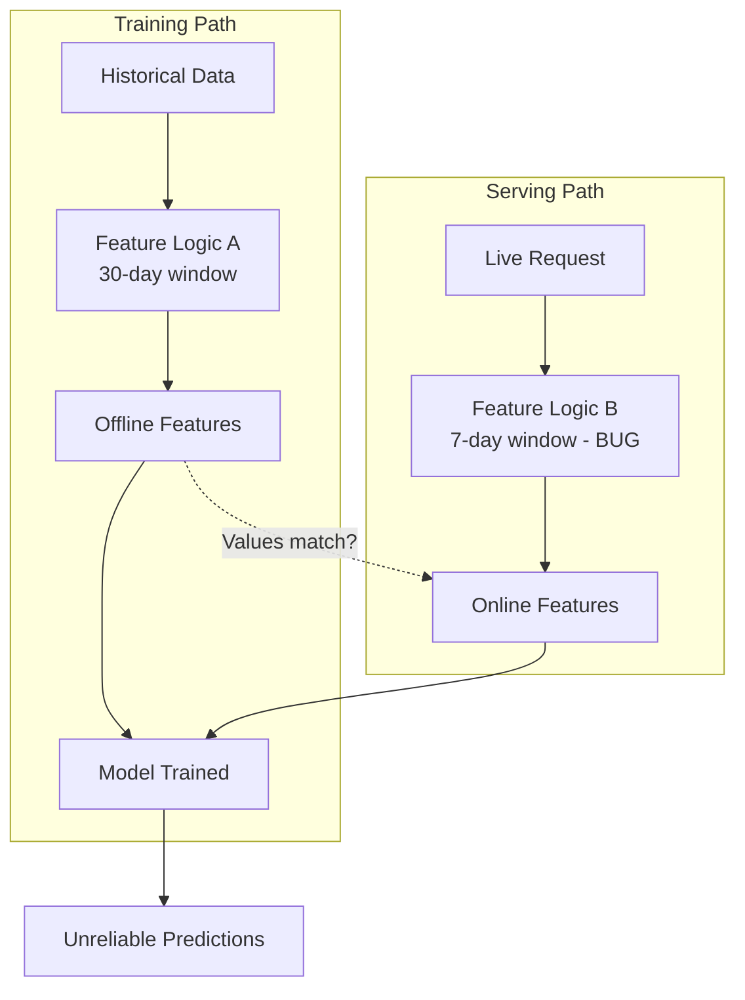
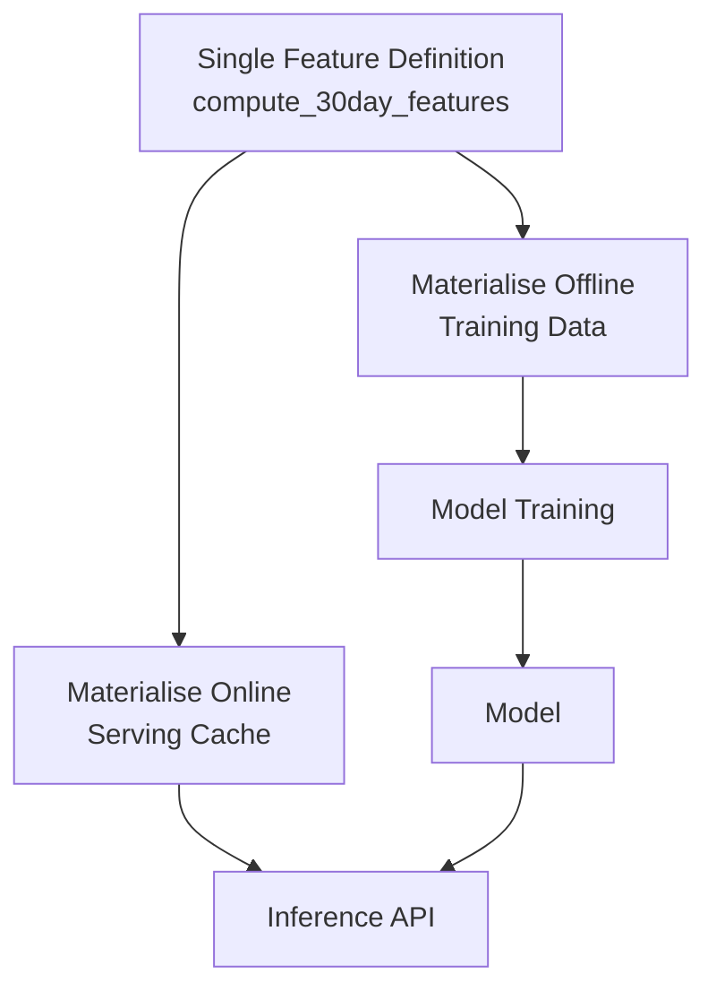
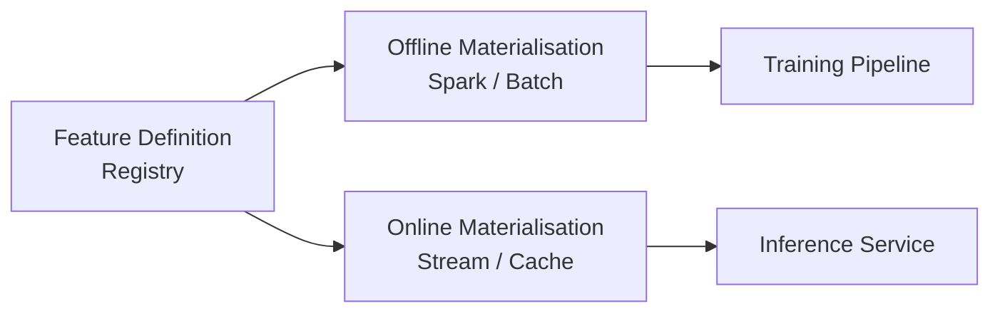

# Training-Serving Skew: Detection and the Feature Store Fix

## The Most Dangerous Silent Bug in Production ML

**Training-serving skew** occurs when features used during training differ from features provided to the model during serving — in value, computation logic, or time window. The model's production performance is worse than offline evaluation predicts, and the bug is **incredibly difficult to debug** because no error is thrown.

This is not a data pipeline ingestion bug — it is a **feature consistency bug** that data pipelines must prevent by enforcing a single source of truth for feature logic.

---

## How Skew Happens

Skew typically arises when:

- **Two teams** implement feature logic independently (training team vs serving team)
- **Different time windows** are hardcoded in each path
- **Different data sources** or filters are applied
- **Code duplication** drifts over time as one path is updated but not the other

---

## Intentional Demonstration: The 30-Day vs 7-Day Bug

### Setup

| Path | Feature Function | Window |
|------|------------------|--------|
| Offline (training) | `compute_30day_features()` | 30 days |
| Online (serving) | `compute_7day_features_bug()` | 7 days (accidental) |

### Ground Truth (Offline Features for Customer 1)

| Feature | Value |
|---------|-------|
| `total_30d_spend` | 170 |
| `transaction_count_30d` | Multiple active transactions |

### Buggy Online Features (Customer 1)

| Feature | Value |
|---------|-------|
| `total_7d_spend` | 0 |
| `transaction_count_7d` | 0 |

The 7-day window returns **zero** because the customer's recent activity falls outside the accidentally shortened window. The model was trained on a pattern showing an **active customer** (spend = 170), but at serving time sees a **completely inactive customer** (spend = 0).

### Impact

- Predictions are **completely unreliable**
- No error in logs — the API returns a valid response with wrong features
- Offline evaluation showed good metrics — production performance collapses

---

## Why This Bug Is So Dangerous

| Property | Why It Matters |
|----------|----------------|
| **Silent** | No exception, no crash — valid HTTP 200 with wrong input |
| **Gradual discovery** | Found only when business KPIs degrade or someone manually compares features |
| **Hard to reproduce** | Requires comparing offline and online feature values for the same entity |
| **Common** | Different teams, codebases, and deployment cycles make divergence likely |
| **Expensive** | Weeks of debugging, lost revenue, eroded trust in ML system |

---

## The Fix: Single Source of Truth

The solution is architectural, not a one-line patch:

> **Do not have two implementations of feature logic.**

Instead, define feature computation **once** and reuse that definition for both offline training and online serving.

### Lab Fix

Replace the buggy online function call with an import of the **same** `compute_30day_features()` used for offline training:

| Path | Before Fix | After Fix |
|------|-------------|-----------|
| Offline | `compute_30day_features()` → spend = 170 | `compute_30day_features()` → spend = 170 |
| Online | `compute_7day_features_bug()` → spend = 0 | `compute_30day_features()` → spend = 170 |

Values now **match perfectly**. Skew is eliminated.

---

## The Feature Store Promise

What the lab simulates with a shared Python function, production feature stores (Feast, Tecton, Hopsworks) implement at scale:

| Capability | How It Prevents Skew |
|------------|---------------------|
| **Single feature definition** | One declarative spec for each feature |
| **Offline materialisation** | Batch job computes features for training from definition |
| **Online materialisation** | Real-time job populates serving cache from same definition |
| **Point-in-time correctness** | Training gets features as they were at label time |
| **Governance** | Feature registry, versioning, ownership, lineage |

The fundamental promise: **define once, materialise everywhere, consistently.**

---

## Connection to Data Pipelines

Data pipelines deliver raw and curated data to feature computation. Skew is not caused by the pipeline transporting data — it is caused by **divergent feature logic** applied to that data. However:

- Pipelines must deliver **the same data** to both offline and online feature computation
- **Schema contracts** ensure the same fields arrive at both paths
- **Freshness SLAs** ensure online features are not stale relative to training assumptions
- **Lineage** traces which pipeline version produced which feature values

A perfect data pipeline with duplicated feature logic still produces skew.

---

## Detection Strategies

| Strategy | How |
|----------|-----|
| **Feature value comparison** | For sample entities, compare offline vs online feature values |
| **Distribution monitoring** | Compare feature distributions between training and serving logs |
| **Shadow scoring** | Run production requests through both paths; compare outputs |
| **Canary entities** | Maintain test entities with known feature values; verify at serving time |

---

## Common Pitfalls / Exam Traps

- **Assuming offline metrics validate serving correctness** — skew is invisible to offline evaluation by definition.
- **Fixing skew with a serving-side patch** — patching the online path without fixing the root cause (duplicate logic) means the next code change reintroduces skew.
- **Confusing skew with data drift** — skew is a code/logic bug (deterministic wrong values); drift is a distribution change over time.
- **Believing unit tests prevent skew** — training and serving code paths are tested separately; integration comparison is required.
- **Ignoring time window consistency** — the most common skew cause is different aggregation windows (7d vs 30d) hardcoded in separate files.

---

## Quick Revision Summary

- **Training-serving skew**: features at training time differ from features at serving time — silent, devastating bug.
- Most common cause: **two independent implementations** of the same feature logic (e.g., 30-day vs 7-day window).
- Model trains on one distribution; serving feeds another — **no error thrown**, production performance collapses.
- Fix: **single source of truth** — one feature definition reused for offline and online materialisation.
- **Feature stores** (Feast, Tecton, Hopsworks) architecturally eliminate this bug class at scale.
- Detection: compare offline vs online feature values for sample entities; monitor feature distributions.
- Skew ≠ data drift — skew is a logic bug; drift is a distribution change.
- Data pipelines must deliver consistent data, but **feature logic consistency** is a separate, equally critical concern.
