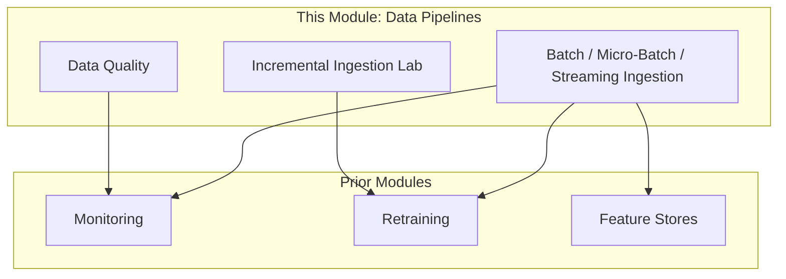
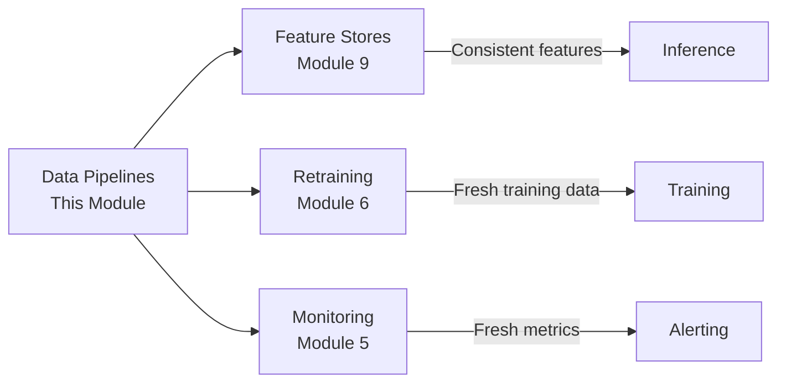

# Data Pipelines for Machine Learning: Module Summary

## Module Position in the ML Engineering Curriculum

This module sits at the intersection of data engineering and ML operations. Prior modules covered model serving, monitoring, feature stores, and retraining. This module addresses the layer beneath all of them: **how data flows reliably into every stage of the ML lifecycle**.

---

## Core Thesis

> **Data pipelines are the circulatory system of machine learning.** They keep fresh, correct data flowing to training, validation, inference, monitoring, and retraining.

Without reliable pipelines:

| Downstream System | Failure When Pipelines Break |
|-------------------|---------------------------|
| **Drift detection** | No fresh predictions or features to compare |
| **Retraining triggers** | No new labelled data to act on |
| **Dashboards and metrics** | Stop reflecting reality |
| **Model serving** | Features become stale or wrong |
| **Validation** | Metrics lie due to corrupted evaluation data |

---

## Key Concepts Covered

### 1. Why ML Needs Pipelines

- Notebooks are exploratory; production requires **automated, repeatable, observable** data flow
- Pipelines feed **training, validation, and inference**
- "Run the notebook again" is not a production strategy

### 2. ETL and ELT

| Pattern | Flow | ML Role |
|---------|------|---------|
| ETL | Extract → Transform → Load | Produces curated tables for feature engineering |
| ELT | Extract → Load → Transform (SQL) | Raw data preserved; transforms in warehouse |

### 3. Three Ingestion Modes

| Mode | Latency | Complexity | Best For |
|------|---------|------------|----------|
| **Batch** | Hours–day | Low | Retraining, offline scoring, heavy aggregations |
| **Micro-batch** | 1–5 min | Medium | Near-real-time features, periodic risk scores |
| **Streaming** | Sub-second | High | Fraud, live recommendations, anomaly detection |

**Escalation path:** batch → micro-batch → streaming. Start simple.

### 4. Streaming Infrastructure

- **Events** — atomic records describing something that happened
- **Topics, producers, consumers** — many-to-many publish/subscribe
- **Kafka** — event transport and durable log
- **Spark, Flink, Beam** — processing engines (windows, aggregations, state)

### 5. Data Quality

Three dimensions, all causing **silent degradation** (not crashes):

| Dimension | Key Concerns |
|-----------|-------------|
| **Freshness** | Event-to-feature lag; SLAs per feature category |
| **Completeness** | Missing events, duplicates (at-least-once delivery) |
| **Correctness** | Invalid values, out-of-order events, distribution shifts |
| **Schema** | Evolution, contracts, backward compatibility |

**Two types of latency:**
- Inference latency (request → prediction)
- Data freshness latency (event → feature in store)

### 6. Data Contracts and Monitoring

- Explicit agreements between producers and consumers
- Schema registries enforce contracts at publish time
- **Data quality monitoring** + **model monitoring** = two halves of ML safety

### 7. Hands-On Lab Patterns

| Pattern | Production Equivalent |
|---------|----------------------|
| Daily CSV simulator | Time-partitioned data arrival |
| Incremental ingestion with state file | Watermark/checkpoint-based pipelines |
| Idempotent append | Safe re-runs in scheduled jobs |
| Retrain trigger on volume/days | Automated model refresh |
| Quality checks at ingestion | Data validation gates |

---

## Connections to Prior Modules

| Prior Module | How Data Pipelines Enable It |
|--------------|------------------------------|
| **Module 5: Monitoring** | Fresh predictions and feature data required for drift detection |
| **Module 6: Retraining** | New labelled data must reach training store via ingestion |
| **Module 9: Feature Stores** | Pipelines materialise offline and online features from shared definitions |

---

## Architectural Decision Summary

| Decision | Recommendation |
|----------|----------------|
| Ingestion mode | Start batch; escalate only with clear freshness requirements |
| Processing pattern | Incremental ingestion with state, not full reprocess |
| Data quality | Monitor freshness, completeness, correctness from day one |
| Schema management | Data contracts with backward-compatible change policies |
| Feature consistency | Single source of truth (feature store); never duplicate logic |
| Investigation order | Data quality first, then model, when performance degrades |

---

## The Production Mindset

| Notebook Thinking | Pipeline Thinking |
|-------------------|-------------------|
| Load data once | Data arrives continuously on schedule |
| Manual steps | Automated, idempotent, observable |
| Works once | Works every day, recovers from failures |
| No freshness concern | SLAs per feature, monitored continuously |
| Single consumer | Training, serving, monitoring, analytics |
| No state | Persistent watermarks, checkpoints, lineage |

---

## Common Pitfalls / Exam Traps

- **Treating data pipelines as infrastructure, not ML-critical path** — pipeline failure equals model failure.
- **Optimising model architecture while ignoring data plumbing** — no model recovers from systematically bad input.
- **One-size-fits-all ingestion mode** — hybrid systems (batch for training, micro-batch for serving) are standard.
- **Monitoring model metrics without monitoring data quality** — most "model drift" is upstream data failure.
- **Building streaming before batch works reliably** — premature complexity is the most common architectural mistake in ML data systems.
- **Forgetting idempotency** — scheduled pipelines that are not idempotent corrupt training data on re-runs.

---

## Quick Revision Summary

- Data pipelines are the **circulatory system** — they feed training, validation, inference, monitoring, and retraining.
- Core principle: **no data → no model; bad data → bad model.**
- Three ingestion modes: **batch** (workhorse), **micro-batch** (compromise), **streaming** (lowest latency, highest complexity).
- ETL/ELT produce curated tables; ingestion modes control **how often** they refresh.
- Kafka = transport; Spark/Flink/Beam = processing; windows + state = streaming features.
- Data quality: **freshness, completeness, correctness, schema** — all cause silent degradation.
- Distinguish **inference latency** from **data freshness latency** — both matter independently.
- **Data contracts** and **incremental ingestion with state** are production essentials.
- **Data quality monitoring + model monitoring** together enable root cause analysis.
- Start simple (batch), escalate deliberately; a well-designed batch pipeline is already a major win.
- Feature consistency (no training-serving skew) requires a **single source of truth** — feature stores at scale.
