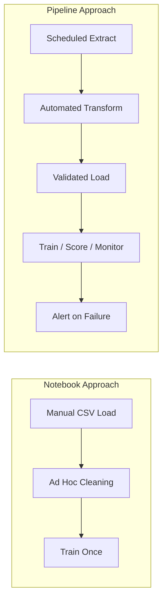
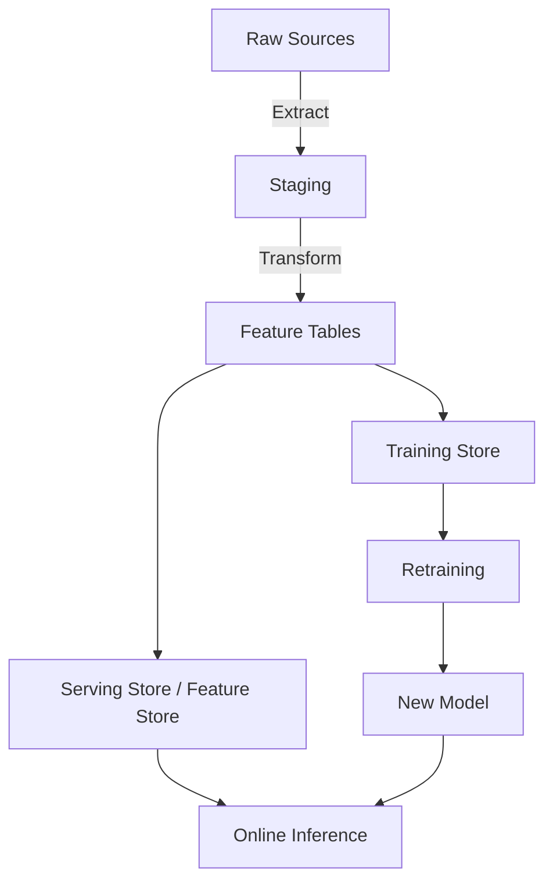

# Why Machine Learning Needs Data Pipelines

## Notebook World vs Production World

The gap between exploratory analysis and production ML is one of the largest shifts when turning a model into a product.

### Notebook Workflow

- Manually load a CSV or run a one-off SQL query
- Ad hoc cleaning, joins, and transformations in arbitrary order
- Run cells until output looks acceptable
- No scheduling, no alerts, no repeatability guarantees

### Production Workflow

- Data must arrive **every day, every hour, or every second**
- Every step is **automated, repeatable, and observable**
- **Alerts** fire when jobs fail, schemas change, or volumes spike
- Multiple consumers (training, scoring, dashboards) depend on the same flow

---

## Where Pipelines Fit in the ML Lifecycle

Data pipelines are not a side concern — they sit upstream of every major ML stage:

| Stage | What Pipelines Provide | Consequence of Pipeline Failure |
|-------|------------------------|--------------------------------|
| **Training** | Historical labelled data, feature tables | Model cannot be built or updated |
| **Validation** | Fresh or held-out evaluation data | Metrics become unreliable or stale |
| **Inference** | Live features and input schemas | Predictions wrong or unavailable |

### Cascading Failures

- **Late data** → retraining jobs slip; batch scoring runs on yesterday's features
- **Wrong data** → validation looks healthy while production decisions degrade
- **Silent corruption** → no crash, just gradually worse business outcomes

---

## Why "Run the Notebook Again" Fails

| Property | Notebook | Production Pipeline |
|----------|----------|---------------------|
| Scheduling | Manual | Cron, orchestrator (Airflow, Dagster) |
| Idempotency | Not guaranteed | Re-runs must not duplicate data |
| State tracking | In memory | Persistent checkpoints, watermarks |
| Observability | Print statements | Structured logs, metrics, lineage |
| Data freshness | Point-in-time snapshot | Continuously updated windows |
| Multi-consumer | Single analyst | Training, serving, analytics, compliance |

A notebook proves a model *can* work. A pipeline proves it *keeps* working as data, schemas, and volume evolve.

---

## Real-World Example: Churn Model Retraining

A telecom churn model retrained weekly needs:

1. **Daily event ingestion** — call logs, billing events, support tickets
2. **Feature aggregation** — 30-day usage stats per customer
3. **Label attachment** — churn outcome from CRM
4. **Append to training store** — master dataset grows incrementally
5. **Retraining trigger** — fires when enough new labelled rows arrive

If step 1 fails silently, the model retrains on stale patterns and misses emerging churn signals. The pipeline is as critical as the gradient descent loop.

---

## The Production Mindset Shift

Moving from notebook to pipeline requires thinking about:

- **Time** — data has timestamps; windows and watermarks matter
- **Volume** — incremental processing beats full rebuilds at scale
- **Contracts** — producers and consumers agree on schema and semantics
- **Recovery** — jobs must resume from last successful state, not restart from scratch

---

## Common Pitfalls / Exam Traps

- **Believing automation alone is enough** — a pipeline that runs daily but ingests wrong data is worse than a manual process that catches errors.
- **Skipping observability until production breaks** — without event-count baselines and freshness metrics, failures are discovered only when business KPIs drop.
- **Treating training and serving data paths as independent** — they must share definitions; divergent logic causes training-serving skew.
- **Full reprocessing instead of incremental ingestion** — re-reading years of data daily does not scale; stateful incremental pipelines are the production pattern.

---

## Quick Revision Summary

- Notebooks are **exploratory and manual**; production pipelines are **automated, scheduled, and observable**.
- Pipelines feed **training, validation, and inference** — failures cascade across the ML lifecycle.
- Late data delays retraining; wrong data makes **validation metrics lie** and breaks production decisions.
- "Run the notebook again" lacks **scheduling, idempotency, state, lineage, and alerting**.
- The notebook-to-pipeline shift is one of the **biggest transitions** in operationalising ML.
- Real production systems require **incremental ingestion, contracts, and recovery** — not one-shot scripts.
- Data pipelines are infrastructure, not optional tooling around the model.
