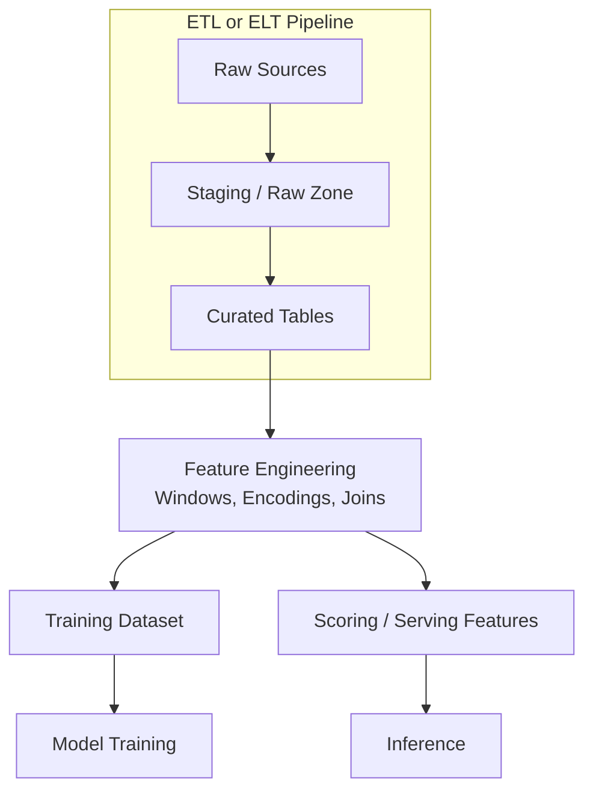

# ETL and ELT: Foundations of ML Data Pipelines

## First Principles

Before features, models, or serving APIs exist, raw data must move from operational systems into an analytics-ready form. Two classic patterns dominate: **ETL** and **ELT**. Both produce the clean, structured tables that downstream ML feature engineering consumes.

---

## ETL: Extract, Transform, Load

In ETL, transformation happens **before** data lands in the warehouse:

### Steps

1. **Extract** — pull data from source systems (databases, log files, REST APIs, message queues)
2. **Transform** — clean, deduplicate, join, aggregate, enforce types and business rules
3. **Load** — write the curated result into a data warehouse (Snowflake, BigQuery) or data lake (S3, HDFS)

### Characteristics

- Transformation logic runs in a **dedicated compute layer** (Spark, custom Python, Informatica)
- Warehouse receives **already-clean** tables
- Strong fit when source data is messy and warehouse storage is expensive per byte

---

## ELT: Extract, Load, Transform

In ELT, raw data lands in the warehouse **first**; transformation happens inside the warehouse using SQL or native compute:

### Steps

1. **Extract** — same as ETL
2. **Load** — ingest raw or lightly-typed data into the warehouse immediately
3. **Transform** — run SQL (or dbt models) inside the warehouse to produce curated tables

### Characteristics

- Leverages **warehouse-native compute** (massively parallel SQL)
- Raw data preserved for reprocessing if transform logic changes
- Strong fit for cloud warehouses with cheap storage and powerful SQL engines

---

## ETL vs ELT Comparison

| Dimension | ETL | ELT |
|-----------|-----|-----|
| Transform location | External engine (Spark, Python) | Inside warehouse (SQL, dbt) |
| Raw data retention | Often discarded post-transform | Typically retained in landing zone |
| Schema enforcement | At transform time | At query/model time |
| Flexibility for complex logic | High (arbitrary code) | Moderate (SQL + UDFs) |
| Reprocessing cost | Re-extract from sources | Re-run SQL on stored raw data |
| Common tools | Apache Spark, Airflow + Python | dbt, BigQuery SQL, Snowflake |
| ML fit | Heavy feature engineering in Spark | SQL-based aggregations, dbt feature models |

---

## How ETL/ELT Feed Machine Learning

Neither pattern trains models directly. Both produce **structured tables** that become:

- **Training feature tables** — wide tables with entity keys, timestamps, labels
- **Scoring feature tables** — same schema, refreshed on schedule for batch inference
- **Feature store inputs** — offline materialisation sources

### Example: E-commerce Click Features

1. **Extract** click events from web server logs
2. **Transform** — deduplicate, parse timestamps, join with product catalogue
3. **Load** — `daily_click_features` table with columns: `user_id`, `product_id`, `clicks_7d`, `clicks_30d`
4. **ML** — churn or recommendation model trains on this table; batch scoring reads the same table nightly

---

## Choosing ETL vs ELT for ML

| Scenario | Prefer |
|----------|--------|
| Complex joins across heterogeneous sources (logs + DB + API) | ETL (Spark) |
| Team is SQL-first, data already in cloud warehouse | ELT (dbt) |
| Need to preserve raw events for audit / reprocessing | ELT |
| Heavy Python/ML-native transforms (embeddings, NLP) | ETL |
| Regulatory requirement to never alter source records | ELT with immutable raw layer |

Most large ML platforms use a **hybrid**: ELT for SQL-friendly aggregations, ETL (Spark) for complex feature engineering that SQL cannot express cleanly.

---

## Common Pitfalls / Exam Traps

- **Assuming ETL and ELT are mutually exclusive** — modern platforms combine both; the question is *where* each transform runs.
- **Skipping the curated layer** — training directly on raw landing-zone data invites schema drift and silent type errors.
- **Different transform logic for training vs scoring** — the ETL/ELT job must produce identical semantics in both paths; otherwise training-serving skew emerges downstream.
- **Confusing ETL with feature engineering** — ETL produces clean tables; feature engineering adds ML-specific windows, encodings, and entity keys on top.

---

## Quick Revision Summary

- **ETL**: extract → transform (external) → load curated tables into warehouse.
- **ELT**: extract → load raw → transform inside warehouse (SQL/dbt).
- Both patterns produce **structured tables** that feed ML feature engineering, training, and scoring.
- ETL suits **complex heterogeneous transforms**; ELT suits **SQL-first teams** with cheap warehouse storage.
- Raw data retention in ELT enables **cheap reprocessing** when transform logic changes.
- ML pipelines sit **downstream** of ETL/ELT — they do not replace data movement patterns.
- Production systems often use a **hybrid** of ETL and ELT for different data sources.
- Identical transform semantics across training and serving paths are **mandatory** for model reliability.
