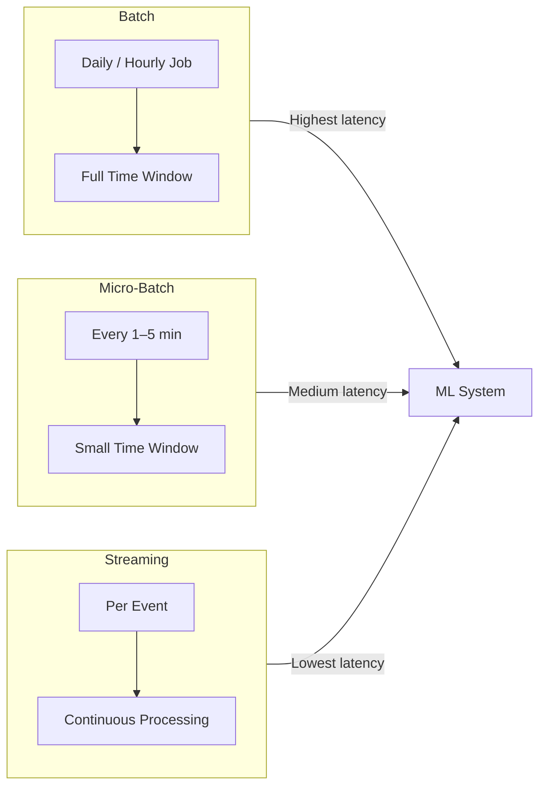
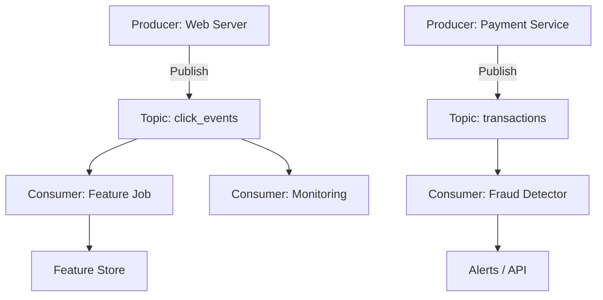
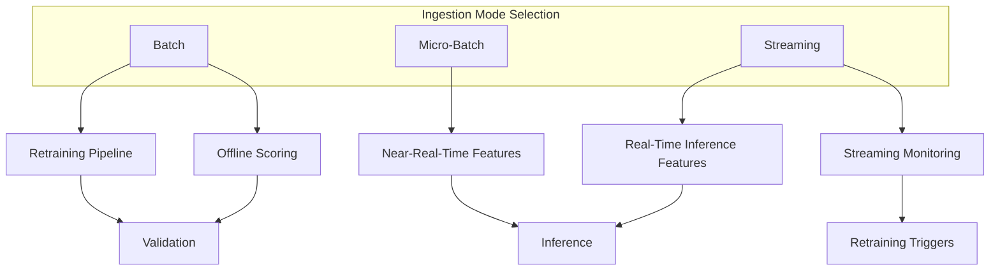

# Pipeline Types: Batch, Micro-Batch, and Streaming

## Overview

Machine learning data pipelines differ primarily in **how often** and **how granularly** data is processed. Three ingestion modes cover the spectrum from nightly retraining to sub-second fraud detection.



---

## Mode 1: Batch Ingestion

**Definition:** Process large chunks of data on a fixed schedule — once per day, once per hour, etc.

### Characteristics

- Operates on **files or table partitions** representing a complete time window
- Each run is a **discrete, versionable batch** — lineage is straightforward
- Jobs may take **minutes to hours**; that is acceptable for many ML workflows

### ML Use Cases

| Use Case | Example |
|----------|---------|
| Regular retraining | Weekly churn model update with new labelled data |
| Offline scoring | Nightly risk scores for all 10M users |
| Heavy aggregations | 30-day and 90-day rolling statistics |
| Feature table refresh | Daily `training_features_20240901` partition |

### Trade-offs

| Advantage | Disadvantage |
|-----------|--------------|
| Simple mental model | Data is **stale between runs** |
| Easy lineage and versioning | Events from the last few hours are missing until next run |
| Fewer infrastructure runs | Unsuitable for sub-minute freshness requirements |

---

## Mode 2: Micro-Batch Ingestion

**Definition:** Process many **small batches** frequently — every 1 to 5 minutes.

### Characteristics

- Feels "almost streaming" but implemented as **repeated small batch jobs**
- Can use Spark Structured Streaming (micro-batch mode), Flink, Beam, or even a cron-triggered script
- Reuses existing **batch tooling** (Spark, SQL) with shorter windows

### ML Use Cases

| Use Case | Example |
|----------|---------|
| Session features | Update user session stats every 2 minutes |
| Risk scoring | Refresh fraud scores every 5 minutes |
| Recent activity | Recompute last 15 minutes of clicks periodically |

### Trade-offs

| Advantage | Disadvantage |
|-----------|--------------|
| Much lower latency than daily batch | More frequent runs → more infrastructure overhead |
| Familiar batch tooling | Not true per-event streaming behaviour |
| Good compromise for minute-level freshness | Still has gaps between micro-batch windows |

---

## Mode 3: Streaming Ingestion

**Definition:** Process events **continuously** as they arrive, reacting in near real time.

### Core Components



- **Producers** — services that emit events (clicks, sensor readings, transactions)
- **Topics / queues** — named channels holding event streams
- **Consumers** — services that subscribe and process events in real time
- **Windows and state** — rolling aggregates, pattern detection over time

### ML Use Cases

- Real-time **anomaly detection** (traffic spikes, system failures)
- **Live recommendations** reacting to recent clicks
- **Dynamic pricing** responding to demand signals
- **Real-time fraud checks** on payment streams

### Trade-offs

| Advantage | Disadvantage |
|-----------|--------------|
| Lowest latency (seconds or sub-second) | Highest complexity and operational cost |
| Continuous feature updates | Requires stream processing expertise |
| Handles high event volume | Stateful processing, exactly-once semantics are hard |

---

## Comparison Table

| Dimension | Batch | Micro-Batch | Streaming |
|-----------|-------|-------------|-----------|
| Schedule | Daily / hourly | Every 1–5 min | Continuous |
| Latency | Hours to 1 day | 1–5 minutes | Seconds to sub-second |
| Complexity | Low | Medium | High |
| Cost | Fewer large jobs | Many small jobs | Always-on infrastructure |
| Lineage | Easy (discrete runs) | Moderate | Harder (continuous state) |
| Tooling | Spark batch, SQL, cron | Spark Structured Streaming, cron | Kafka + Flink/Spark/Beam |
| Best for | Retraining, offline scoring | Near-real-time features | Fraud, live personalisation |

---

## Linking Pipelines to the ML Lifecycle



All three modes can support ML. The choice depends on:

- **Latency needs** — how fresh must features be at inference time?
- **Complexity budget** — does the team have stream-processing expertise?
- **Cost constraints** — always-on streaming costs more than nightly batch
- **Volume** — high event rates may force streaming or micro-batch

---

## Decision Framework

```
Need sub-second reaction?
  YES → Streaming
  NO → Need minute-level freshness?
    YES → Micro-batch
    NO → Batch (start here)
```

**Rule of thumb:** Start with batch. Move to micro-batch only when fresher data is clearly required. Adopt full streaming only when minute-level freshness is insufficient or event volume demands it.

---

## Common Pitfalls / Exam Traps

- **Jumping to streaming prematurely** — most ML systems operate fine on batch or micro-batch; streaming adds operational burden without proportional benefit.
- **Confusing micro-batch with true streaming** — Spark Structured Streaming in default mode is micro-batch under the hood; exam questions may test this distinction.
- **Ignoring staleness in batch systems** — if a nightly job runs at 1 AM, features exclude all events after the previous day's cutoff until the next run.
- **Assuming one mode for the entire system** — training may be batch while serving features are micro-batch or streaming; hybrid architectures are normal.

---

## Quick Revision Summary

- Three ingestion modes: **batch** (large scheduled chunks), **micro-batch** (frequent small chunks), **streaming** (continuous per-event).
- Batch is the **workhorse** for retraining, offline scoring, and heavy aggregations — simple but stale between runs.
- Micro-batch is the **middle ground** — minute-level freshness using familiar batch tools.
- Streaming uses **producers, topics, consumers, windows, and state** for sub-second ML use cases.
- Selection depends on **latency, complexity, budget, and volume** — not model architecture.
- **Start with batch**, escalate to micro-batch, then streaming only with clear requirements.
- All modes link to the ML lifecycle: training, validation, inference, monitoring, and retraining.
- Hybrid systems commonly use **different modes for different pipeline stages**.
