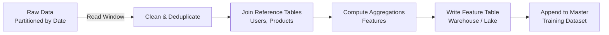
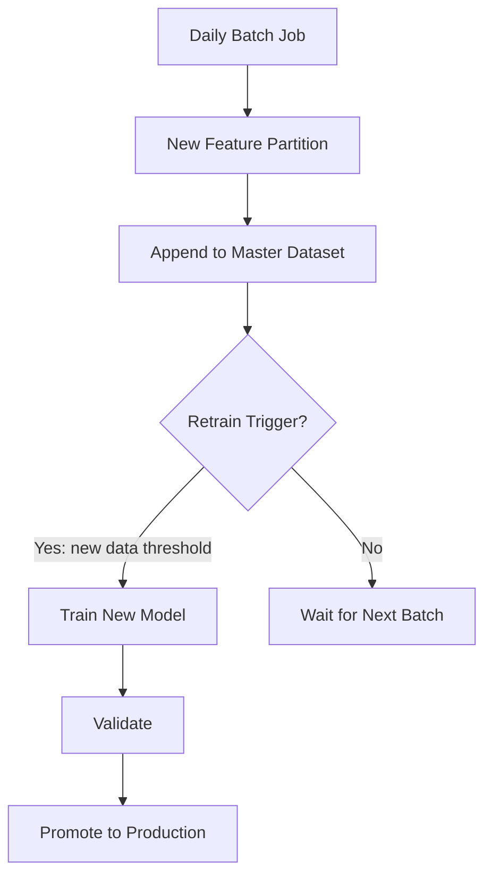

# Batch Ingestion for Machine Learning

## What Is Batch Ingestion?

Batch ingestion processes **large chunks of data on a fixed schedule** — once per day at 1:00 AM, every hour for the past five hours, etc. Each job reads raw data for a specific time window, cleans and joins it, computes aggregations, and writes results into a data warehouse or feature table.

This is the **default pattern** for most ML systems. Teams typically implement batch or micro-batch pipelines long before adopting full streaming.

---

## How a Batch Job Works



### Concrete Training Data Example

| Step | Action |
|------|--------|
| Schedule | Daily at 10:00 AM |
| Read | Yesterday's events from partition `events/2024/09/01` |
| Join | Reference tables: `users`, `products` |
| Compute | Feature columns: spend, click counts, tenure |
| Write | `training_features_20240901` daily table |
| Append | Add to master training dataset for retraining pipeline |

Job duration of **minutes to hours** is normal and acceptable for daily retraining schedules.

---

## Where Batch Fits in ML

| ML Activity | Why Batch Works |
|-------------|-----------------|
| **Regular retraining** | Weekly churn model update with newly labelled data |
| **Offline scoring** | Monthly risk scores or nightly recommendations for all users |
| **Heavy aggregations** | 30-day and 90-day rolling statistics, complex multi-table joins |
| **Feature table materialisation** | Precompute expensive features once, serve many consumers |

### When Batch Is the Right Choice

If the use case does **not** require instant reaction to new events, batch is often the **easiest and most robust** option. A recommendation model retrained nightly on the previous day's click data does not need per-second ingestion.

---

## Batch Job Anatomy

### Input: Partitioned Time Windows

Batch jobs read **discrete partitions** — not the entire dataset every time (in incremental designs):

```
events/
  2024/09/01/  ← yesterday's partition
  2024/09/02/
  ...
```

### Processing Steps

1. **Extract** — read partition for target window
2. **Clean** — handle nulls, deduplicate, filter invalid records
3. **Join** — enrich with dimension tables (user profile, product metadata)
4. **Aggregate** — compute windowed features ($\text{sum}(\text{spend})_{30d}$, $\text{count}(\text{clicks})_{7d}$)
5. **Load** — write to feature table with partition key

### Output: Versioned Feature Tables

Each run produces a **named, timestamped artifact**:

```
training_features_20240901.csv
training_features_20240902.csv
...
master_training_dataset.csv  (append-only)
```

Discrete runs make **lineage tracking** straightforward: "Model v3.2 was trained on data through 2024-09-01."

---

## Batch and the Retraining Loop



Batch ingestion is the **data supply chain** for retraining. Without reliable daily batches:

- Training data stops growing
- Retraining triggers have nothing to act on
- Model performance drifts as the world changes but the model does not

---

## Advantages and Limitations

| Advantage | Limitation |
|-----------|------------|
| Simple mental model | Features stale between runs |
| Easy versioning and lineage | Misses recent events until next job |
| Mature tooling (Spark, SQL, Airflow) | Unsuitable for fraud needing sub-minute features |
| Cost-efficient (fewer runs) | Long job failures delay entire day's data |
| Idempotent re-runs possible | Not real-time |

---

## Real-World Pattern: E-commerce Feature Pipeline

A marketplace runs a nightly Spark job:

1. Reads `orders/YYYY/MM/DD` and `clicks/YYYY/MM/DD`
2. Joins with `dim_customer` and `dim_product`
3. Computes per-customer features: `orders_30d`, `avg_order_value_30d`, `category_affinity`
4. Writes to `feature_store.customer_daily_features`
5. Retraining pipeline consumes the latest 90 days of partitions every Sunday

Serving uses the **same feature table** refreshed nightly — no separate online computation for these slow-moving features.

---

## Common Pitfalls / Exam Traps

- **Full reprocess instead of incremental append** — re-reading years of partitions daily wastes compute; append new partitions to a master dataset.
- **Assuming batch implies offline-only serving** — batch-computed features can feed online APIs via a feature store refreshed on schedule.
- **No partition strategy** — without date-based partitioning, batch jobs scan entire tables and become prohibitively slow.
- **Ignoring job failure recovery** — a failed nightly job means an entire day of training data is missing; alerts and automatic retries are essential.
- **Confusing batch ingestion with batch inference** — ingestion is about data arrival; batch inference is about scoring many rows at once. They often co-occur but are distinct concepts.

---

## Quick Revision Summary

- Batch ingestion runs on a **fixed schedule**, processing a **specific time window** per job.
- Ideal for **retraining, offline scoring, and heavy aggregations** where minute-level freshness is unnecessary.
- Typical flow: read partitioned raw data → clean → join → aggregate → write feature table → append to master training set.
- Jobs taking **minutes to hours** is normal for daily ML workflows.
- Each run produces a **versioned, lineage-friendly** artifact.
- Batch is the **most common starting point** for ML data pipelines before micro-batch or streaming.
- Key limitation: **staleness** between scheduled runs.
- Reliable batch jobs are the **foundation** of retraining pipelines and drift monitoring.
