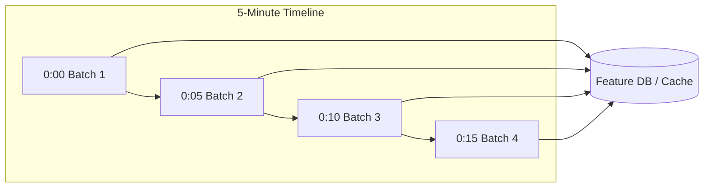
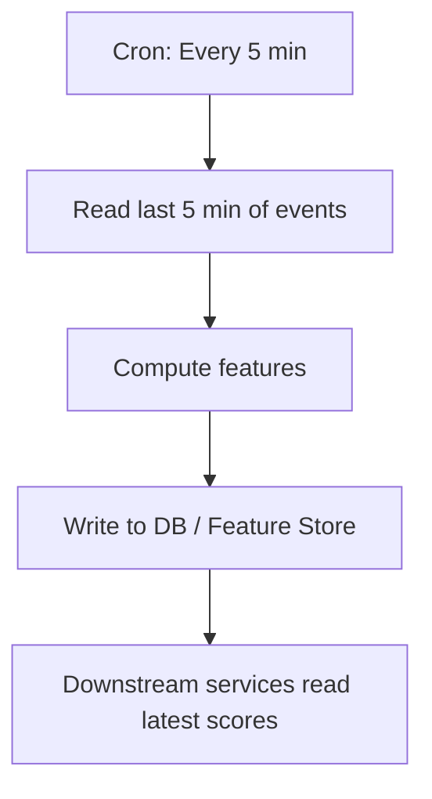
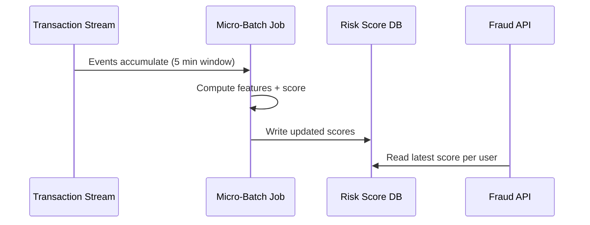

# Micro-Batch Ingestion: Concept and Architecture

## Definition

Micro-batch ingestion is still **batching** — but the batches are **smaller** and run **much more frequently** (every 1 to 5 minutes). Conceptually it feels like almost-streaming, but it is implemented as many small, scheduled batch jobs.

---

## How It Differs from Batch and Streaming

| Property | Batch | Micro-Batch | Streaming |
|----------|-------|-------------|-----------|
| Window size | Hours to days | 1–5 minutes | Per event |
| Run frequency | Daily / hourly | Every 1–5 min | Continuous |
| Implementation | Cron + Spark/SQL job | Spark Structured Streaming, Flink micro-batch, cron script | Kafka + Flink/Beam |
| Latency | High | Medium (minutes) | Low (seconds) |
| Complexity | Low | Medium | High |

Micro-batch occupies the **middle ground**: fresher than daily batch, simpler than full event-by-event streaming.

---

## Implementation Options

### 1. Spark Structured Streaming (Micro-Batch Mode)

Default processing mode triggers computation every trigger interval (e.g., 2 minutes), reading new data since the last checkpoint.

### 2. Apache Flink / Apache Beam

Both support micro-batch execution models alongside true streaming.

### 3. Simple Cron + Script

A lightweight pattern: a cron job runs a small Python/SQL script every few minutes, reading the last $N$ minutes of data. No streaming framework required.

---

## When to Use Micro-Batch

Micro-batch is ideal when you need **fresher features** but **not per-event updates**:

| Use Case | Refresh Interval | Feature Examples |
|----------|------------------|------------------|
| User session features | Every 2 minutes | `session_duration`, `pages_viewed_session` |
| Risk / fraud scores | Every 5 minutes | `spend_last_5m`, `failed_logins_last_5m` |
| Recent click activity | Every 3 minutes | `clicks_last_15m`, `categories_viewed_last_15m` |
| Active session personalisation | Every 1–2 minutes | `recent_product_views` |

### Decision Rule

Choose micro-batch when:

- Minute-level freshness is **required**
- Per-event (sub-second) updates are **not** required
- Team already has **batch tooling** (Spark, SQL) and wants to reuse it

---

## Concrete Example: Risk Scoring Pipeline

Every 5 minutes:

1. **Read** the last 5 minutes of transaction events
2. **Compute features:**
   - `spend_last_5m` — total spend in window
   - `spend_last_60m` — rolling hour spend
   - `failed_logins_last_5m` — authentication failure count
3. **Run** risk model on updated feature vectors
4. **Write** updated risk scores to a database
5. **Downstream** services and dashboards read the latest score on demand

**Result:** Near-real-time risk scores without building a fully event-by-event streaming system.

---

## Trade-offs

### Advantages

- **Much lower latency** than daily or hourly batch
- **Reuses batch infrastructure** — many teams already operate Spark or SQL pipelines
- **Simpler operations** than always-on streaming with state management
- **Good enough** for most "near-real-time" ML features

### Disadvantages

- **More frequent runs** → higher infrastructure overhead than daily batch
- **Not true streaming** — events within a window are invisible until the next micro-batch completes
- **Monitoring burden** — more jobs to watch, more failure modes
- **Gap risk** — a 5-minute window means up to 5 minutes of staleness

---

## Micro-Batch vs "Almost Streaming"

Spark Structured Streaming's default mode is micro-batch: it processes small chunks of data at each trigger interval. This is **not** the same as record-by-record processing.

| Aspect | Micro-Batch (Spark default) | True Streaming (Flink) |
|--------|----------------------------|------------------------|
| Processing unit | Chunk of records | Individual events |
| Latency floor | Trigger interval (e.g., 1s–5min) | Milliseconds |
| State management | Checkpoint-based | In-memory / RocksDB state |
| Complexity | Lower | Higher |

---

## Common Pitfalls / Exam Traps

- **Calling micro-batch "streaming"** — it is batching with a short interval; exam questions may distinguish these explicitly.
- **Choosing micro-batch when daily batch suffices** — unnecessary infrastructure cost if features only change meaningfully over days.
- **Choosing micro-batch when sub-second latency is required** — fraud on live transactions may need true streaming, not 5-minute windows.
- **No idempotency** — if a micro-batch job re-runs, it must not double-count events; watermarking and deduplication matter.
- **Ignoring checkpoint/state** — micro-batch jobs need persistent state to know where the last run ended.

---

## Quick Revision Summary

- Micro-batch = **small batches, frequent runs** (every 1–5 minutes) — a compromise between batch and streaming.
- Implemented via **Spark Structured Streaming, Flink, Beam, or simple cron scripts**.
- Best for features needing **minute-level freshness** but not per-event updates.
- Example: risk scores refreshed every 5 minutes from recent transactions.
- **Lower latency** than batch; **lower complexity** than true streaming.
- Trade-off: more infrastructure overhead and up to one window interval of staleness.
- Reuses familiar **batch tooling** — a practical escalation path from daily batch.
- Not equivalent to true streaming; Spark's default mode is micro-batch under the hood.
