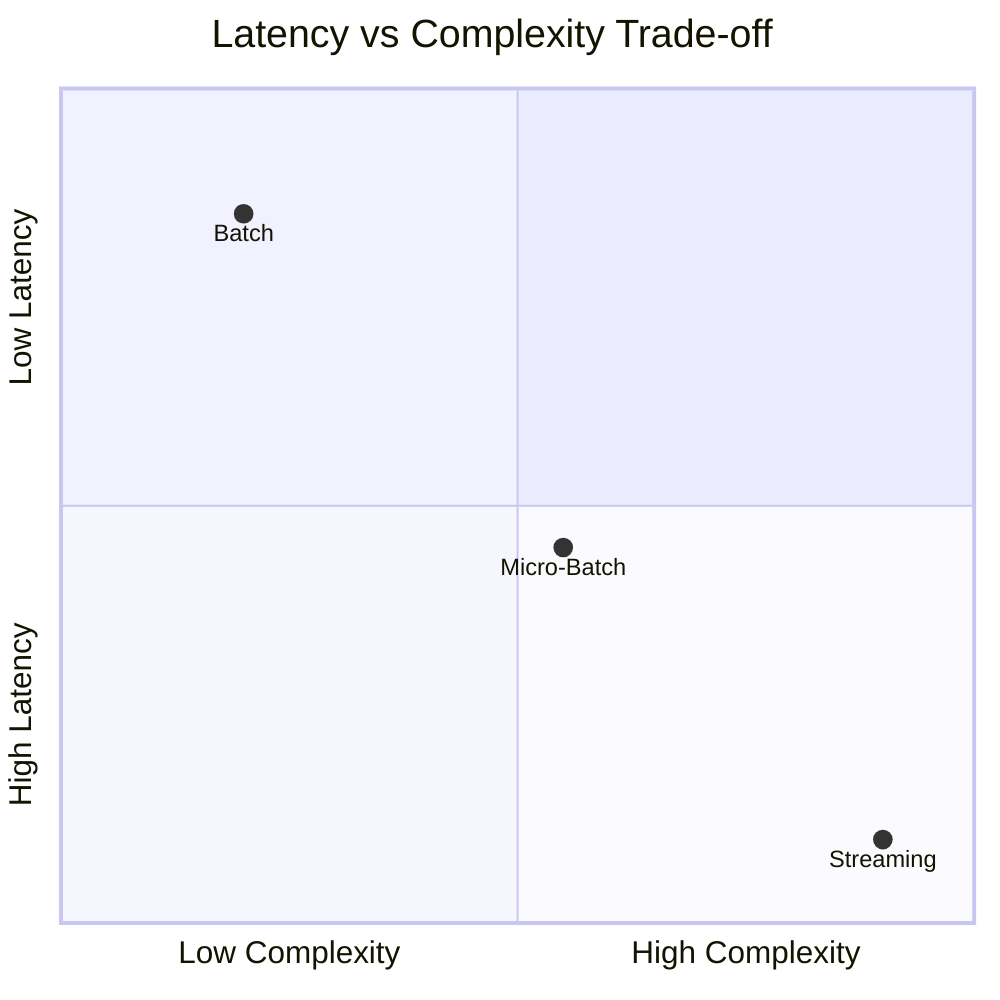
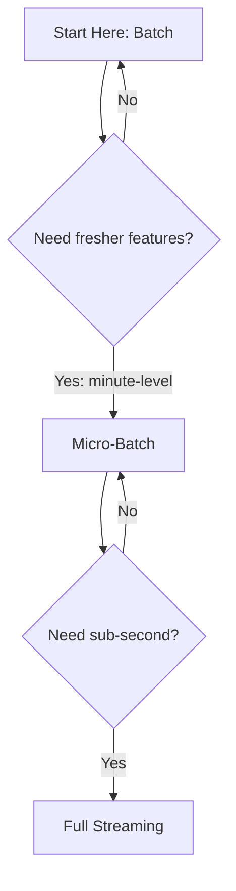

# Comparing Batch and Micro-Batch Ingestion

## Side-by-Side Comparison

Batch and micro-batch are the two most common ingestion modes for ML training and feature computation. Understanding their trade-offs is essential for architectural decisions.

| Dimension | Batch | Micro-Batch |
|-----------|-------|-------------|
| **Latency** | Hours to a full day | 1–5 minutes |
| **Complexity** | Simple — fewer moving parts | More complex — frequent runs, more monitoring |
| **Cost** | Fewer large jobs, lower overhead | Many smaller jobs, cumulative overhead |
| **Infrastructure** | Cron + nightly Spark/SQL | Cron every few min or streaming framework in micro-batch mode |
| **Staleness** | High — events missing until next run | Low — events visible within minutes |
| **Lineage** | Easy — discrete daily/hourly artifacts | Moderate — more runs to track |
| **Failure blast radius** | One failed job = one day/hour of data | One failed job = one small window; may cascade if unchecked |

---

## Use Case Fit

| Use Case | Recommended Mode | Rationale |
|----------|------------------|-----------|
| Weekly churn model retraining | **Batch** | Labels arrive daily; model updates weekly |
| Nightly recommendations for all users | **Batch** | Score-all pattern; no per-request urgency |
| 30/90-day rolling statistics | **Batch** | Heavy aggregation; daily refresh sufficient |
| Fraud risk score refresh | **Micro-batch** | Need 5-minute freshness, not per-transaction |
| Active session personalisation | **Micro-batch** | Recent clicks matter within minutes |
| Dashboard metrics for ops team | **Micro-batch** | Near-real-time visibility without streaming cost |

---

## Cost Analysis Intuition

### Batch: Fewer, Bigger Jobs

- One nightly Spark job processing 24 hours of data
- Cluster spins up, runs for 2 hours, shuts down
- **Cost driver:** peak compute for large aggregations

### Micro-Batch: Many, Smaller Jobs

- 288 runs per day (every 5 minutes)
- Each run processes 5 minutes of data — fast, small
- **Cost driver:** orchestration overhead, frequent cluster warm-up, checkpoint I/O

At scale, micro-batch can cost **more per event processed** than batch, even though each individual job is cheaper.

---

## Escalation Path

### Rule of Thumb

> **Start with batch. Move to micro-batch only when you clearly need fresher data.**

Most teams achieve significant production value with a well-designed batch or micro-batch pipeline before ever touching full streaming.

---

## What Each Mode Powers

### Batch Powers

- **Retraining pipelines** — append daily feature partitions to master training set
- **Offline scoring** — compute predictions for all entities nightly
- **Heavy feature engineering** — multi-way joins, 90-day windows, complex aggregations

### Micro-Batch Powers

- **Near-real-time features** — session stats, recent spend, failed login counts
- **Periodic metric refresh** — dashboards, risk scores, active-user features
- **Bridge to streaming** — teams gain operational experience before full streaming adoption

---

## Lab Preview: Batch-Style Simulation

A practical exercise demonstrates the batch pattern without production infrastructure:

1. **Simulate** new data arriving as daily CSV files (`day_1.csv`, `day_2.csv`, ...)
2. **Write** an ingestion script that finds new day files and appends them to a master training dataset
3. **Hook** ingestion to a simple training function — a miniature data-to-train pipeline

This concrete workflow reinforces that even simple batch patterns are a **huge win** over manual notebook re-runs.

---

## Hybrid Architectures in Practice

Real systems rarely use a single mode everywhere:

| Pipeline Stage | Typical Mode |
|----------------|--------------|
| Training data ingestion | Batch (daily) |
| Offline feature materialisation | Batch (daily) |
| Online feature refresh | Micro-batch (5 min) or streaming |
| Model monitoring metrics | Micro-batch or streaming |
| Retraining trigger evaluation | Batch (daily check) |

---

## Common Pitfalls / Exam Traps

- **Escalating to micro-batch without a freshness requirement** — adds cost and operational burden with no business benefit.
- **Assuming micro-batch is "free" compared to streaming** — 288 daily runs require monitoring, alerting, and idempotency guarantees.
- **Using batch for fraud features needing 30-second freshness** — staleness window is the entire batch interval (up to 24 hours).
- **Treating the comparison as binary** — hybrid systems using batch for training and micro-batch for serving features are standard.
- **Ignoring the "start with batch" principle** — premature optimisation toward streaming complexity is a common architectural mistake.

---

## Quick Revision Summary

- **Batch**: higher latency (hours/day), lower complexity, fewer large jobs, ideal for retraining and offline scoring.
- **Micro-batch**: lower latency (minutes), higher complexity, many small jobs, ideal for near-real-time features.
- **Cost**: batch = fewer big jobs; micro-batch = more runs with cumulative overhead.
- **Rule of thumb**: start with batch; escalate to micro-batch only when freshness requirements demand it.
- Batch excels at **heavy aggregations and score-all jobs**; micro-batch excels at **periodic feature refresh**.
- A well-designed batch or micro-batch pipeline is already a **major production win**.
- Lab exercise: daily CSV simulation → incremental ingestion → training hook demonstrates the batch pattern concretely.
- Real systems commonly use **hybrid modes** across different pipeline stages.
