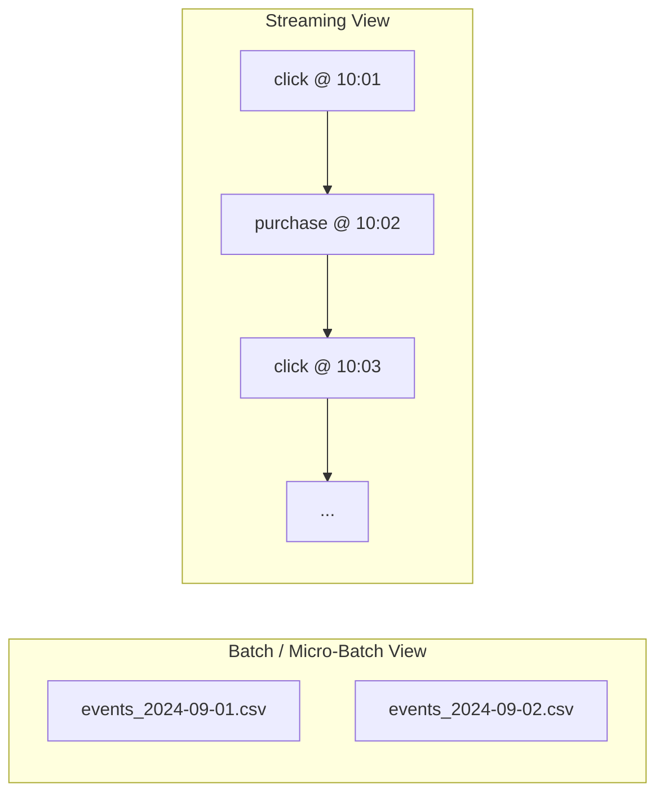
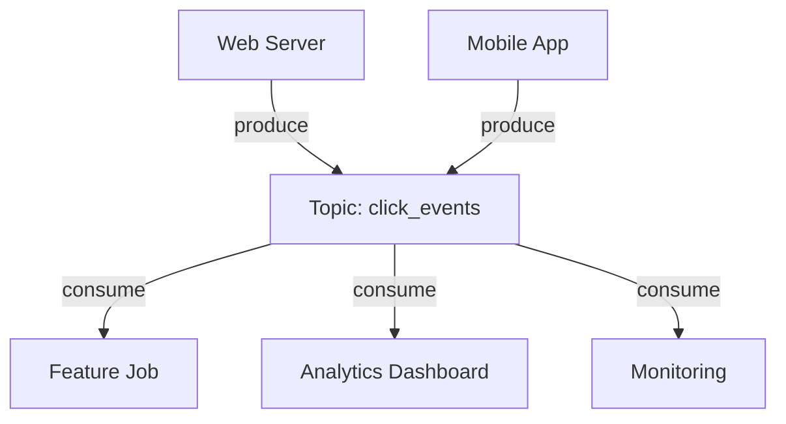
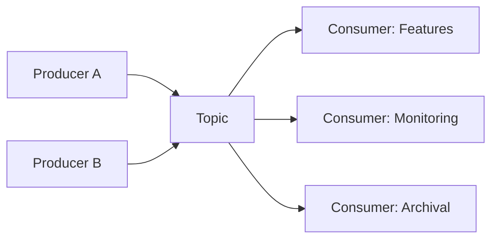

# Event Streams: Foundations of Streaming for ML

## From Files to Continuous Flow

Batch and micro-batch pipelines treat data as **files or table partitions** — yesterday's data, last hour's data. Streaming moves to a **continuous flow of events**, asking: *what is happening right now?*



---

## What Is an Event?

An event is a **small record** describing something that happened:

| Field | Description | Example |
|-------|-------------|---------|
| **What** | Event type | `click`, `purchase`, `sensor_reading` |
| **When** | Timestamp | `2024-09-01T10:01:23Z` |
| **Who / What entity** | Actor or object | `user_id=123`, `sensor_id=45` |
| **Details** | Payload attributes | `amount=$52`, `url=/product/A`, `temp=25°C` |

### Example Events

```
User 123 clicked Product A at 10:01 AM
Sensor 45 reported 25°C at 9:00 AM
Payment 987 was approved for $52
```

A **stream** is a sequence of these events ordered (or partially ordered) over time.

---

## Core Streaming Concepts

### Topic

A **named channel** or stream of events. Topics group related events:

| Topic Name | Events Contained |
|------------|------------------|
| `click_events` | Page views, button clicks |
| `transactions` | Payment approvals, refunds |
| `sensor_readings` | IoT temperature, pressure data |
| `application_logs` | Error events, latency measurements |

### Producer

A service that **publishes events** into a topic.

- Web server sends click events to `click_events`
- Payment gateway sends transactions to `transactions`
- IoT gateway sends sensor readings to `sensor_readings`

### Consumer

A service that **subscribes to a topic** and processes events.

- Feature computation job aggregates clicks per user
- Fraud detector evaluates each transaction
- Monitoring service tracks error rates



---

## Many-to-Many Architecture

Streaming systems support **many-to-many** relationships:

- **Many producers** can write to the **same topic** (web + mobile → `click_events`)
- **Many consumers** can read from the **same topic** for different purposes (features, monitoring, analytics)

This decouples event producers from consumers — producers do not need to know who reads their events.



---

## Batch vs Streaming Mental Model

| Question | Batch / Micro-Batch | Streaming |
|----------|---------------------|-----------|
| Unit of data | File / partition | Individual event |
| Processing trigger | Schedule (cron) | Event arrival |
| Time orientation | "What happened yesterday?" | "What is happening now?" |
| State | Recomputed each run | Maintained across events (rolling windows) |
| Latency | Minutes to hours | Milliseconds to seconds |

---

## Streaming and ML Use Cases

Events are the raw material for real-time ML features:

| Event Stream | ML Application |
|--------------|----------------|
| Click events | Live recommendation, session personalisation |
| Transactions | Real-time fraud detection |
| Sensor readings | Anomaly detection, predictive maintenance |
| Application logs | System failure prediction, ops alerting |
| Model predictions (meta-stream) | Real-time model monitoring, drift detection |

---

## Event Schema Considerations

Even at the event level, structure matters for downstream ML:

```json
{
  "event_type": "purchase",
  "timestamp": "2024-09-01T10:01:23Z",
  "user_id": "123",
  "product_id": "A",
  "amount": 52.00,
  "currency": "USD"
}
```

- **Consistent field names and types** across producers
- **Event time vs processing time** — when it happened vs when the pipeline saw it
- **Ordering guarantees** — most systems guarantee order within a partition key, not globally

---

## Common Pitfalls / Exam Traps

- **Confusing event time with processing time** — a click at 10:00 AM may arrive at 10:05 AM; windowed features must specify which timestamp they use.
- **Assuming global ordering** — events from different users/partitions may arrive out of order; per-key ordering is the typical guarantee.
- **Treating topics as databases** — topics are append-only logs with retention policies, not queryable tables.
- **Single consumer assumption** — multiple independent consumers read the same topic; each maintains its own offset/position.
- **Ignoring producer diversity** — many producers writing to one topic require schema contracts to prevent silent corruption.

---

## Quick Revision Summary

- Streaming processes **continuous event flows** rather than files or partitions.
- An **event** records what happened, when, who/what was involved, and details.
- **Topics** are named channels; **producers** publish; **consumers** subscribe and process.
- Architecture is **many-to-many** — multiple producers and consumers per topic.
- Streaming asks **"what is happening now?"** vs batch's **"what happened in this window?"**
- Events power real-time ML: fraud detection, recommendations, anomaly detection, monitoring.
- Event **schema, timestamps, and ordering** are foundational design decisions.
- Topics decouple producers from consumers — a core scalability pattern.
