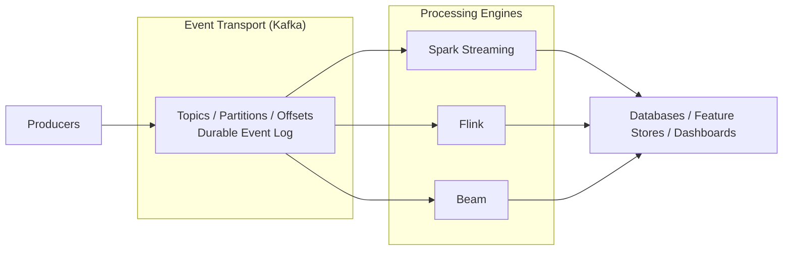
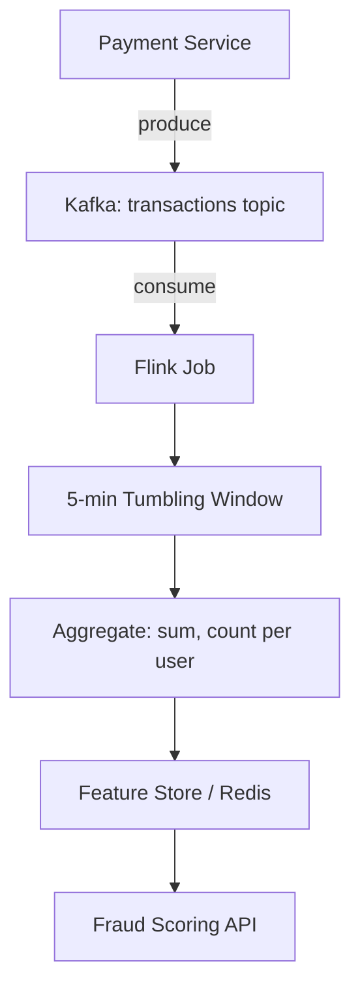

# Kafka, Spark, Flink, and Beam: Roles in Streaming ML

## Separating Transport from Processing

The streaming ecosystem contains many names — Kafka, Spark Streaming, Flink, Beam. The key insight is to separate **event transport** from **event processing**.

---

## Kafka: The Event Highway

Apache Kafka primarily handles **event transport and storage**:

| Responsibility | Description |
|----------------|-------------|
| **Topics** | Named channels partitioning the event space |
| **Partitions** | Parallelism units within a topic; ordering guaranteed per partition |
| **Offsets** | Position markers — consumers track how far they have read |
| **Durability** | Events persisted to disk; configurable retention (hours to forever) |
| **Replay** | Consumers can re-read from any offset |

Kafka is **not** a processing engine. It does not compute aggregations or run ML models. It is a **durable, ordered log** that decouples producers from consumers.

**Analogy:** Kafka is the highway; processing engines are the vehicles driving on it.

---

## Processing Engines: Spark, Flink, Beam

These frameworks **read events** from Kafka (or other sources), apply transformations, and write results to sinks.

| Engine | Strengths | Typical ML Role |
|--------|-----------|-----------------|
| **Spark Structured Streaming** | Micro-batch default, unified batch/streaming API, large-scale ETL | Feature computation, batch + near-real-time |
| **Apache Flink** | True record-by-record streaming, low latency, advanced state | Real-time aggregations, complex event processing |
| **Apache Beam** | Portable abstraction (runs on Flink, Spark, Dataflow) | Pipeline portability across cloud providers |

### What Processing Engines Do

1. **Read** events from Kafka topics (or files, APIs)
2. **Transform** — filter, map, join, aggregate
3. **Window** — group events by time periods
4. **Maintain state** — running counts, last values, rolling statistics
5. **Write** results to databases, feature stores, dashboards, or back to Kafka topics

---

## Three Key Processing Concepts

### 1. Time Windows

Group events over time periods for aggregation:

| Window Type | Behaviour | Example |
|-------------|-----------|---------|
| **Tumbling** | Non-overlapping, fixed-size | Count clicks in each 5-minute block: [0–5), [5–10), [10–15) |
| **Sliding** | Overlapping, fixed-size with slide interval | Average spend in last 10 minutes, computed every 1 minute |
| **Session** | Gap-based — window closes after inactivity period | User session duration (gap = 30 min inactivity) |

```mermaid
gantt
    title Tumbling vs Sliding Windows (5-min tumbling, 10-min sliding every 2 min)
    dateFormat X
    axisFormat %s
    section Tumbling
    Window 1 :0, 5
    Window 2 :5, 5
    Window 3 :10, 5
    section Sliding
    Slide A :0, 10
    Slide B :2, 10
    Slide C :4, 10
```

### 2. Aggregations

Compute statistics over events in each window, often **grouped by key** (user, device, account):

- $\text{count}(\text{events})$ per user per window
- $\text{sum}(\text{amount})$ per account per window
- $\text{avg}(\text{transaction\_amount})$ per user per hour

### 3. Stateful Processing

The job maintains **running state** across events:

- Running count of clicks per user
- Last known value of a sensor reading
- Rolling average updated with each new event

These three concepts are exactly what streaming ML features require:

- `clicks_last_10m` — tumbling or sliding window count
- `avg_transaction_amount_last_hour` — sliding window aggregation
- `last_purchase_category` — stateful last-value tracking

---

## End-to-End Streaming ML Feature Pipeline

1. Payment service publishes transactions to Kafka
2. Flink job consumes events, applies 5-minute tumbling windows
3. Aggregates `spend_5m` and `txn_count_5m` per `user_id`
4. Writes to online feature store
5. Fraud API reads fresh features at inference time

---

## Role Summary Table

| Component | Role | Analogy |
|-----------|------|---------|
| **Kafka** | Durable event log, transport, replay | Highway |
| **Spark Streaming** | Micro-batch processing, large-scale transforms | Heavy truck (batch-like trips) |
| **Flink** | Low-latency record-by-record processing | Sports car (per-event speed) |
| **Beam** | Portable pipeline abstraction | Universal adapter |
| **Feature Store** | Serves computed features to training and inference | Destination warehouse |

---

## Choosing a Processing Engine

| Requirement | Prefer |
|-------------|--------|
| Already use Spark for batch; need near-real-time | Spark Structured Streaming |
| Sub-second latency, complex event patterns | Flink |
| Multi-cloud portability | Beam (on Flink or Dataflow) |
| Simple periodic aggregation (5-min cron) | Cron + SQL (no streaming framework) |

---

## Common Pitfalls / Exam Traps

- **Using Kafka as a database** — it is a log with retention limits, not a query engine; use a processing engine or sink for reads.
- **Confusing Spark Structured Streaming with true streaming** — default mode is micro-batch; latency floor is the trigger interval.
- **Ignoring state backend in Flink** — stateful features require durable state storage (RocksDB); state loss means wrong features.
- **Assuming all engines support identical semantics** — exactly-once, at-least-once, and at-most-once delivery differ across engines.
- **Processing without windowing** — unbounded streams need window boundaries for meaningful aggregations; raw event counts without windows are rarely useful for ML.

---

## Quick Revision Summary

- **Kafka** = event transport and durable log (topics, partitions, offsets) — the highway.
- **Spark, Flink, Beam** = processing engines that transform events into features — the vehicles.
- Three key concepts: **windows** (tumbling, sliding, session), **aggregations** (per-key statistics), **state** (running values).
- Windows enable ML features like `clicks_last_10m` and `avg_spend_last_hour`.
- Spark suits **micro-batch and unified batch/stream**; Flink suits **low-latency true streaming**.
- Beam provides **portable pipeline abstraction** across runtimes.
- End-to-end flow: produce → Kafka → process → feature store → inference API.
- Do not conflate transport (Kafka) with computation (Flink/Spark/Beam).
