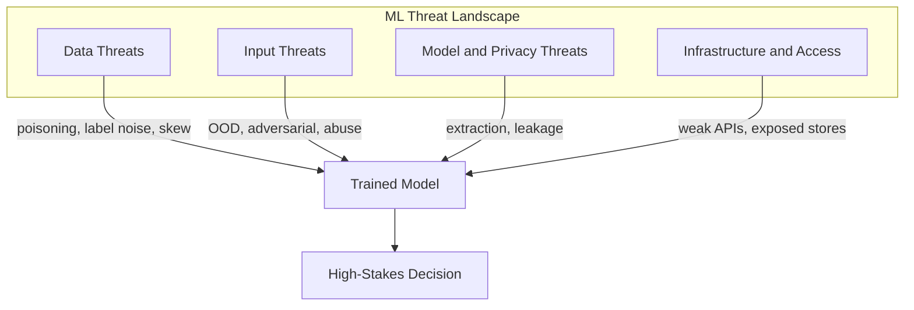

# Threats to Machine Learning Systems: What Can Go Wrong

## Why Security and Responsibility Matter in MLOps

Production ML work does not end at accuracy, latency, and observability. Models increasingly sit inside **decision loops** for high-stakes outcomes: loan approvals, fraud detection, content moderation, healthcare triage, and dynamic pricing. When these systems are attacked, abused, or misused, harm propagates across users, businesses, and regulators.

Security and responsible use are not optional add-ons delegated to a separate security team. They are **design constraints** that model engineers must internalise from the first architecture sketch.

---

## The Mental Map: Four Threat Buckets

Every ML system exposes risk across four interconnected surfaces. Thinking in these buckets helps you design defensively without needing to become a security researcher.

| Bucket | What is at risk | Typical failure mode |
|--------|-----------------|----------------------|
| **Data** | Training sets, labels, sampling | Model learns attacker-favoured or biased behaviour |
| **Input** | Live prediction requests | Unreliable or exploitable outputs at serving time |
| **Model and privacy** | Model weights, outputs, internals | IP theft, membership inference, compliance breach |
| **Infrastructure and access** | APIs, feature stores, logs | Unauthorised access, lateral movement |

---

## 1. Data Threats

**Intuition:** The model is only as trustworthy as the data it learned from. Corrupt the ground, and every downstream metric lies.

- **Data poisoning** — deliberate injection of malicious training examples so the model learns behaviours that benefit an attacker (e.g., approving specific fraudulent patterns).
- **Label noise** — inconsistent or buggy labelling across teams or time periods. Offline metrics may look fine while the model trains on shaky ground.
- **Skewed samples** — over- or under-representation of groups, regions, or behaviours creates blind spots and fairness gaps.

Data quality is simultaneously an **accuracy**, **security**, and **fairness** concern.

---

## 2. Input Threats

**Intuition:** Models assume incoming data resembles training distribution. Violate that assumption and predictions become unreliable — or exploitable.

- **Out-of-distribution (OOD) inputs** — strange formats, extreme values, or entirely new patterns the model never saw.
- **Adversarial-style inputs** — deliberately crafted queries that probe decision boundaries.
- **Abuse patterns** — high-volume API hammering with input variations until a fraud rule or content filter is bypassed.

Defensive primitives: input validation, rate limiting, anomaly monitoring on traffic patterns.

---

## 3. Model and Privacy Threats

**Intuition:** A deployed model is both an asset (IP) and a potential information channel back to training data.

- **Model extraction** — querying a public API at scale to train a surrogate copy, exposing IP and enabling offline weakness analysis.
- **Information leakage** — overfitted models or overly detailed outputs that reveal patterns about individuals or rare training events.
- **Over-sharing internals** — downloadable weights, verbose error messages, forgotten debug endpoints.

**Principle:** Expose only what is needed. Treat models as sensitive assets alongside source code and databases.

---

## 4. Infrastructure and Access Threats

**Intuition:** ML systems have a broad attack surface — not just the model binary.

Weaknesses in data pipelines, feature stores, batch jobs, online APIs, dashboards, and logs can compromise the entire system. Immature deployment and testing processes prolong exposure after a vulnerability is discovered.

---

## Integration with the Broader MLOps Stack

Security connects to patterns already established in production ML engineering:

| MLOps capability | Security role |
|------------------|---------------|
| Deployment patterns (canary, blue-green) | Control who calls the model and how |
| Monitoring and logging | Detect unusual traffic and behaviour |
| Retraining pipelines | Recover from data issues; roll back bad models |
| Feature governance | Visibility into which data and features are used |

When designing or reviewing any system component, ask: **What could go wrong here, and how would we notice?**

---

## Common Pitfalls / Exam Traps

- Treating security as a post-deployment checklist rather than a design-time requirement.
- Assuming high offline accuracy implies the model is safe to deploy — data poisoning and skew can produce good-looking metrics with dangerous behaviour.
- Conflating **input threats** (serving-time) with **data threats** (training-time); mitigations differ completely.
- Ignoring infrastructure threats because "we only exposed a simple REST endpoint."
- Believing model engineers have no security responsibility — first-line defences (validation, least privilege, monitoring) are engineering tasks.

---

## Quick Revision Summary

- ML systems face threats across **data, input, model/privacy, and infrastructure** — use this four-bucket mental map.
- Models in decision loops for money, access, and safety amplify the impact of any successful attack.
- Data poisoning, label noise, and sampling skew corrupt what the model learns — not just how well it scores.
- Input threats include OOD traffic, adversarial probing, and API abuse; defend with validation, rate limits, and monitoring.
- Model extraction and information leakage turn outputs and internals into privacy and IP risks.
- Security is woven into MLOps: deployment controls, monitoring, retraining, and feature governance all contribute.
- Design defensively from the start: least privilege, minimal exposure, auditable deployments.
