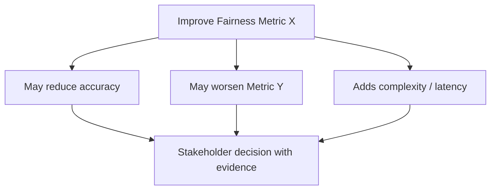
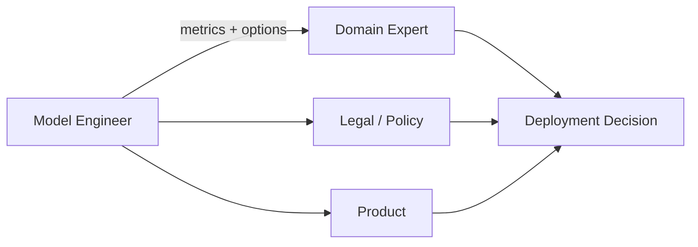

# Fairness Limitations, Trade-offs, and the Model Engineer's Role

## There Is No Single Fairness Metric

Fairness is not a scalar you optimise once and forget. Different definitions capture different notions of equitable treatment — and they **frequently conflict**.

| Fairness criterion | What it demands | Example tension |
|--------------------|-----------------|-----------------|
| Equal accuracy | Same error rate across groups | May conflict with base-rate differences |
| Equal false positive rate | Same FP rate across groups | Conflicts with equal recall when base rates differ |
| Equal false negative rate | Same FN rate across groups | Conflicts with equal precision |
| Equal calibration | Same score-to-probability mapping | Conflicts with equal FPR and FNR simultaneously |
| Demographic parity | Equal positive prediction rate | May sacrifice overall accuracy significantly |

**Impossibility result (informal):** Except in trivial cases, you cannot satisfy all fairness definitions simultaneously when group base rates differ. This is not a tooling bug — it is a mathematical constraint.

---

## Accuracy–Fairness Trade-offs

Improving one fairness measure often costs:

- **Overall accuracy** — rebalancing or constraints reduce global performance.
- **Latency** — per-group models or post-processing add inference overhead.
- **Complexity** — multi-objective training, constrained optimisation, or ensemble architectures.
- **Operational cost** — additional monitoring, retraining, and governance infrastructure.

These trade-offs are real engineering decisions, not moral failures. Document them explicitly.

---

## Metrics Cannot Tell You What Is Acceptable

Whether a 3% gap or a 10% gap is tolerable depends on:

- **Domain stakes** — movie recommendation vs medical diagnosis.
- **Regulatory environment** — sector-specific anti-discrimination law.
- **Organisational policy** — internal fairness commitments.
- **Affected population** — size, vulnerability, historical context.

Fairness numbers are **inputs to discussion and investigation**, not magic yes/no verdicts.

---

## The Model Engineer's Responsibilities

### 1. Make Group-Wise Metrics Easy to Compute

Build scripts, notebooks, or dashboards that compute segmented metrics by default. If it is easy, teams do it regularly. If it requires a bespoke analysis each time, it gets skipped before launch.

### 2. Flag Large or Surprising Gaps Early

Surface disparities during development and validation — not in a pre-launch panic. Integrate fairness checks into CI/CD alongside accuracy and latency gates.

### 3. Document Groups, Gaps, and Decisions

Record:

- Which groups were evaluated.
- What gaps were observed.
- What decisions were made in response (deploy, mitigate, reject).

This demonstrates fairness was considered and gives future teams context.

### 4. Collaborate — Do Not Decide Alone

Work with domain experts, legal, policy, and product teams. The model engineer provides **clear evidence and options**; organisational stakeholders weigh trade-offs and set thresholds.

---

## Fairness Checks: End-to-End Pattern

1. **Group comparisons** — same model, different groups, same metrics.
2. **Beyond accuracy** — FP rate, FN rate, calibration, performance by slice.
3. **Visualise** — tables and charts that surface disparities for all stakeholders.
4. **Recognise trade-offs** — multiple definitions, conflicting constraints.
5. **Automate and log** — fairness checks in CI/CD; results in audit trail.
6. **Human decision** — metrics inform; policy and context decide.

---

## Connection to Responsible Production ML

Fairness evaluation logged alongside model metadata forms part of a **basic audit trail** — connecting monitoring, governance, and accountability. This is a key step toward production-grade responsible ML, not a one-time academic exercise.

---

## Common Pitfalls / Exam Traps

- Claiming a model is "fair" because one metric looks acceptable — other definitions may be violated.
- Optimising demographic parity without checking whether FN rates worsened for a vulnerable group.
- Setting universal thresholds (e.g., 10% max gap) without domain consultation.
- Treating fairness as purely the model engineer's ethical burden — it is an organisational decision.
- Running fairness analysis only once at launch — data drift changes group-wise behaviour over time.
- Ignoring trade-offs in exam answers — acknowledge that improving one fairness criterion may harm another.

---

## Quick Revision Summary

- No single universal fairness metric — equal accuracy, FPR, FNR, and calibration can conflict.
- Improving one fairness measure may cost accuracy, latency, or complexity.
- Whether a gap is acceptable depends on domain, stakes, policy, and regulation.
- Model engineer role: make metrics easy, flag gaps early, document decisions, collaborate.
- Fairness numbers are inputs to human decisions — not automated verdicts.
- Integrate fairness checks into CI/CD and audit trails for continuous accountability.
- Document which groups were tested, what gaps appeared, and what action was taken.
