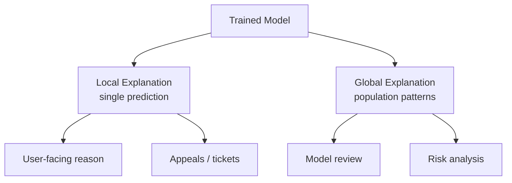

# Explainability: What It Is, Why It Matters, and Its Limits

## The Inevitable Question: "Why Did the Model Do That?"

Users denied a loan, stakeholders reviewing risk models, and regulators auditing automated decisions all ask the same question. Answering it requires tracing how data flowed through the system, which model version produced the output, and what features influenced the prediction.

Explainability and audit trails work together as an **accountability toolkit** for production ML.

---

## What Explainability Means

Explainability is making model behaviour **understandable enough** that humans can reason about it. It does not require perfect transparency of every weight — it requires **useful, honest summaries**.

Two flavours dominate practice:

| Type | Question answered | Audience |
|------|-------------------|----------|
| **Local** | Why this prediction for this specific case? | End user, support, appeals |
| **Global** | What features drive behaviour in general? | Model reviewers, risk analysts, engineers |

---

## Local Explainability

Focuses on a **single instance**.

**Example — loan denial:**
> For this application, low income and recent delinquency contributed most to the rejection.

**Use cases:**

- User-facing explanations after adverse decisions.
- Support ticket investigation.
- Appeal workflows where the applicant challenges the outcome.

Common methods: SHAP values, LIME, feature contribution from tree models, attention weights (for some neural architectures).

---

## Global Explainability

Summarises behaviour across **many cases**.

**Example — credit risk model:**
> Across the portfolio, credit history length, debt-to-income ratio, and recent delinquency are the top risk drivers.

**Use cases:**

- Model validation and risk committee review.
- Feature design decisions (is the model relying on a problematic proxy?).
- Regulatory reporting on model drivers.

Common methods: permutation importance, global SHAP summaries, partial dependence plots.

---

## Why Invest in Explainability

### 1. Debugging and Safety

Explanations reveal strange dependencies — a model leaning heavily on **postcode** may be using it as a proxy for a protected attribute. Catching this before deployment prevents regulatory and fairness incidents.

### 2. User Trust and Experience

After a negative decision, a clear and honest reason:

- Reduces perceived arbitrariness.
- Guides users on what to improve.
- Supports legitimate appeal processes.

### 3. Internal and Regulatory Review

Stakeholders ask: *What is really driving these decisions? Is it aligned with our policies?* Explainability provides evidence-based answers.

---

## Limits and Warnings

### Explanations Are Approximations

Popular methods (LIME, SHAP) **simplify** complex models into human-digestible form. They can:

- Oversimplify non-linear interactions.
- Be unstable across similar inputs.
- Mislead when the model uses features in ways the explanation method assumes away.

### Garbage In, Explanation Out

Explanations are only as good as the data and features underneath. If training data is biased or features are proxies for sensitive attributes, a polished explanation chart does not fix the underlying problem.

### Just-So Stories

Plausible-sounding explanations can **gloss over deeper issues**:

- A model denies loans to a region because of postcode — the explanation says "low income feature" while the real driver is geographic proxy for ethnicity.
- Feature contributions sum neatly but ignore correlated features that jointly encode protected information.

### Correct Usage

Use explainability **alongside**:

- Domain expertise
- Fairness checks (group-wise metrics)
- Sanity checks on feature provenance
- Audit trails for reproducibility

Never as a **substitute** for these.

---

## Comparison: Local vs Global

| Dimension | Local | Global |
|-----------|-------|--------|
| Scope | One prediction | Entire dataset / model |
| Method examples | LIME, SHAP per instance | Permutation importance, global SHAP |
| Primary consumer | User, support | Risk team, regulator, engineer |
| Risk | Overfitting explanation to one case | Missing subgroup-specific behaviour |
| Production need | Both are usually required | Both are usually required |

---

## Common Pitfalls / Exam Traps

- Treating SHAP values as ground truth rather than an approximation.
- Providing local explanations without checking global feature importance — local and global can disagree.
- Using explainability to "prove" fairness — a model can have reasonable explanations and still discriminate.
- Exposing full feature attribution in public APIs — privacy and extraction risk.
- Skipping explainability for "simple" models — linear models can still use proxy features that need scrutiny.

---

## Quick Revision Summary

- Explainability makes model behaviour understandable for humans — local (one case) and global (population).
- **Local:** why this prediction — for users, support, appeals.
- **Global:** what drives the model generally — for review, risk analysis, feature design.
- Invest in explainability for debugging, user trust, and regulatory review.
- Popular methods are **approximations** — they can oversimplify or mislead.
- Biased data and proxy features produce polished but misleading explanations.
- Use explainability with fairness checks and domain expertise — not as a substitute.
- Production systems typically need both local and global explanation capabilities.
