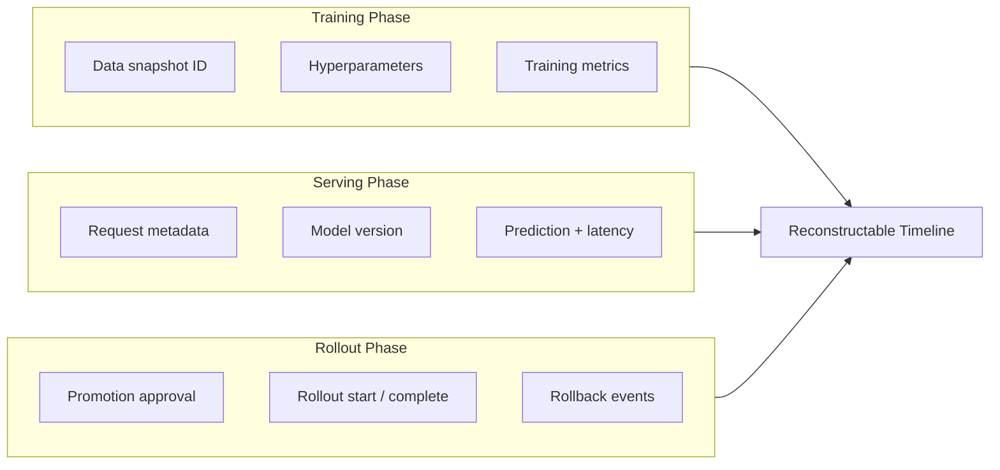
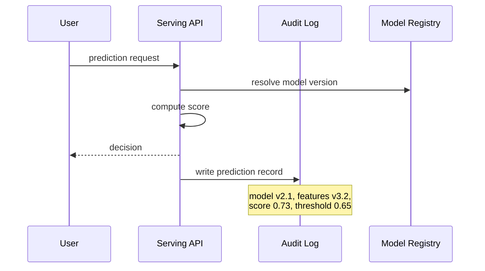

# Audit Trails Across the ML Pipeline

## What Is an Audit Trail?

An audit trail is the persistent record that lets you reconstruct **what happened, when, and under which configuration**. For ML systems, it spans individual predictions, training runs, deployments, and rollbacks — tying data, model versions, and decisions into a coherent timeline.

Without audit trails, answering "which model made this decision?" requires forensic guesswork.

---

## Per-Prediction Logging

For each prediction (online or batch), capture:

| Field category | What to log | Example |
|----------------|-------------|---------|
| **Model metadata** | Name, version, hash, config flags | `credit-risk-v2.1`, `hash:abc123` |
| **Data / feature context** | Key input fields, feature store version, timestamp | `features_v3.2`, `2025-06-05T14:32:01Z` |
| **Decision details** | Prediction, score, threshold applied | `score: 0.73`, `threshold: 0.65`, `decision: deny` |
| **Explanation summary** | Optional short local explanation | `top drivers: income, delinquency` |
| **Request context** | Request ID, calling service | `req-8f3a`, `loan-origination-svc` |

### Privacy Constraint

Do not log raw PII unnecessarily. Apply minimisation and access-control policies — audit logs themselves become sensitive datastores if they contain names, emails, or full feature vectors with identifying content.

---

## Pipeline-Spanning Audit Events

Audit trails are not limited to serving. They cover the full ML lifecycle:

### During Training

Log:

- Data snapshot or version used
- Hyperparameters and training configuration
- Evaluation metrics achieved (overall and group-wise)
- Tools like MLflow, Weights & Biases, or custom experiment trackers serve this role.

### During Serving

Log:

- Request metadata (non-PII identifiers)
- Model version serving the request
- Predictions, scores, and latency
- Error rates and anomaly flags

### During Rollout

Log:

- When a new model was trained and by whom
- Who approved promotion to production
- Rollout start, completion, and any rollback events
- Canary metrics that justified the promotion

---

## Reconstructing a Decision

Given a complaint — *"Why was I denied on June 5th?"* — a complete audit trail answers:

1. **Which model version** was serving at that timestamp?
2. **Which data and feature versions** were used to compute the input?
3. **What score and threshold** produced the decision?
4. **What fairness and quality checks** did that model version pass before promotion?
5. **Who approved** deployment?

---

## Audit Trail Design Principles

| Principle | Rationale |
|-----------|-----------|
| **Structured format** | JSON/JSONL enables querying and trend analysis |
| **Immutable append** | Records are not edited — new entries correct errors |
| **Correlatable IDs** | Request ID links prediction log to application log |
| **Version everything** | Model, data, features, and config all versioned |
| **Minimise PII** | Log references (user token) not raw identifiers |
| **Retention policy** | Define how long logs are kept and who can access them |

---

## Integration with Fairness and Governance

Audit trails should include **group-wise fairness metrics** from evaluation:

- Not just "model passed" but the raw per-group metrics that led to the pass/fail.
- Enables future auditors to verify the decision without re-running analysis.

This connects fairness evaluation (Topic 3) to long-term accountability.

---

## Common Pitfalls / Exam Traps

- Logging only predictions without model version — impossible to reproduce the decision later.
- Storing raw PII in audit logs, creating a second sensitive datastore.
- Console-printing pass/fail in CI/CD without persisting — the record vanishes after the pipeline run.
- Mutable logs that can be edited without trace — undermines audit credibility.
- Missing rollout events — knowing the prediction but not which model was live at that time.
- Conflating application logs with ML audit trails — both needed, different schemas.

---

## Quick Revision Summary

- Audit trails reconstruct what happened across the ML lifecycle.
- Per-prediction logs: model version, feature version, score, threshold, request ID, optional explanation.
- Training logs: data snapshot, hyperparameters, metrics (including group-wise).
- Rollout logs: promotion approval, rollout/rollback events.
- Do not log raw PII — apply minimisation to audit records themselves.
- Structured, append-only, versioned logs enable compliance and incident investigation.
- Include fairness evaluation results in the audit trail, not just pass/fail.
- A complete trail answers: which model, which data, which checks, who approved.
