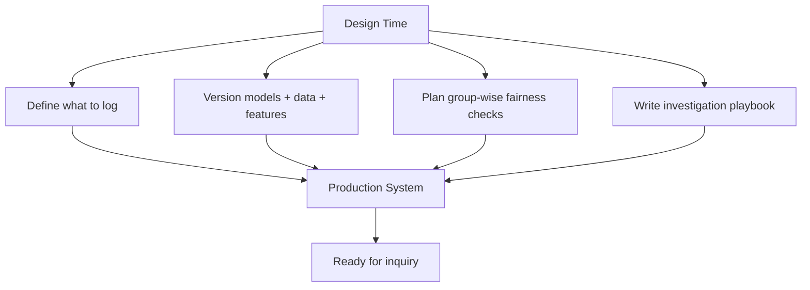

# Regulatory Expectations and Designing for Auditability

## Shared Expectations Across Regulated Domains

Specific laws vary by jurisdiction and sector (finance, healthcare, hiring, insurance). Despite differences, regulated domains share common expectations for automated decision systems:

| Expectation | What it means in practice |
|-------------|---------------------------|
| **Purpose limitation** | Use data only for declared, consented purposes |
| **Non-discrimination** | Avoid unjustified bias or harmful disparate impact |
| **Explainability** | Provide understandable reasons to non-technical people |
| **Record-keeping** | Maintain records of models used, evaluations performed, and approvals granted |
| **Accountability** | Demonstrate governance when users or regulators inquire |

When a user asks *"Why was I denied?"* or a regulator asks *"How is this model governed?"* — explainability plus audit trails must be ready, not assembled under pressure.

> This is engineering guidance, not legal advice. Consult legal teams for jurisdiction-specific obligations.

---

## Design for Auditability at Design Time

The best time to build auditability is **before the first production deployment**, not after an incident.

Treat the following as core requirements — equal to accuracy and latency:

- Model versioning
- Structured logging
- Fairness evaluation records
- Deployment approval workflows

---

## What to Decide Early

### Logging Scope

Define upfront what each prediction and training run records:

- Model name, version, hash
- Data and feature versions
- Prediction, score, threshold
- Group-wise fairness metrics from evaluation
- Approval metadata for promotions

### Answerable Questions

The system should easily answer:

1. **Which model** made this decision?
2. **What data and features** were used?
3. **What fairness, quality, or regression checks** did that model pass?
4. **Who approved** deployment and when?

### Investigation Playbook

A simple runbook describing how to investigate a complaint or incident:

| Step | Action |
|------|--------|
| 1 | Retrieve prediction audit record by request ID and timestamp |
| 2 | Identify model version and feature version in service at that time |
| 3 | Pull fairness evaluation record for that model version |
| 4 | Generate local explanation for the specific case |
| 5 | Escalate to domain expert / legal if disparity or error confirmed |

When something goes wrong, you do not want to invent the process on the spot.

---

## Regulatory Inquiry Scenario

**Regulator:** "How do you ensure your credit model does not discriminate?"

**A well-designed system responds with:**

- Group-wise evaluation results logged at training and pre-deployment.
- Documented fairness thresholds agreed with policy teams.
- Audit trail showing which model version was live during the inquiry period.
- Global explainability analysis showing top features (with proxy review).
- Change history: when models were retrained, what changed, who approved.

**A poorly designed system responds with:**

- "We have 95% accuracy."
- Scrambling to re-run analysis on a model no longer in production.
- No record of who approved the current version.

---

## Auditability vs Explainability

| Capability | Answers | Format |
|------------|---------|--------|
| **Explainability** | Why did the model decide X? | Feature contributions, natural language |
| **Auditability** | What model, data, and process produced X? | Versioned logs, timestamps, approvals |
| **Together** | Full accountability chain | Explanation grounded in reproducible record |

Explainability without audit trails is unverifiable. Audit trails without explainability are opaque to non-engineers.

---

## Common Pitfalls / Exam Traps

- Treating regulatory compliance as a legal-team-only concern — engineering design determines feasibility.
- Building auditability after a complaint arrives — records are incomplete or lost.
- Logging pass/fail without underlying metrics — auditors cannot verify the decision.
- No investigation playbook — incident response is slow and inconsistent.
- Assuming 95% accuracy satisfies regulatory expectations for fairness and explainability.
- Confusing explainability with auditability — both are required but serve different questions.

---

## Quick Revision Summary

- Regulated domains share expectations: purpose limitation, non-discrimination, explainability, record-keeping.
- Design for auditability at **design time** — not after incidents.
- Model versioning, structured logging, and fairness records are core requirements.
- System must answer: which model, what data, what checks passed, who approved.
- Write an **investigation playbook** before you need it.
- Explainability (why) and auditability (what/when/who) complement each other.
- Fairness metrics logged per model version enable regulatory and internal review.
- High accuracy alone does not demonstrate responsible governance.
