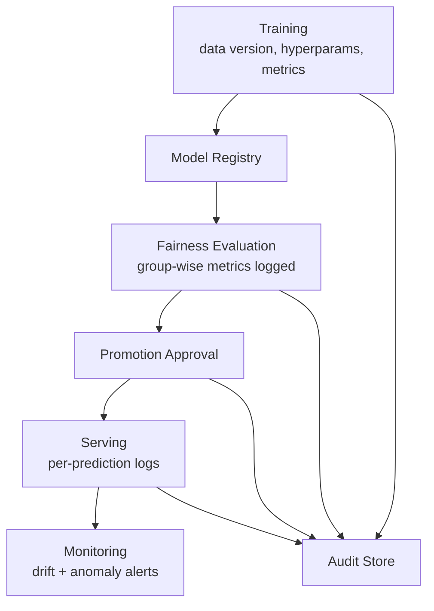

# Explainability, Audit Trails, and Accountability: Integration Recap

## The Accountability Toolkit

Responsible production ML requires two complementary capabilities:

1. **Explainability** — understanding model behaviour at local and global levels.
2. **Audit trails** — persistent logs tying together data, model versions, decisions, and time.

Together they form an accountability toolkit that answers both *"why?"* and *"what exactly happened?"*

---

## Explainability Recap

| Dimension | Scope | Primary use |
|-----------|-------|-------------|
| **Local** | Single prediction | User-facing reasons, appeals, support |
| **Global** | Population-level patterns | Model review, risk analysis, feature design |

Explainability supports debugging, user trust, and regulatory review. It is an approximation — use alongside fairness checks and domain expertise.

---

## Audit Trails Recap

Audit trails span the full ML pipeline:

Each stage produces records that let you reconstruct any decision after the fact.

---

## Regulatory and Organisational Context

People will ask **why** (explainability) and **how** (auditability):

- Users challenging adverse decisions.
- Business stakeholders reviewing model risk.
- Regulators auditing governance practices.
- Internal audit teams verifying process compliance.

The system must answer both question types for non-ML stakeholders — not only for engineers who can inspect code and notebooks.

---

## Design Principle: Traceable and Interpretable

A production ML system should be:

- **Traceable** — every decision links to a model version, data version, and configuration.
- **Interpretable enough** — explanations are honest, useful summaries, not opaque score dumps.

This is not academic overhead. It is the difference between a system that survives regulatory scrutiny and one that cannot defend its decisions.

---

## Bridge to Hands-On Fairness Labs

The practical lab sequence applies the concepts from this module:

| Lab step | Concept applied |
|----------|-----------------|
| Segmented evaluation | Group-wise metrics — disaggregate accuracy, precision, recall |
| Automated fairness check | Policy thresholds on recall gap and FPR gap |
| Logging fairness results | Structured audit record in JSONL format |

This closes the loop: **evaluate → enforce → record** — turning fairness from a one-time check into a governed, auditable practice.

---

## Module 11 Integration Map

| Topic | Contribution to responsible ML |
|-------|-------------------------------|
| Threats and security | Defensive design from the start |
| Data privacy | PII handling, minimisation, RBAC |
| Fairness and bias | Group-wise evaluation and thresholds |
| Explainability | Local and global understanding |
| Audit trails | Persistent, structured accountability records |
| Regulatory context | Design-time auditability |

---

## Common Pitfalls / Exam Traps

- Treating explainability and audit trails as optional "nice to haves" for regulated domains.
- Building explainability without audit trails — cannot verify explanations against the actual model version used.
- Running fairness analysis in notebooks without persisting results — no system of record.
- Designing only for engineer-level debugging — stakeholders need plain-language answers.
- Skipping the lab patterns (segment → check → log) in production — fairness remains a one-off exercise.

---

## Quick Revision Summary

- Explainability (why) and audit trails (what/when/who) form the accountability toolkit.
- Local explanations for individual decisions; global explanations for model review.
- Audit trails span training, evaluation, promotion, serving, and monitoring.
- Regulatory and organisational context demands answers for non-technical stakeholders.
- Design systems to be traceable and interpretable from the start.
- Lab workflow: segmented evaluation → automated fairness check → JSONL audit log.
- Fairness, security, privacy, explainability, and auditability integrate into responsible production ML.
