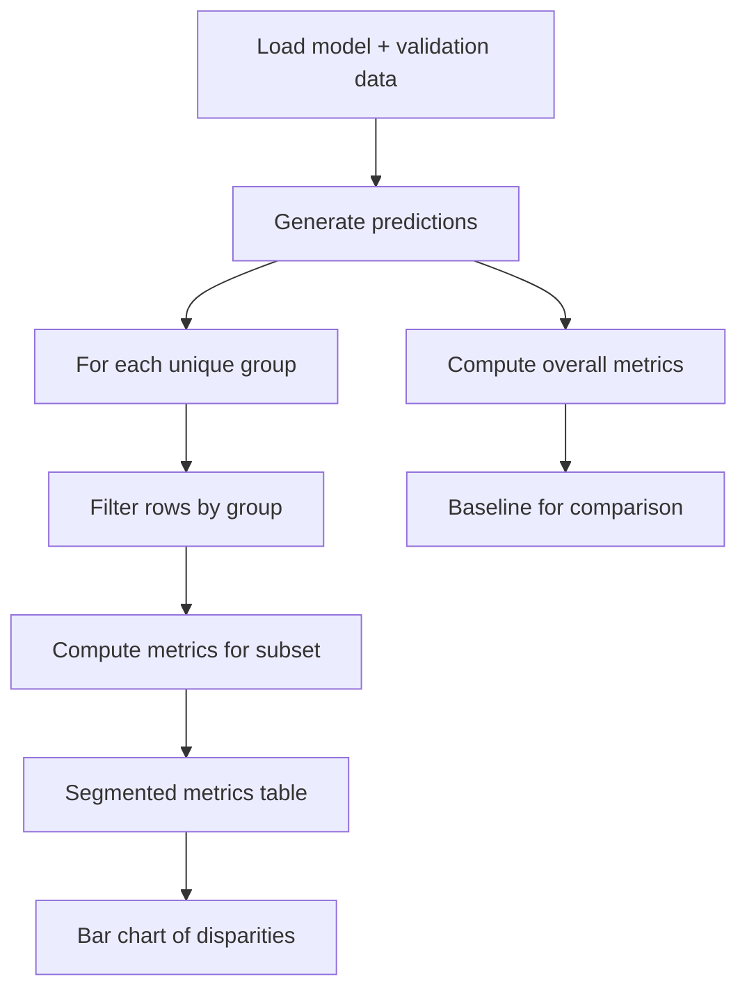

# Segmented Evaluation: Performance by Group

## The Problem with a Single Global Metric

A credit scoring model reporting 95% accuracy looks excellent. But accuracy aggregated over all users can **hide systematic underperformance** for specific groups. A model that is "technically accurate" on average can still cause unintended harm.

Segmented evaluation — computing metrics independently per group — is the foundational practice for any fairness analysis.

---

## Why Disaggregation Matters

| View | What you see | Risk |
|------|--------------|------|
| Global accuracy = 95% | One reassuring number | Hidden group disparities |
| Group A accuracy = 97% | Strong performance | — |
| Group B accuracy = 88% | Weaker performance | 9 pp gap invisible globally |

The global number is a **dangerous summary statistic** when group sizes differ or error distributions are asymmetric.

---

## Lab Setup Pattern

A typical fairness lab uses synthetic data when real data is sensitive or unavailable — a common industry practice.

### Synthetic Data Design

Define two groups (Group A, Group B) with a **slight difference in base positive-class probability**:

- Group B has a higher natural likelihood of the positive label.
- This mimics real-world population differences.
- The model may latch onto group-correlated patterns, producing performance disparities.

After data generation, train a simple model (e.g., logistic regression) and save:

- Model artefact (`.pkl`)
- Validation CSV with a `group` column and labels

---

## Segmented Evaluation Workflow



### Step 1: Overall Metrics (Baseline)

Compute accuracy, precision, recall, and AUC across the entire validation set. This is the number you might report to stakeholders if not being careful.

### Step 2: Per-Group Metrics

Loop through each unique value in the `group` column:

1. Create a boolean mask selecting only rows for that group.
2. Pass the filtered labels and predictions to a metrics function.
3. Collect a separate metric set per group.

### Step 3: Compare and Visualise

Print a segmented table and generate a bar chart. The chart makes recall or accuracy gaps **immediately obvious**.

---

## Example Output Interpretation

```
Overall:  accuracy=0.91  recall=0.85  precision=0.88  AUC=0.93

Group A:  accuracy=0.94  recall=0.91  precision=0.90  AUC=0.95
Group B:  accuracy=0.86  recall=0.74  precision=0.82  AUC=0.87
```

**Reading this:**

- Overall recall (0.85) looks acceptable.
- Group B recall (0.74) is substantially lower — the model misses true positives for Group B more often.
- This disparity was **completely invisible** in the global number.
- In a lending context, lower recall for Group B may mean qualified applicants are disproportionately denied.

---

## Implementation Pattern (Pseudocode)

```python
overall = compute_metrics(y_true, y_pred)

for group in df["group"].unique():
    mask = df["group"] == group
    group_metrics = compute_metrics(y_true[mask], y_pred[mask])
    print(group, group_metrics)
```

The `compute_metrics` helper centralises accuracy, precision, recall, AUC computation — reused for both global and segmented views.

---

## This Is Step One of a Fairness Audit

Segmented evaluation **uncovers** hidden performance issues. It does not:

- Automatically fix them.
- Define whether the gap is acceptable.
- Replace policy discussion.

It converts an invisible problem into an **observable** one — the prerequisite for automated checks and audit logging in subsequent steps.

---

## Common Pitfalls / Exam Traps

- Reporting only overall metrics to stakeholders for high-impact models.
- Forgetting to include the `group` column in the validation set used for evaluation.
- Using training set for segmented evaluation — overfitting inflates all group metrics.
- Ignoring small groups with few samples — metrics are noisy and unreliable.
- Stopping at accuracy without examining recall and FPR — the direction of harm matters.
- Assuming synthetic lab results do not reflect real-world patterns — the methodology transfers directly.

---

## Quick Revision Summary

- High global accuracy can hide poor performance for specific groups.
- **Segmented evaluation:** compute accuracy, precision, recall, AUC per group independently.
- Workflow: predict → overall baseline → loop groups → filter → compute metrics → compare.
- Bar charts make disparities immediately visible.
- Recall gaps often indicate denied opportunities (lending) or missed detections (fraud).
- Synthetic data with group-specific base rates is a valid way to practise fairness analysis.
- Disaggregation is the first and most important step in any fairness audit.
