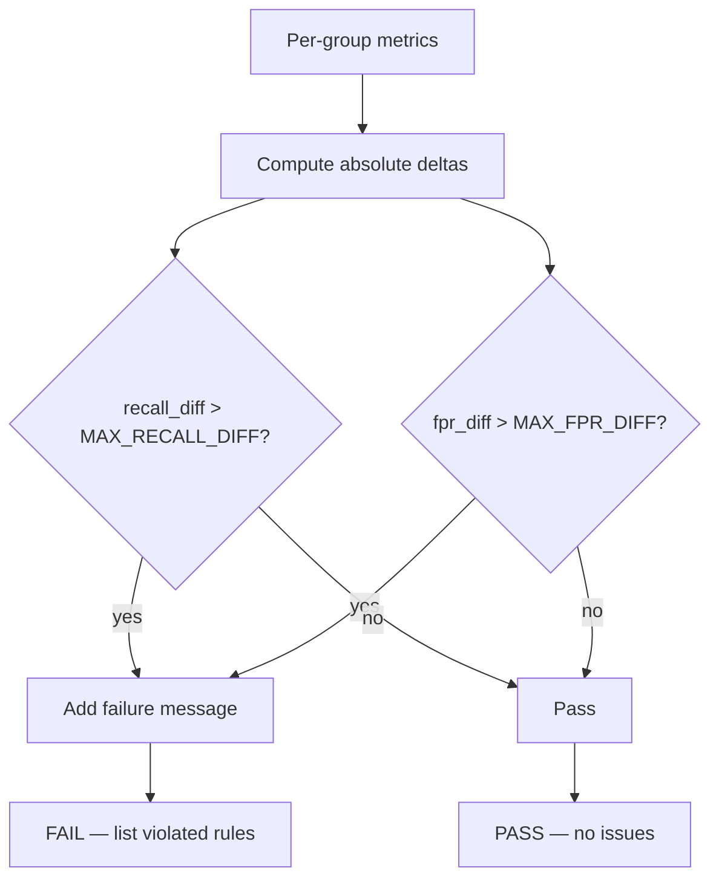

# Automated Fairness Checks: Policy, Thresholds, and Pass/Fail Logic

## From Observation to Automation

Manually inspecting a segmented metrics table and bar chart works for one model. It does not scale across dozens of models, retraining cycles, and CI/CD pipelines. The next step is encoding fairness expectations as **explicit rules and thresholds** that produce an automated pass or fail signal.

---

## Fairness Policy as Code

Define constraints at the top of the fairness check script:

```python
MAX_RECALL_DIFFERENCE = 0.10   # 10 percentage points
MAX_FPR_DIFFERENCE = 0.10      # 10 percentage points
```

**Policy statement:**

- The absolute difference in recall between any two groups must not exceed 10%.
- The absolute difference in false positive rate (FPR) between any two groups must not exceed 10%.

These thresholds are **not universal**. They are context-dependent and must be decided with product owners, legal teams, and domain experts.

| Domain | Example threshold | Rationale |
|--------|-------------------|-----------|
| High-stakes medical model | 1% max gap | Patient safety |
| Loan approval | 5–10% max gap | Regulatory scrutiny, opportunity impact |
| Movie recommendation | 10%+ may be acceptable | Low individual harm |

---

## Why Recall and FPR?

Different error types matter in different model types:

| Metric | Measures | Critical for |
|--------|----------|--------------|
| **Recall** ($1 - \text{FNR}$) | How well true positives are identified | **Opportunity models** — loan approval, hiring (missing qualified candidates = false negative) |
| **FPR** | How often negatives are incorrectly flagged positive | **Punitive models** — fraud detection, content moderation (false accusations = false positive) |

$$\text{FPR} = \frac{FP}{FP + TN}$$

$$\text{Recall} = \frac{TP}{TP + FN}$$

A complete fairness check often monitors both — even if one is primary for the domain.

---

## Computing Confusion-Based Rates

Use a confusion matrix per group to derive raw counts:

| | Predicted + | Predicted − |
|---|-----------|-------------|
| Actual + | TP | FN |
| Actual − | FP | TN |

From these, compute FPR, FNR, recall, and precision for each group.

A helper function wrapping `sklearn.metrics.confusion_matrix` keeps the main script clean.

---

## Delta Computation and Pass/Fail Logic



### Delta calculation

$$\Delta_{\text{recall}} = |\text{recall}_A - \text{recall}_B|$$

$$\Delta_{\text{FPR}} = |\text{FPR}_A - \text{FPR}_B|$$

### Pass/fail logic

```python
issues = []
if recall_diff > MAX_RECALL_DIFFERENCE:
    issues.append(f"Recall gap {recall_diff:.2%} exceeds {MAX_RECALL_DIFFERENCE:.2%}")
if fpr_diff > MAX_FPR_DIFFERENCE:
    issues.append(f"FPR gap {fpr_diff:.2%} exceeds {MAX_FPR_DIFFERENCE:.2%}")

verdict = "PASS" if not issues else "FAIL"
```

---

## Interpreting a FAIL Verdict

A FAIL does **not** automatically mean discard the model. It means:

- A human must investigate before proceeding.
- The automated check is a **safety net**, not a final arbiter.
- The conversation shifts from "is the model accurate?" to "is the model fair enough for our policy?"

| Verdict | Action |
|---------|--------|
| PASS | Proceed with standard deployment review |
| FAIL | Investigate root cause (data, features, threshold); consult stakeholders; consider mitigation or rejection |

---

## CI/CD Integration

Place the fairness check script in the training or validation pipeline:

1. Train model.
2. Run segmented evaluation.
3. Run fairness check.
4. If FAIL → block promotion (or require override with documented approval).

This prevents models with known disparities from reaching production unnoticed.

---

## Common Pitfalls / Exam Traps

- Treating 10% as a universal threshold — always context-dependent.
- Only checking recall and ignoring FPR (or vice versa) — domain determines which matters.
- Treating FAIL as "model is unusable" — it triggers investigation, not automatic rejection.
- Running fairness checks only on overall data without per-group confusion matrices.
- Not documenting who set the thresholds and why — auditors will ask.
- Checking only two groups when the dataset has many — extend deltas to all pairs or worst-case pair.

---

## Quick Revision Summary

- Automate fairness by encoding policy thresholds as pass/fail rules in CI/CD.
- Typical constraints: max recall difference and max FPR difference between groups.
- **Recall** critical for opportunity models (lending); **FPR** critical for punitive models (fraud).
- Compute confusion matrix per group → derive FPR, recall → compute absolute deltas.
- FAIL triggers human investigation — not automatic model rejection.
- Thresholds must be set with product, legal, and domain experts — not by engineers alone.
- Fairness check is a safety net integrated into the ML pipeline before promotion.
