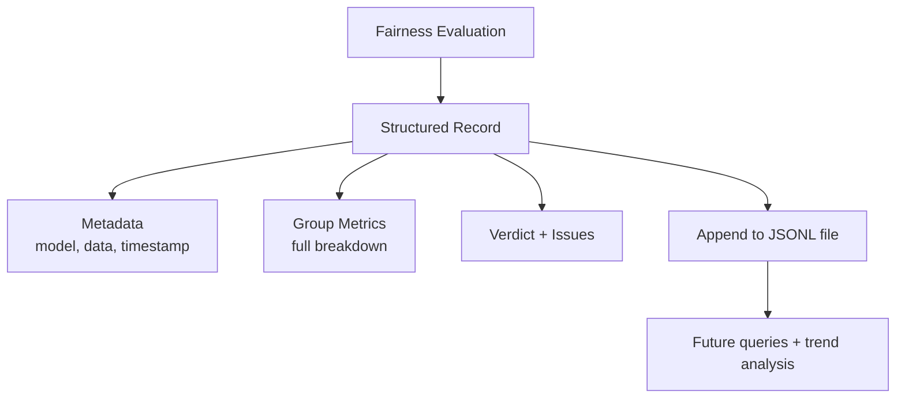
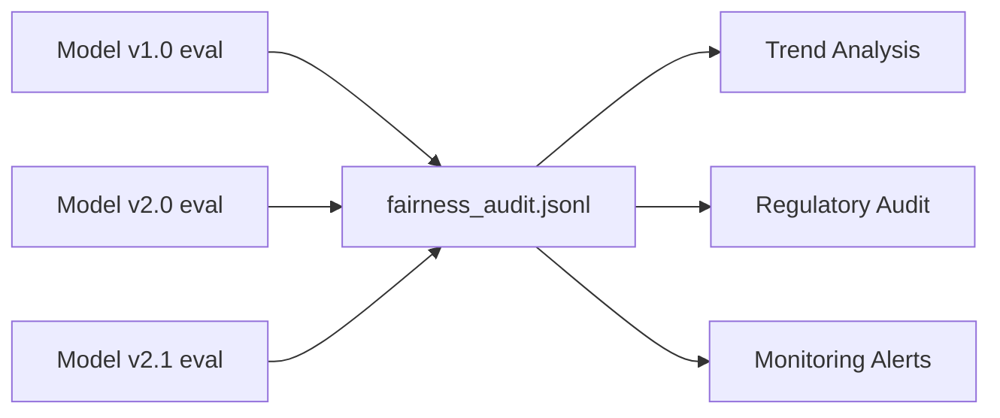

# Logging Fairness Metrics for Audit and Monitoring

## Why Console Output Is Not Enough

An automated fairness check that prints PASS or FAIL to the terminal works for CI/CD at the moment of execution. But a month later, when an auditor, regulator, or teammate asks *"What was the fairness evaluation for model version 2.1, and why did we ship it?"* — that console output is gone.

Governance and compliance require a **persistent, structured system of record**.

---

## The Fairness Audit Record

Capture all context surrounding a fairness evaluation in a single structured record:

| Field | Purpose |
|-------|---------|
| `model_version` | Which model was evaluated |
| `data_version` | Which dataset the evaluation ran against |
| `timestamp` | When the evaluation occurred |
| `group_metrics` | Full per-group breakdown (accuracy, recall, FPR, etc.) |
| `deltas` | Computed gaps between groups |
| `thresholds` | Policy limits applied |
| `verdict` | PASS or FAIL |
| `issues` | List of violated rules (if any) |

**Log the raw data behind the decision, not just the verdict.** Auditors need to verify; engineers need to investigate.



---

## JSONL as an Audit Log Format

**JSON Lines (JSONL):** a text file where each line is a self-contained, valid JSON object.

### Why JSONL works well for ML audit logs

| Property | Benefit |
|----------|---------|
| **Append-only** | Open file in append mode; write one new line per evaluation |
| **Line-by-line processing** | Stream large files without loading everything into memory |
| **Language-agnostic** | Parse with Python, SQL engines, big-data tools |
| **Human-readable** | Inspect with `cat`, `jq`, or a text editor |
| **Scalable** | Grows over time without schema migration pain |

### Write pattern

```python
import json

record = {
    "model_version": "2.1",
    "data_version": "validation_2025-06-05",
    "timestamp": "2025-06-05T14:32:01Z",
    "group_metrics": { ... },
    "deltas": { "recall_diff": 0.12, "fpr_diff": 0.04 },
    "thresholds": { "max_recall_diff": 0.10, "max_fpr_diff": 0.10 },
    "verdict": "FAIL",
    "issues": ["Recall gap 12% exceeds 10%"]
}

with open("logs/fairness_audit.jsonl", "a") as f:
    f.write(json.dumps(record) + "\n")
```

Each new model version or re-evaluation appends a new line — building a **chronological history**.

---

## From One-Time Check to Continuous Monitoring

Over time, the JSONL file becomes a complete chronicle of fairness evaluations. This enables:

| Query | How |
|-------|-----|
| "What was the verdict for model 2.1?" | Filter by `model_version` |
| "Is recall fairness improving over time?" | Plot `deltas.recall_diff` by `timestamp` |
| "Did we ship a model that failed?" | Find records where `verdict = FAIL` near deployment date |
| "Which groups are consistently worst?" | Analyse `group_metrics` across records |

Load into a pandas DataFrame, query with DuckDB, or ingest into a dedicated logging service as the system matures.



---

## Alternatives and Evolution

JSONL is a simple, effective starting pattern. As systems mature:

- **Databases** (PostgreSQL, BigQuery) — structured querying at scale.
- **Dedicated ML governance platforms** — model registry with fairness gates.
- **Monitoring dashboards** — real-time fairness metric visualisation.

The principle remains: **structured, persistent, append-only records** with full context.

---

## Privacy in Fairness Logs

Fairness audit records typically contain **aggregate metrics**, not individual predictions — lower PII risk. Still:

- Do not include raw feature values or user identifiers in the log entry.
- Restrict access to audit logs via RBAC.
- Define retention policy for log files.

---

## End-to-End Responsible ML Pipeline

| Stage | Output |
|-------|--------|
| Segmented evaluation | Per-group metrics table |
| Fairness check | PASS/FAIL with violated rules |
| Audit logging | Persistent JSONL record |
| Deployment | Only proceed with documented review if FAIL |
| Monitoring | Periodic re-evaluation logged to same file |

This closes the loop from evaluation to governance.

---

## Common Pitfalls / Exam Traps

- Printing fairness results to stdout without persisting — no system of record.
- Logging only verdict without per-group metrics — cannot verify or investigate later.
- Overwriting the log file instead of appending — destroys history.
- Using a format that requires loading the entire file to read one record (single giant JSON array).
- Not including `data_version` — cannot reproduce the evaluation.
- Assuming a database is required from day one — JSONL is a valid production pattern at moderate scale.

---

## Quick Revision Summary

- Console pass/fail is ephemeral — governance requires persistent structured logs.
- A fairness audit record includes metadata, full group metrics, deltas, thresholds, and verdict.
- **JSONL format:** one JSON object per line; append-only, streamable, language-agnostic.
- Each model evaluation appends a line — building chronological fairness history.
- Enables trend analysis: is fairness improving or worsening over model versions?
- Evolve to databases or governance platforms as scale demands.
- Pipeline: evaluate → check → log → deploy — fairness becomes continuous, not one-time.
