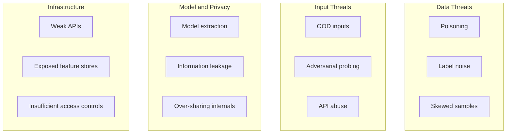

# Module 11 Summary: Security, Privacy, Fairness, and Accountability in Production ML

## Module Arc

Earlier modules focused on making models **fast, reliable, and observable**. This module adds the critical dimensions of **security, privacy, fairness, explainability, and auditability** — the foundations of responsible production ML.

---

## Topic 1: Threats to ML Systems

### Four Threat Buckets

### Why ML Is Targeted

- High-stakes decisions (money, access, safety).
- Complex, non-intuitive behaviour exploitable via probing.
- Broad attack surface across the full pipeline.
- Slow recovery without mature MLOps.

### First-Line Defences

Input validation, rate limiting, least privilege, monitoring, secure defaults (debug off, minimal errors, auditable CI/CD).

---

## Topic 2: Data Privacy

| Concept | Key practice |
|---------|--------------|
| PII | Direct and quasi-identifiers; often hidden inside features |
| Sensitive attributes | Health, financial, biometric, protected characteristics |
| Data minimisation | Collect only what the task requires |
| Anonymisation techniques | Masking, aggregation, pseudonymisation — risk reduction, not guarantee |
| RBAC | Least privilege by role; environment separation |
| Audit logs and lineage | Track access, deployments, and feature provenance |

**Mental model:** You borrow user data to provide value — privacy is a non-functional requirement from design time.

---

## Topic 3: Fairness and Bias

| Step | Action |
|------|--------|
| Disaggregate | Compute metrics per group, not just globally |
| Examine errors | FP and FN rates often matter more than accuracy |
| Check calibration | Score 0.8 should mean ~80% positive rate in every group |
| Visualise | Bar charts, calibration plots, delta tables |
| Automate | Policy thresholds → pass/fail in CI/CD |
| Log | Persistent fairness audit records |

**Key insight:** No single fairness metric; definitions conflict. Metrics inform human decisions — they are not magic verdicts.

---

## Topic 4: Explainability and Audit Trails

| Capability | Answers |
|------------|---------|
| Local explainability | Why this prediction for this case? |
| Global explainability | What drives the model in general? |
| Audit trails | Which model, data, config, and approval produced this decision? |

Explainability is approximate — use with fairness checks and domain expertise. Audit trails must be structured, persistent, and span training through serving.

---

## Integration with the Full MLOps Stack

| Prior module capability | Security / responsibility role |
|-------------------------|-------------------------------|
| Deployment patterns (Modules 3–4) | Control who calls the model |
| Monitoring and logging (Module 5) | Detect unusual traffic and behaviour |
| Retraining pipelines (Modules 6, 10) | Recover from data issues; roll back bad models |
| Feature governance (Module 9) | Visibility into data and features used |

Security and responsibility are not separate from MLOps — they **reuse the same infrastructure and discipline**.

---

## Lab Workflow Summary

1. **Segmented evaluation** — per-group accuracy, precision, recall.
2. **Automated fairness check** — recall and FPR gap vs policy thresholds.
3. **Audit logging** — structured JSONL record with metadata and full metrics.

---

## Design-Time Checklist for Responsible ML

- [ ] Threat map reviewed for each pipeline component
- [ ] PII inventory and minimisation applied to features
- [ ] RBAC and environment separation configured
- [ ] Group-wise evaluation in validation pipeline
- [ ] Fairness thresholds agreed with stakeholders
- [ ] Fairness results logged persistently
- [ ] Local and global explainability available
- [ ] Audit trails span training, evaluation, promotion, serving
- [ ] Investigation playbook written
- [ ] Monitoring includes input, output, and fairness drift alerts

---

## Common Pitfalls / Exam Traps

- Treating security, privacy, and fairness as post-deployment afterthoughts.
- Reporting only global accuracy for high-impact models.
- Believing anonymisation alone guarantees privacy.
- Treating explainability as proof of fairness.
- Console-only fairness checks without persistent audit records.
- Assuming one fairness metric suffices — know the trade-offs.
- Ignoring the connection between MLOps maturity and security posture.

---

## Quick Revision Summary

- ML threats span **data, input, model/privacy, and infrastructure** — design defensively from the start.
- Privacy: PII in features, minimisation, pseudonymisation, RBAC, audit logs, lineage.
- Fairness: disaggregate metrics, examine FP/FN, check calibration, automate thresholds, log results.
- Explainability: local (one case) + global (population); approximations, not truth machines.
- Audit trails: structured, persistent, versioned — span training through serving.
- Regulatory context demands traceable, interpretable systems with investigation playbooks.
- Labs: segmented evaluation → fairness check → JSONL audit log.
- Security and responsibility integrate with deployment, monitoring, retraining, and feature governance.
- When designing any system, ask: **What could go wrong, and how would we notice?**
