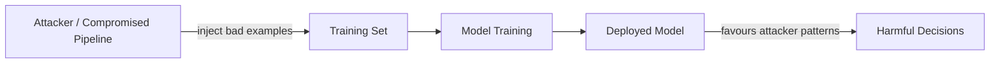
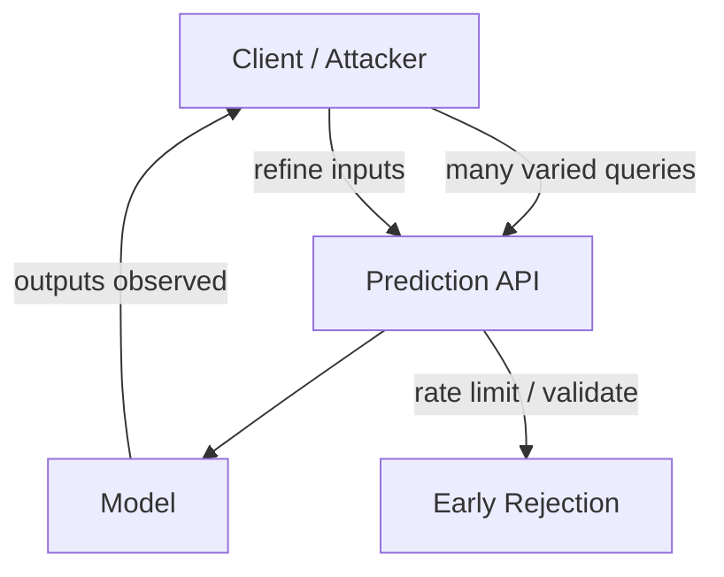

# Data and Input Threats in Machine Learning Systems

## Why ML Security Is Not Optional

ML systems increasingly drive real-world decisions: loan approvals, fraud checks, content moderation, healthcare triage, dynamic pricing. Attack or misuse produces unfair decisions, privacy leaks, fraud losses, regulatory fines, and reputational damage.

Unlike rule-based systems, ML behaviour is **complex and non-intuitive**. Attackers can probe inputs, observe outputs, and iteratively find weaknesses. Security is therefore a core competency for model engineers, not a handoff to a separate team.

---

## Data Threats: Corrupting What the Model Learns

### Data Poisoning

An attacker or compromised process injects malicious examples into the training set. Over time, the model learns behaviours that benefit the attacker — for example, approving certain fraudulent transaction patterns more often.

### Label Noise (Non-Adversarial)

Even without deliberate attack, labels degrade:

- Different teams apply slightly different labelling rules over time.
- Bugs mislabel portions of the data.
- Offline evaluation metrics look acceptable while the model trains on inconsistent ground truth.

### Skewed Samples

When groups, regions, or behaviours are over- or under-represented, the model develops **blind spots** and **fairness disparities**. A fraud model trained predominantly on one geography may fail elsewhere.

| Threat type | Intent | Detection signal |
|-------------|--------|------------------|
| Poisoning | Deliberate | Sudden metric shifts; anomalous label clusters |
| Label noise | Accidental | Inter-annotator disagreement; temporal drift |
| Skew | Structural | Group-wise metric gaps; representation imbalance |

**Key insight:** Data quality is a security and fairness concern, not only an accuracy concern.

---

## Input Threats: Breaking the Model at Prediction Time

### The Distribution Assumption

Models assume inference-time inputs resemble training data. When they receive:

- Out-of-distribution (OOD) patterns
- Strange formats or schema violations
- Extreme or impossible feature values
- Entirely new behavioural patterns

…predictions become **unreliable** even if the model scored well offline.

### Adversarial-Style and Abuse Inputs

At a high level, adversarial probing means deliberately crafting inputs — or sending large query volumes — to explore decision boundaries and weak spots.

**Simple abuse patterns matter:** An attacker hammers an API with many input variations until one bypasses a fraud rule or content filter. This does not require sophisticated gradient-based attacks.

### Defensive Controls for Input Threats

| Control | Purpose |
|---------|---------|
| **Input validation** | Reject malformed, out-of-range, or schema-violating requests early |
| **Rate limiting** | Throttle excessive query volumes that enable boundary probing |
| **Anomaly monitoring** | Alert on unusual input distributions or traffic spikes |
| **OOD detection** | Flag inputs far from training distribution before scoring |

---

## Real-World Examples

- **Fraud scoring:** Poisoned training labels that mark attacker-controlled merchants as "legitimate" cause systematic approval of fraudulent transactions.
- **Content moderation:** OOD inputs (unicode tricks, image perturbations) bypass classifiers trained on clean corpora.
- **Credit scoring:** Skewed training data from one demographic leads to systematically worse predictions for under-represented groups — a fairness issue rooted in data, not just the algorithm.

---

## Common Pitfalls / Exam Traps

- Assuming offline metrics on a static test set catch poisoning — poisoned examples may be in the training set, not the holdout.
- Confusing **data threats** (training-time) with **input threats** (serving-time); fixing one does not fix the other.
- Believing adversarial attacks require advanced ML knowledge — high-volume API abuse is often sufficient.
- Ignoring label noise because overall accuracy is high; noise disproportionately affects minority classes.
- Skipping input validation because "the model will handle weird inputs gracefully" — it will not.

---

## Quick Revision Summary

- ML security matters because models sit in high-stakes decision loops and are harder to reason about than rule engines.
- **Data threats:** poisoning (deliberate), label noise (accidental), skew (structural) — all corrupt learned behaviour.
- **Input threats:** OOD inputs, adversarial probing, and API abuse break reliability at serving time.
- Data quality is simultaneously a security, fairness, and accuracy concern.
- Defend inputs with validation, rate limiting, monitoring, and OOD detection.
- Attackers learn by observing outputs — limit query volume and log anomalies.
- Always separate training-time data risks from serving-time input risks when designing mitigations.
