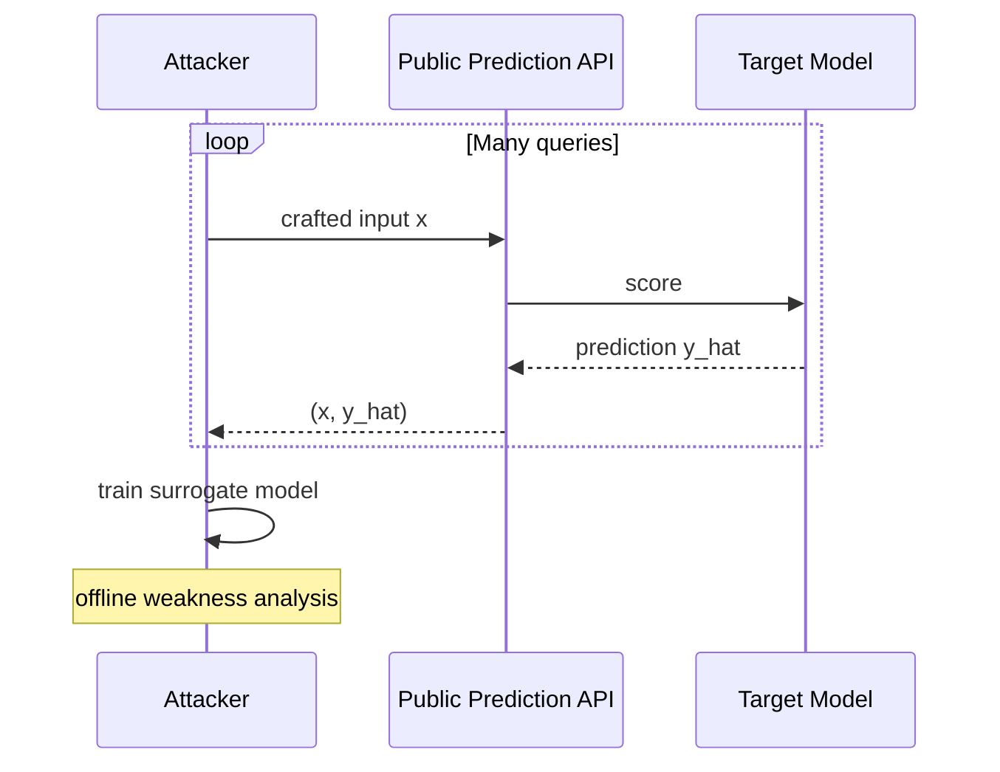
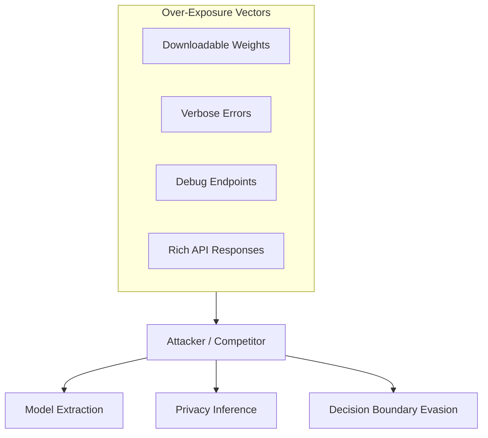

# Model and Privacy Threats: Extraction, Leakage, and Over-Exposure

## The Model as a Sensitive Asset

A deployed model is not a black box that only produces predictions. It is also:

- **Intellectual property** — months of feature engineering, architecture tuning, and proprietary data.
- **An information channel** — outputs can leak details about training data or individual records.
- **An attack surface** — internals exposed through APIs, weights, or debug tooling.

The governing principle: **expose only what is needed**, and treat the model like source code or a production database.

---

## Model Extraction

### What It Is

An attacker sends a large volume of queries to a public prediction API, records $(x, \hat{y})$ pairs, and trains a **surrogate model** that approximates the target.

### Why It Matters

- **IP theft** — competitors replicate model behaviour without your training data.
- **Offline attack development** — attackers study the surrogate without rate limits or logging on the live system.
- **Lower barrier to evasion** — once the decision boundary is approximated, crafting bypass inputs becomes easier.

### Mitigations

| Mitigation | Mechanism |
|------------|-----------|
| Rate limiting | Reduces query volume available for surrogate training |
| Output rounding / coarsening | Reduces fidelity of $(x, \hat{y})$ pairs |
| Query monitoring | Detect systematic probing patterns |
| Authentication and billing | Raises cost of large-scale querying |
| Watermarking / model fingerprinting | Detect stolen surrogates (advanced) |

---

## Information Leakage from Predictions

### Membership and Attribute Inference

If a model is **overfitted** or outputs are **too detailed** (precise probabilities, rich feature attributions), predictions may reveal:

- Whether a specific individual appeared in training data.
- Patterns about rare events or sensitive subpopulations.

This escalates from a model-quality issue to a **privacy and compliance** problem (GDPR, sector-specific regulations).

### Overfitting as a Privacy Risk

Models that memorise rare training examples can output high-confidence predictions that effectively **encode** those examples. Differential privacy and regularisation reduce this risk but trade off accuracy.

---

## Over-Sharing Internals

Common exposure vectors:

- **Downloadable model weights** — full architecture and parameters exposed.
- **Verbose error messages** — stack traces, feature names, internal paths.
- **Forgotten debug endpoints** — `/debug`, `/explain_raw`, staging URLs left enabled in production.
- **Excessive API responses** — returning all feature contributions, raw logits, and internal embeddings when only a binary decision is needed.

---

## The Minimum-Exposure Principle

For every API field, endpoint, and log entry, ask:

1. Does the consumer **need** this to function?
2. Could an adversary use this to reconstruct behaviour or identify individuals?
3. Can we provide a **coarser** version (rounded score, binary label, delayed explanation)?

Secure defaults:

- Disable debug endpoints in production by default.
- Keep error messages minimal and generic.
- Gate model artefact downloads behind strict RBAC.
- Log predictions at appropriate granularity — not raw PII alongside scores.

---

## Common Pitfalls / Exam Traps

- Equating "model leakage" only with **data leakage** (train-test contamination) — this topic covers **model extraction** and **output-side privacy leakage**.
- Returning full probability vectors and SHAP values to all API consumers "for transparency" — expands the attack surface.
- Assuming a surrogate model will be inaccurate — with enough queries, surrogates can closely match tree ensembles and even neural nets.
- Leaving staging endpoints accessible because "nobody knows the URL."
- Treating overfitting purely as a generalisation problem — it is also a privacy risk.

---

## Quick Revision Summary

- Models are sensitive assets: IP, information channel, and attack surface simultaneously.
- **Model extraction:** query API at scale, train surrogate, analyse weaknesses offline.
- **Information leakage:** overfitted or overly detailed outputs reveal training data patterns.
- **Over-sharing:** weights, debug endpoints, verbose errors, and rich responses expand risk.
- Principle: expose only what is needed; prefer coarse outputs and strict access controls.
- Mitigations: rate limiting, output coarsening, monitoring, authentication, least-privilege artefact access.
- Privacy leakage from models is a compliance issue, not just a modelling inconvenience.
